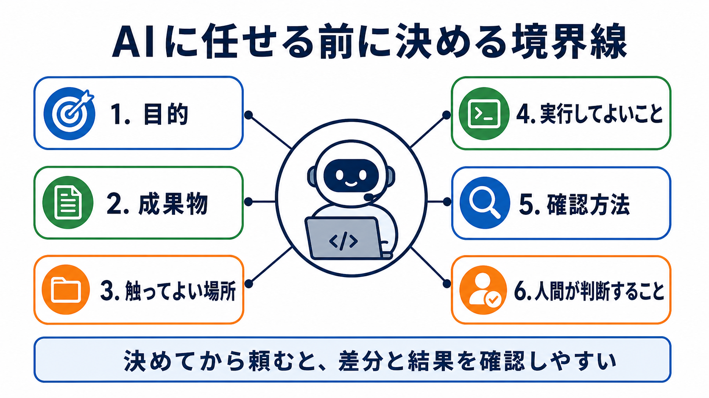

# AIに任せる範囲を広げる前に

## この章でできるようになること

AIに大きめの作業を頼む前に、目的、任せる範囲、触ってよい場所、実行してよいこと、確認方法を分けて整理できるようになります。

基本編では、AIに小さな変更を頼み、差分や動作を確認しながら進めました。
発展編では、AIに任せる量を少しずつ増やします。
ただし、任せる量を増やすほど、作業前の整理が重要になります。

## まず知っておくこと

AIに任せる範囲を広げる、というのは、AIを信じ切るという意味ではありません。

むしろ逆です。
AIが迷わず動けるように、最初に人間が作業の境界線を引きます。

ここでいう境界線とは、次のようなものです。

- 何を達成したいのか
- どこまでAIに任せるのか
- どのファイルやディレクトリを触ってよいのか
- どのコマンドを実行してよいのか
- 作業後に何で確認するのか
- 最終判断を誰が持つのか



AIは、目的が曖昧でも自然な文章で返答できます。
しかし、自然な文章で返ってくることと、作業の前提が正しいことは別です。

発展編では、AIの回答が自然かどうかではなく、AIが安全に作業できる条件が揃っているかを見ます。

## 任せる前に決めること

AIに依頼する前に、まず次の6つを分けます。

### 目的

目的は、何のために作業するのかです。

たとえば、次のように書きます。

```text
発展編 第1部の導入として、AIに任せる前に決めることを説明する章を作りたい。
```

目的が曖昧なままだと、AIは「よさそうな作業」を自分で補って進めることがあります。
それが助かる場合もありますが、教材や公開物では、意図しない方向に進む原因にもなります。

### 成果物

成果物は、作業が終わったときに何ができていればよいかです。

たとえば、次のように書きます。

```text
Markdownの章ファイルを1つ追加し、サイドバーから読めるようにする。
```

成果物を決めると、AIも人間も「どこまでやれば完了か」を判断しやすくなります。

### 触ってよい場所

触ってよい場所は、AIが編集してよいファイルやディレクトリです。

たとえば、次のように書きます。

```text
編集してよいのは docs/advanced/part-1-ai-work-environment/ と site/sidebars.js だけです。
```

作業範囲を明示しないと、AIが関連しそうな別ファイルまで直すことがあります。
それが必要な場合もありますが、最初は範囲を狭くして、必要になったら広げるほうが安全です。

### 実行してよいこと

実行してよいことは、AIがコマンド実行や外部アクセスをしてよいかどうかです。

たとえば、次のように分けます。

- 読み取り中心の確認はしてよい
- buildはしてよい
- installはまだしない
- 削除やpushは許可するまでしない

発展編では、AIに任せる量が増えます。
そのため、作業前に「実行してよいこと」と「まだ実行しないこと」を分けます。

### 確認方法

確認方法は、作業後に何を見れば完了といえるかです。

たとえば、次のように書きます。

```text
git diff で変更範囲を確認し、npm run build が通ることを確認する。
```

確認方法がない依頼は、AIの「できました」に頼りやすくなります。
AIの報告は便利ですが、最終的には差分、画面、テスト、buildなどで確認します。

### 人間が持つ判断

AIに任せる範囲を広げても、目的、採用判断、公開判断は人間が持ちます。

AIは、作業案、実装、レビュー、説明を手伝えます。
しかし、どの案を採用するか、どの変更を公開するか、どこまで任せるかは人間が決めます。

## やってみる

この時点では、まだAIに実装を頼みません。
まず、作業の境界線を整理させます。

```text
これからAIに作業を頼む前に、作業の境界線を整理したいです。

次の項目に分けて、確認すべきことを質問してください。

- 目的
- 成果物
- 触ってよい場所
- 実行してよいこと
- 確認方法
- 人間が判断すること

一度に結論を書かず、まず私に質問してください。
まだファイルは変更しないでください。
```

AIから質問が返ってきたら、自分の言葉で答えます。
そのあと、次のように頼みます。

```text
今の回答をもとに、AIに作業を頼む前の確認メモとしてMarkdownで整理してください。

目的、成果物、触ってよい場所、実行してよいこと、確認方法、
人間が判断することを分けてください。
秘密情報は含めないでください。
まだファイルは変更しないでください。
```

## AIに練習問題を出してもらう

AIに、任せる前の判断練習を出してもらいます。

```text
AIに作業を頼む前の判断練習を出してください。

次の条件でお願いします。

- 問題は5問
- 各問題は、AIへの依頼文を1つずつ表示する
- 各問題は、A/B/Cから選ぶ選択式にする
- 選択肢は、A: そのまま頼んでよい、B: 条件を追加してから頼む、C: まだ頼まない、にする
- 1問ずつ依頼文を表示し、その直下にA/B/Cの選択肢も毎回表示して、私の回答を待つ
- 私は、各問題に対してA/B/Cだけで回答します
- 私が回答するまで、その問題の答え、採点、解説を表示しないでください
- 私が回答したあとで、その問題を採点し、理由も解説してください
- 解説が終わったら、次の問題を1問だけ出してください
- コマンドは実行しないでください
```

この練習では、AIに何を頼めるかだけでなく、どの条件が足りないと危ないかを見ます。

## 何が起きたのか

この章では、AIに作業そのものを任せる前に、作業の前提を整理しました。

これは、AIの能力を制限するためだけではありません。
AIが必要な情報を見つけやすくし、余計な変更を避け、作業後の確認をしやすくするためです。

依頼文に目的だけを書くと、AIは手段を広く補います。
目的、成果物、触ってよい場所、実行してよいこと、確認方法を書くと、AIはその枠の中で動きやすくなります。

## 運用者の視点

AIに任せる範囲を広げるときは、最初から大きく任せないほうが安全です。

まず読み取り中心で状況を整理させます。
次に、計画を出させます。
そのあとで、触ってよい場所と確認方法を決めてから実装を許可します。

この順番にすると、AIの作業を止める場所ができます。
止める場所があると、方針がずれても戻しやすくなります。

## AIに聞いてみよう

```text
このリポジトリでAIに少し大きめの作業を頼む前に、
目的、成果物、触ってよい場所、実行してよいこと、確認方法、
人間が判断することを確認するチェックリストを作ってください。

まだファイルは変更しないでください。
```

## 次へ

次は、AIが働く環境を分解します。
AGENTS.md、要件メモ、補助コンテキスト、プロンプトテンプレート、skills、確認コマンドが、それぞれどんな役割を持つのかを見ます。
