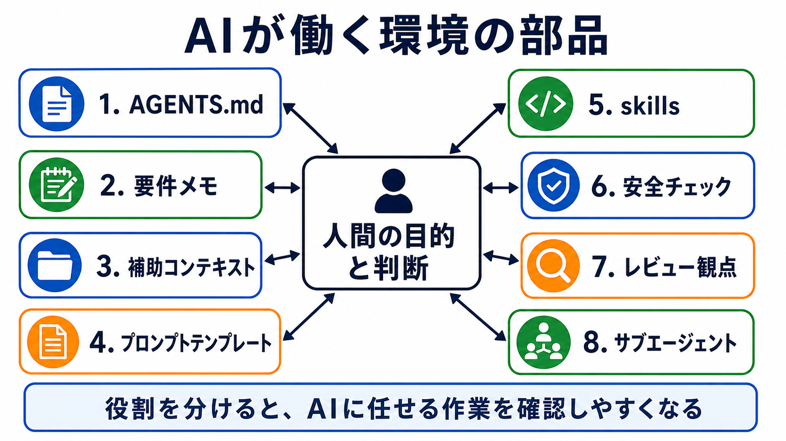

# AIが働く環境を分解する

## この章でできるようになること

AIに任せるための作業環境を、いくつかの部品に分けて説明できるようになります。

前の章では、AIに作業を頼む前に、目的、成果物、触ってよい場所、実行してよいこと、確認方法、人間が判断することを整理しました。
この章では、その整理を支える道具や情報を分解します。

## まず知っておくこと

AIが働く環境は、AIツール本体だけでできているわけではありません。

AIが見ているファイル、会話で伝えたこと、AGENTS.mdのような指示ファイル、実行できるコマンド、確認手順、レビュー観点が組み合わさって、AIの作業の前提になります。

発展編では、これらをひとまとめにせず、役割ごとに分けて扱います。



## 作業環境を部品に分ける

ここでは、AIが働く環境を次の8つに分けて見ます。

### 1. AGENTS.md

AGENTS.mdは、リポジトリ内でAIエージェントに守ってほしい作業方針を書く場所です。

たとえば、次のようなことを書きます。

- 学習者向け本文は日本語で書く
- SVGを勝手に作らない
- 画像はimagegenで作る
- commit前にbuildを確認する
- 危険なコマンドは説明してから扱う

AGENTS.mdは、AIに毎回同じ方針を説明し直さないための土台です。
ただし、何でもAGENTS.mdに入れると肥大化します。
詳しい扱いは、第2部で扱います。

### 2. 要件メモ

要件メモは、作りたいもの、決まったこと、まだ決まっていないこと、やらないことを整理したメモです。

長い会話の中で決まったことを、そのまま会話に残しておくだけだと、あとから見失いやすくなります。
Markdownファイルなどに要件メモとして残しておくと、AIにも人間にも読み直しやすくなります。

要件メモには、パスワード、APIキー、トークン、秘密鍵は書きません。

### 3. 補助コンテキスト

補助コンテキストは、作業対象の外にある参考情報です。

たとえば、次のようなものです。

- 公式ドキュメント
- 公式サンプル
- 設計メモ
- 過去のissue
- 参考にしたいOSSリポジトリ

補助コンテキストは、AIの判断材料を増やします。
ただし、作業対象と混同させると危険です。
参照用の情報は、基本的に読み取り中心で扱います。

### 4. プロンプトテンプレート

プロンプトテンプレートは、よく使う依頼の型です。

たとえば、次のような依頼はテンプレート化できます。

- まず質問してください
- 修正観点を洗い出してください
- 差分をレビューしてください
- 練習問題を一問一答で出してください
- commit前の確認項目を出してください

プロンプトテンプレートがあると、毎回その場で長文を考えなくても、安定した形式でAIに頼めます。

### 5. skills

skillsは、特定の作業で繰り返し使う知識や手順を切り出すための仕組みです。

AGENTS.mdは、リポジトリ全体で守る方針に向いています。
skillsは、画像生成、レビュー、公開前確認など、特定の作業だけで使う手順に向いています。

skillsを増やせばよいわけではありません。
本当に繰り返し使う作業だけを切り出します。

### 6. 安全チェック

安全チェックは、AIの作業を受け入れる前に確認する手順です。

たとえば、次のような確認があります。

```bash
git status
git diff
npm run build
```

プロジェクトによっては、test、lint、リンクチェックも使います。

安全チェックは、AIを疑うためではなく、AIの作業を安心して受け止めるためにあります。

### 7. レビュー観点

レビュー観点は、AIに何を見てほしいかを分けるためのものです。

たとえば、同じ差分でも、次の観点では見る場所が変わります。

- 初学者が迷わないか
- 危険な操作がないか
- 秘密情報が入っていないか
- 画像と本文が対応しているか
- buildが通る構成か

AIに「レビューして」とだけ頼むよりも、観点を分けたほうが結果を使いやすくなります。

### 8. サブエージェント

サブエージェントは、使える環境では、調査、実装、レビューなどを役割ごとに分けるために使えます。

ただし、サブエージェントを増やせば自動的に安全になるわけではありません。
書き込み範囲、担当範囲、統合判断を人間が決める必要があります。

サブエージェントの詳しい扱いは、第8部で扱います。

## やってみる

AIに、今のプロジェクトで使えそうな作業環境の部品を棚卸ししてもらいます。

```text
このリポジトリでAIに作業を頼むときの作業環境を、次の部品に分けて棚卸ししてください。

- AGENTS.md
- 要件メモ
- 補助コンテキスト
- プロンプトテンプレート
- skills
- 安全チェック
- レビュー観点
- サブエージェント

各項目について、今すでにあるもの、まだ足りないもの、今は作らなくてよいものを分けてください。
まだファイルは変更しないでください。
```

AIの回答を見たら、すべてを一度に作ろうとしないでください。
まずは、いま困っている作業に効くものから整えます。

## AIに練習問題を出してもらう

AIに、作業環境の部品を見分ける練習を出してもらいます。

```text
AIに任せるための作業環境について、部品を見分ける練習問題を出してください。

次の条件でお願いします。

- 問題は5問
- 各問題は、短い状況説明を1つずつ表示する
- 各問題は、A/B/C/Dから選ぶ選択式にする
- 選択肢は、A: AGENTS.md、B: 要件メモ、C: 補助コンテキスト、D: 安全チェック、にする
- 1問ずつ状況説明を表示し、その直下にA/B/C/Dの選択肢も毎回表示して、私の回答を待つ
- 私は、各問題に対してA/B/C/Dだけで回答します
- 私が回答するまで、その問題の答え、採点、解説を表示しないでください
- 私が回答したあとで、その問題を採点し、理由も解説してください
- 解説が終わったら、次の問題を1問だけ出してください
```

この練習では、情報や手順をどこに置くと扱いやすいかを考えます。

## 何が起きたのか

この章では、AIが働く環境を部品に分けました。

全部をAGENTS.mdに書くと、AGENTS.mdが大きくなりすぎます。
全部を会話で伝えると、長い会話の中で見失いやすくなります。
全部をAIの判断に任せると、確認しにくくなります。

だから、方針、要件、参考情報、依頼の型、専門手順、確認方法、レビュー観点を分けて持ちます。

## 運用者の視点

AIに任せるための作業環境は、一度に完成させるものではありません。

最初はAGENTS.mdと確認コマンドだけでも構いません。
会話が長くなってきたら要件メモを作ります。
同じ依頼を何度も書いていると感じたら、プロンプトテンプレートにします。
特定の作業を何度も繰り返すなら、skillsを検討します。

必要になったものから足していくほうが、作業環境は育てやすくなります。

## AIに聞いてみよう

```text
このリポジトリでAIに作業を頼むための環境を整理したいです。

AGENTS.md、要件メモ、補助コンテキスト、プロンプトテンプレート、skills、
安全チェック、レビュー観点、サブエージェントに分けて、
今すぐ整えるべきものと、後でよいものを提案してください。

まだファイルは変更しないでください。
```

## 次へ

次は、見せる情報と見せない情報を決めます。
AIに見せると助けになる情報と、見せてはいけない秘密情報を分けていきます。
