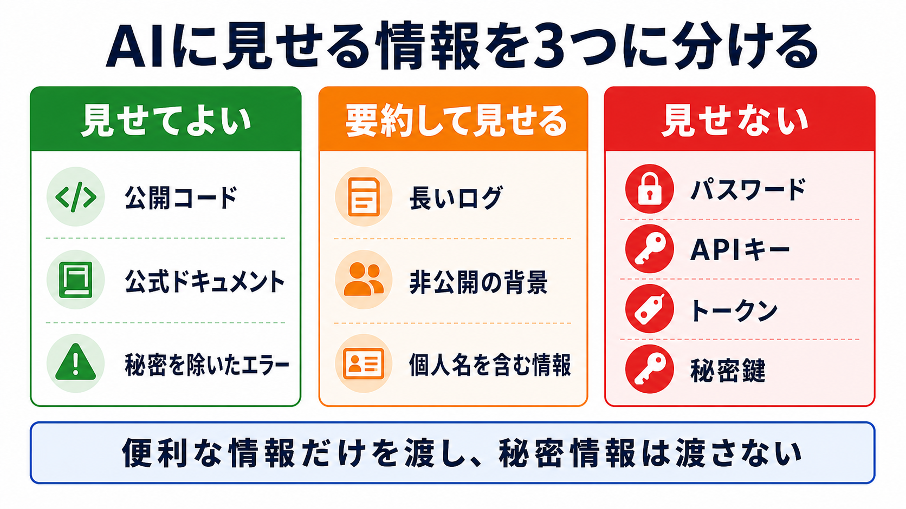

# 見せる情報と見せない情報を決める

## この章でできるようになること

AIに見せると助けになる情報、要約して見せる情報、見せてはいけない情報を分けられるようになります。

前の章では、AIが働く環境を部品に分けました。
この章では、その中でも特に「AIに見せる情報の範囲」を扱います。

## まず知っておくこと

AIは、見えている情報を材料にして答えます。
そのため、よい情報を見せると、回答や作業の精度は上がりやすくなります。

一方で、見せてはいけない情報もあります。
パスワード、APIキー、トークン、秘密鍵、個人情報、業務上の秘密は、AIに貼らない、ファイルにも残さない、公開もしない、という判断が必要です。

発展編では、コンテキストを広げる力と、秘密情報を守る力をセットで扱います。



## 3つに分ける

AIに渡す情報は、まず次の3つに分けます。

### 見せてよい情報

見せてよい情報は、AIが作業するために必要で、公開されても困りにくい情報です。

たとえば、次のようなものです。

- 公開リポジトリのコード
- 教材本文
- 公開されている公式ドキュメント
- 公開されているOSSリポジトリ
- エラーメッセージから秘密情報を除いたもの
- 自分で書いた要件メモ

ただし、公開リポジトリの中にも秘密情報が混ざっていないとは限りません。
見せる前に、`.env` やトークンらしき文字列が含まれていないか確認します。

### 要約して見せる情報

そのまま見せる必要はないけれど、内容の一部はAIに伝えたい情報もあります。

たとえば、次のようなものです。

- 個人名や会社名が含まれるログ
- 長すぎるエラー出力
- 非公開の設計メモ
- 業務上の背景
- 顧客やユーザーの具体的な情報

この場合は、固有名詞や秘密情報を取り除き、必要な部分だけを要約して伝えます。

たとえば、次のようにします。

```text
社内の管理画面で、ユーザー一覧を読み込む処理が失敗しています。
実際のURLとユーザー名は伏せます。
エラーの種類は 401 Unauthorized です。
```

### 見せない情報

見せない情報は、AIに貼らない、要件メモに書かない、commitしない、公開しない情報です。

たとえば、次のようなものです。

- パスワード
- APIキー
- アクセストークン
- 秘密鍵
- ログイン認証コード
- `.env` の中身
- 個人情報
- 契約や業務上の秘密

AIに「秘密情報は貼らないで」と言われてから気づくのではなく、自分で先に止めます。

## 補助コンテキストを使うときの注意

補助コンテキストは、作業対象の外にある参考情報です。
公式ドキュメント、公式サンプル、OSSリポジトリ、設計メモなどが含まれます。

補助コンテキストを使うと、AIは似た実装や公式の使い方を見ながら考えられます。
ただし、次の点を明示します。

- どれが作業対象か
- どれが参照用か
- 参照用は編集しないこと
- 参照用の内容をそのままコピーしないこと
- ライセンスや利用条件を確認すること

たとえば、次のように頼みます。

```text
この作業では、現在のリポジトリだけを編集対象にしてください。

../reference-repos/example-project は参照用です。
必要なら読み取って構いませんが、編集しないでください。
実装をそのままコピーせず、考え方だけ参考にしてください。
```

## やってみる

AIに、見せる情報と見せない情報を分類してもらいます。

```text
これからAIに作業を頼む前に、渡してよい情報と渡してはいけない情報を整理したいです。

次の3つに分けるチェックリストを作ってください。

- 見せてよい情報
- 要約して見せる情報
- 見せない情報

特に、パスワード、APIキー、トークン、秘密鍵、`.env`、個人情報を含めてください。
まだファイルは変更しないでください。
```

この依頼では、AIに秘密情報そのものを見せる必要はありません。
分類の観点だけを出してもらいます。

## AIに聞いてみよう

```text
次の情報をAIに渡してよいか判断したいです。

実際の値は貼りません。
項目名だけを見て、見せてよい、要約して見せる、見せない、の3つに分類してください。

- エラーメッセージ
- `.env` の中身
- 公開リポジトリのREADME
- APIキー
- 公式ドキュメントのURL
- ユーザーのメールアドレス
- npm run build の出力
- 参考にしたいOSSリポジトリ

分類理由も短く説明してください。
```

## 何が起きたのか

この章では、AIに見せる情報を3つに分けました。

AIに見せる情報を増やすと、回答の精度は上がりやすくなります。
しかし、秘密情報まで見せてしまうと、取り返しがつかないことがあります。

だから、コンテキストを広げる前に、見せてよい、要約して見せる、見せない、を分けます。

## 運用者の視点

実務では、AIに貼る前に、ログやエラー出力をそのまま貼ってよいかを確認します。

判断に迷う場合は、値そのものを貼るのではなく、項目名やエラーの種類だけを伝えます。
それでも足りない場合は、秘密情報を伏せた最小例を作ります。

AIに見せる情報は、多ければよいわけではありません。
作業に必要な情報だけを、危険な情報を除いて渡すのが基本です。

## 次へ

次は、変更前後で確認できる形にします。
AIに作業を任せる前に、差分、build、test、lintなどで何を確認するのかを決めます。
