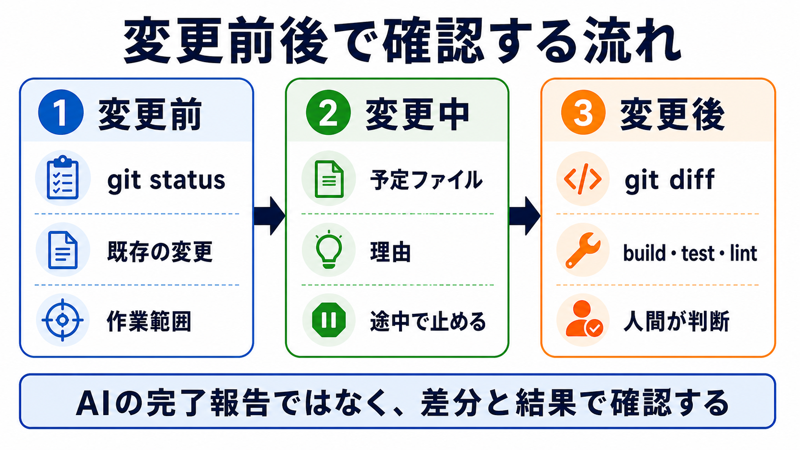

# 変更前後で確認できる形にする

## この章でできるようになること

AIに作業を任せる前に、変更前、変更中、変更後で何を確認するかを決められるようになります。

前の章では、AIに見せる情報と見せない情報を分けました。
この章では、AIが作業したあとに、何が変わったのか、期待どおりに動くのかを確認するための手順を作ります。

## まず知っておくこと

AIが「できました」と言っても、それだけで完了にはしません。

完了したかどうかは、差分、build、test、lint、画面、ログなどで確認します。
どの確認を使うかは、作業の種類によって変わります。

確認方法を先に決めておくと、AIに任せる作業が大きくなっても、途中で止めたり、戻したりしやすくなります。



## 確認を3つのタイミングに分ける

AIの作業は、変更前、変更中、変更後に分けて確認します。

### 変更前

変更前には、今の状態を確認します。

```bash
git status
```

`git status` は、どのファイルが変更されているかを確認する入口です。
AIに作業を頼む前に、すでに変更済みのファイルがあるかを見ます。

すでに未commitの変更がある場合は、それが自分の作業なのか、AIに触らせてよいものなのかを確認します。

### 変更中

変更中には、AIにいきなり最後まで進ませすぎないようにします。

たとえば、次のように頼みます。

```text
まず変更予定のファイルと理由を説明してください。
まだ編集しないでください。
```

または、実装を始めたあとでも、途中で止めて確認します。

```text
ここまでの変更内容を要約し、次に変更する予定のファイルを説明してください。
まだcommitしないでください。
```

AIに長く走らせるほど、方針がずれたときに戻しにくくなります。
途中で止める場所を作ることが大切です。

### 変更後

変更後には、差分と動作を確認します。

```bash
git diff
```

`git diff` は、ファイルの中身がどう変わったかを見るコマンドです。
AIが編集した内容を、commit前に確認するために使います。

Webサイトやドキュメントでは、buildも確認します。

```bash
npm run build
```

buildが通ることは、最低限の確認です。
buildが通っても、文章がわかりやすいとは限りません。
そのため、差分、表示、リンク、画像、文章の流れもあわせて見ます。

## 確認コマンドの役割

確認コマンドは、同じように見えても役割が違います。

| 確認 | 見るもの |
| --- | --- |
| `git status` | どのファイルが変わったか |
| `git diff` | 中身がどう変わったか |
| build | プロジェクトとして組み立てられるか |
| test | 期待する動作が壊れていないか |
| lint | 書き方や形式の問題がないか |
| 画面確認 | 実際に読めるか、操作できるか |

この表は暗記するものではありません。
AIに作業を頼む前に、「今回は何で確認するのか」を選ぶために使います。

## やってみる

AIに、作業前後の確認手順を作ってもらいます。

```text
このリポジトリでAIにドキュメント修正を頼む前に、
変更前、変更中、変更後で確認することをチェックリストにしてください。

次の観点を含めてください。

- git status
- git diff
- npm run build
- 画像参照
- Markdownリンク
- commit前に人間が見ること

まだファイルは変更しないでください。
```

AIが出したチェックリストを、そのまま全部使う必要はありません。
自分の作業に合うものを選びます。

## AIに聞いてみよう

```text
これからAIに小さな変更を頼みます。

作業を始める前に、変更前、変更中、変更後で止まるポイントを作ってください。
それぞれのタイミングで、何を確認し、どのコマンドを使うかを説明してください。

まだファイルは変更しないでください。
```

## 何が起きたのか

この章では、AIに作業を任せる前に、確認方法を決めました。

AIが作業したあとに確認方法を考えると、どこを見ればよいかわからなくなることがあります。
先に確認方法を決めておくと、AIの作業を受け止めやすくなります。

確認は、AIを疑うためだけのものではありません。
AIと一緒に作業を進めるための共通のものさしです。

## 運用者の視点

大きめの作業をAIに頼むときは、次の順番を基本にします。

1. `git status` で作業前の状態を見る
2. AIに変更予定ファイルと理由を説明させる
3. 小さく編集させる
4. `git diff` で差分を見る
5. build、test、lintなど必要な確認をする
6. 人間が採用するか判断する

この順番を守ると、AIに任せる量を増やしても、どこで確認するかを見失いにくくなります。

## 次へ

次は、第1部の確認です。
自分のプロジェクトで、AIに任せるための作業環境に何が必要かを棚卸しします。
