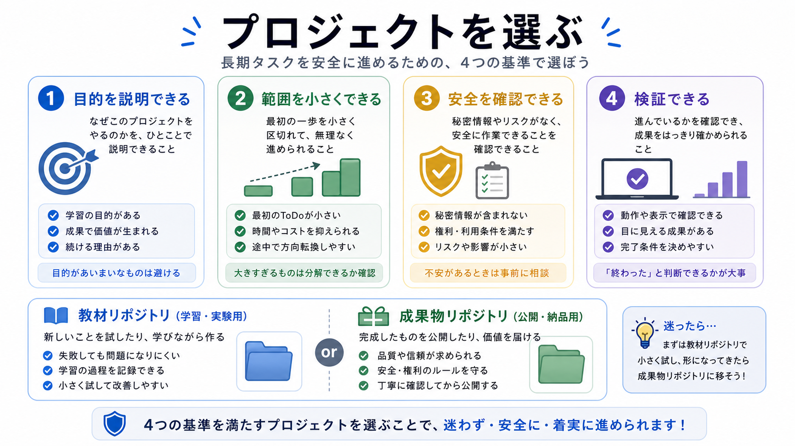

# 自分のプロジェクトを選ぶ

この章では、AIと継続開発したい成果物リポジトリを選びます。

第10部では、発展編で学んだAGENTS.md、要件メモ、プロンプトテンプレート、skills、安全確認、AIレビューを、自分のプロジェクトに合わせてまとめます。
まず、どのプロジェクトに導入するかを決めます。

## この章でできるようになること

- AI開発環境を導入するプロジェクトを選べる
- 教材リポジトリと成果物リポジトリを混同しない
- 最初に整える範囲を小さく決められる

## どのプロジェクトを選ぶか

最初に選ぶのは、小さくて自分が目的を説明できるプロジェクトです。

候補は次のようなものです。

- 基本編で作ったポートフォリオ
- 自分用の小さなWebページ
- ローカルで使う小さな自動化
- 学習用の練習リポジトリ

いきなり仕事の本番リポジトリや、大量の秘密情報を扱うプロジェクトを選ぶ必要はありません。



## 選ぶ基準

プロジェクトを選ぶときは、次を確認します。

| 観点 | 確認すること |
| --- | --- |
| 目的 | 何を作るリポジトリか説明できるか |
| 範囲 | 最初に整える場所を小さくできるか |
| 安全 | 秘密情報や公開情報の扱いを確認できるか |
| 検証 | buildや手動確認の方法があるか |

AI開発環境は、プロジェクト全体を一気に完璧にするためのものではありません。
まず、AIに迷ってほしくない最小のルールを置きます。

## 教材リポジトリと混同しない

この教材リポジトリは、学ぶための場所です。
自分の成果物リポジトリは、自分が作るものを置く場所です。

第10部で整える対象は、基本的には自分の成果物リポジトリです。
教材リポジトリに直接、自分用のルールを混ぜないようにします。

```text
教材リポジトリ:
この教材を読む、確認する

成果物リポジトリ:
自分の作品やツールを育てる
```

## 最初に整える範囲

最初から全部を整えようとしなくて構いません。

最初の範囲は、次のくらいで十分です。

- プロジェクトの目的
- 編集してよい範囲
- 秘密情報の扱い
- 確認コマンド
- commit前に見ること

skillsや高度なサブエージェント運用は、必要になってからで構いません。

## やってみる

AI開発環境を入れる候補を1つ選びます。

```text
プロジェクト名:

何を作るものか:

最初にAIへ任せたい作業:

AIに任せたくない作業:

確認方法:
```

この表が書けたら、次章でAGENTS.mdを作る準備ができます。

## AIに聞いてみよう

AIに、プロジェクト選びを手伝ってもらいます。

```text
AIと継続開発するための作業環境を入れるプロジェクトを選びたいです。

私の候補を聞いたうえで、次の観点で質問してください。

- 目的を説明できるか
- 最初に整える範囲を小さくできるか
- 秘密情報や公開情報のリスクは高すぎないか
- buildや手動確認の方法があるか

質問は1問ずつ出してください。
まだファイル編集、削除、commit、pushはしないでください。
```

## 何が起きたのか

この章では、AI開発環境を導入するプロジェクトを選びました。

最初は、自分が目的を説明でき、確認方法がある小さなプロジェクトを選びます。
次章では、そのプロジェクト用のAGENTS.mdを作ります。

## 次へ

次は、AGENTS.mdを作ります。

- [AGENTS.mdを作る](02-project-agents-md.md)
