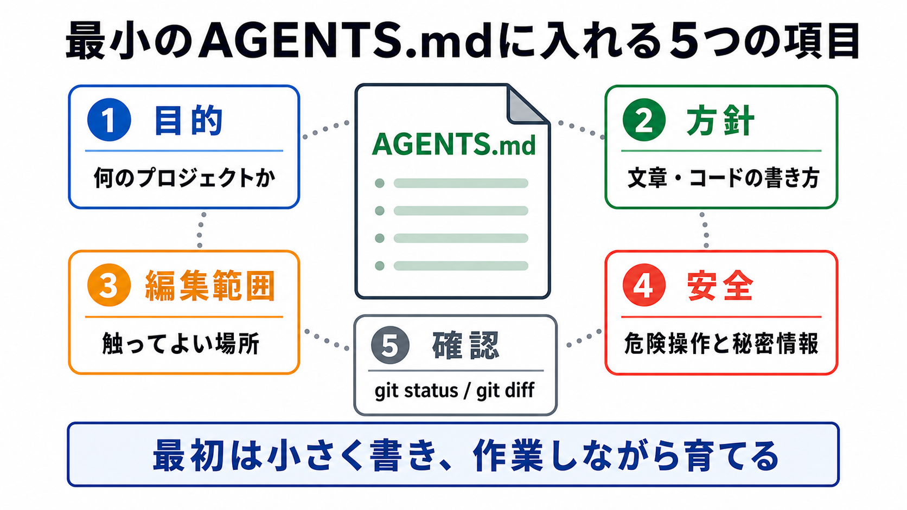

# AGENTS.mdを作る

この章では、プロジェクトの目的、編集方針、安全方針、commit前確認をAGENTS.mdに整理します。

AGENTS.mdは、AIに毎回守ってほしいリポジトリ固有の作業方針を書く場所です。
教材本文やREADMEの代わりではありません。

## この章でできるようになること

- 自分のプロジェクト用AGENTS.mdの最小構成を作れる
- 本文やREADMEに書く内容とAI向け指示を分けられる
- AGENTS.mdを肥大化させずに始められる

## 最小構成

最初のAGENTS.mdは、短くて構いません。

```text
# AGENTS.md

## プロジェクトの目的

## 編集方針

## 安全方針

## 確認コマンド

## commit前確認
```



## 書くこと

AGENTS.mdには、AIに常に守ってほしいことを書きます。

たとえば、次のような内容です。

- このプロジェクトが何を作るものか
- どのファイルを主に編集するか
- 秘密情報を入れないこと
- 変更前に差分を見ること
- buildや確認コマンド
- commitやpushは人間の許可を待つこと

一方で、章本文、長いチュートリアル、詳細な設計メモは別ファイルに置くほうが扱いやすいです。

## 書きすぎない

AGENTS.mdが長くなりすぎると、読む側のAIにも、人間にも扱いにくくなります。

次のものは、別の場所に逃がす候補です。

| 内容 | 置き場所の候補 |
| --- | --- |
| 長い要件 | 要件メモ |
| 何度も使う依頼文 | プロンプトテンプレート |
| 特定作業の手順 | skill |
| 補足説明 | docsやreference |

AGENTS.mdは、常に守る方針に絞ります。

## AIに下書きを頼む

AIにAGENTS.mdの下書きを頼むときは、まず読み取り中心にします。

```text
このプロジェクト用のAGENTS.md案を作りたいです。

まず読み取り中心で、次を確認してください。

- READMEや主要ファイルから、プロジェクトの目的を推測する
- package.jsonなどから確認コマンド候補を探す
- 秘密情報や公開前確認で注意すべき場所を推測する

そのうえで、短いAGENTS.md案を出してください。
まだファイル編集、削除、commit、pushはしないでください。
```

下書きを読んでから、人間が採用する内容を選びます。

## やってみる

自分のプロジェクト用AGENTS.mdの材料を書きます。

```text
プロジェクトの目的:

AIに主に任せたいこと:

AIに勝手にしてほしくないこと:

確認コマンド:

commit前に見ること:
```

この材料があれば、AGENTS.mdの初版を作りやすくなります。

## AIに聞いてみよう

AIに、AGENTS.md案のレビューを頼みます。

```text
自分のプロジェクト用AGENTS.md案をレビューしてください。

観点:
- 常に守る方針に絞れているか
- READMEや教材本文と役割が混ざっていないか
- 安全方針と確認コマンドがあるか
- 長すぎる内容を別ファイルへ逃がす候補があるか

まだファイル編集、削除、commit、pushはしないでください。
```

## 何が起きたのか

この章では、自分のプロジェクト用AGENTS.mdの最小構成を作りました。

AGENTS.mdには、AIに常に守ってほしい方針だけを書きます。
次章では、よく使う依頼をプロンプトテンプレートとして置きます。

## 次へ

次は、プロンプトテンプレートを置きます。

- [プロンプトテンプレートを置く](03-prompt-templates.md)
