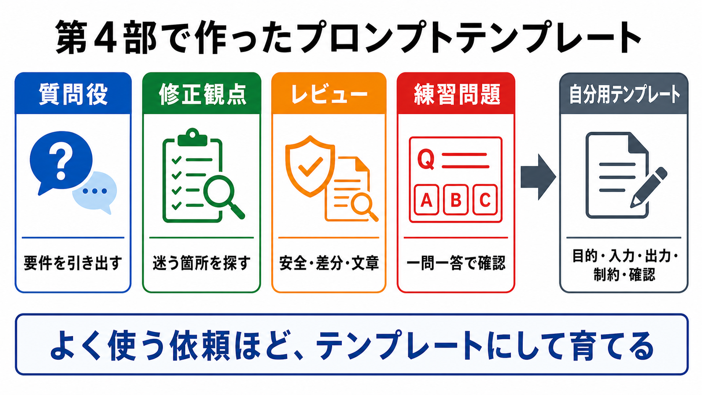

# プロンプトテンプレートを置く

この章では、よく使う依頼を、READMEやdocs配下のメモとしてまとめます。

プロンプトテンプレートは、毎回の会話で使う依頼文の型です。
AGENTS.mdに常に置くほどではないけれど、繰り返し使う依頼をまとめます。

## この章でできるようになること

- よく使う依頼をテンプレート化できる
- AGENTS.mdとプロンプトテンプレートを分けられる
- 自分の作業に合わせた依頼文を育てられる

## 置く候補

プロンプトテンプレートは、プロジェクトの中で見つけやすい場所に置きます。

たとえば、次のような場所です。

```text
docs/prompts.md
docs/ai-prompts.md
docs/templates/prompts.md
```

どこに置くかより、見つけやすく、更新しやすいことが大切です。



## テンプレートに向く依頼

テンプレートに向くのは、何度も使う依頼です。

- 変更前に計画してもらう
- 差分をレビューしてもらう
- 初学者視点で説明を見てもらう
- commit前確認をしてもらう
- 長期タスクの質問役になってもらう
- 練習問題を一問一答で出してもらう

毎回少しだけ書き換えて使うものをテンプレートにします。

## テンプレートの形

テンプレートには、次を入れます。

```text
目的:
対象:
観点:
出力形式:
禁止すること:
```

禁止することには、必要に応じて次を入れます。

```text
まだファイル編集、削除、commit、pushはしないでください。
```

AIに何をしてほしいかだけでなく、何をしないでほしいかも書きます。

## AIにテンプレート案を作らせる

AIには、まず候補を出してもらいます。

```text
このプロジェクトでよく使うプロンプトテンプレート案を作ってください。

対象:
- 計画依頼
- 差分レビュー
- commit前確認
- 長期タスクの質問役

各テンプレートには、目的、対象、観点、出力形式、禁止することを入れてください。
まだファイル編集、削除、commit、pushはしないでください。
```

候補を見て、自分が本当に使うものだけ残します。

## やってみる

自分のプロジェクトで、よく使う依頼を3つ書きます。

```text
テンプレート1:
目的:
禁止すること:

テンプレート2:
目的:
禁止すること:

テンプレート3:
目的:
禁止すること:
```

使わないテンプレートを増やすより、使うものを少なく始めます。

## AIに聞いてみよう

AIに、テンプレートの置き場所を相談します。

```text
このプロジェクトで、よく使うAI依頼文をプロンプトテンプレートとして置きたいです。

次を確認して、置き場所と最小構成を提案してください。

- READMEと役割が混ざらないか
- AGENTS.mdに置くべき内容と分けられているか
- 初回に必要なテンプレートは多すぎないか

まだファイル編集、削除、commit、pushはしないでください。
```

## 何が起きたのか

この章では、よく使う依頼をプロンプトテンプレートとして置く方法を扱いました。

テンプレートは、会話で繰り返し使う依頼文の型です。
次章では、繰り返し使う専門手順がある場合だけ、skill化を検討します。

## 次へ

次は、必要ならskillsを作ります。

- [必要ならskillsを作る](04-skill-decision.md)
