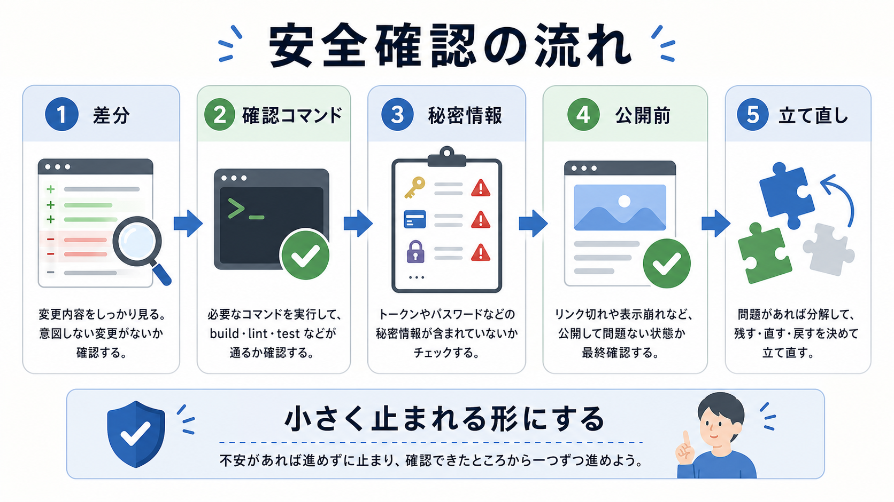

# 確認手順を整える

この章では、build、test、review、commit前確認を、自分のプロジェクトで実行できる形にします。

AIと継続開発するためには、実装依頼だけでなく、確認の流れが必要です。
何を確認すれば受け入れてよいのかを、プロジェクトごとに整理します。

## この章でできるようになること

- 自分のプロジェクトの確認コマンドを整理できる
- commit前の確認手順を作れる
- AIに確認だけを頼む依頼文を作れる

## 確認の流れ

最小の確認手順は、次の流れです。

```text
差分を見る
↓
秘密情報を確認する
↓
build、test、lintなどを確認する
↓
必要ならAIレビューを挟む
↓
人間が受け入れるか判断する
```



## 確認コマンドを探す

Node.js系のプロジェクトなら、まず `package.json` の `scripts` を見ます。
Goや他の言語なら、それぞれのプロジェクトに合わせて確認方法を探します。

確認コマンドは、次のように分類します。

```text
build:

test:

lint:

手動確認:

まだない確認:
```

ない確認があること自体は失敗ではありません。
今ある確認を把握することが目的です。

## AIに確認コマンドを調べさせる

AIに頼む場合は、まず読み取り中心です。

```text
このプロジェクトで使える確認コマンドを調べてください。

次の順でお願いします。

1. package.jsonや設定ファイルを読み、build、test、lintに相当するものを探す
2. 見つかったコマンドを一覧にする
3. それぞれが何を確認するものか説明する
4. 実行すると状態を変える可能性があるものがあれば明記する

まだコマンド実行、ファイル編集、削除、commit、pushはしないでください。
```

確認コマンドは、実行前に意味を説明させます。

## commit前チェック

commit前には、少なくとも次を確認します。

```text
git status --short
git diff
確認コマンド
秘密情報
公開対象
```

プロジェクトによっては、スクリーンショット確認やブラウザ確認も入ります。
自分のプロジェクトで必要な確認を、短いリストにします。

## やってみる

自分のプロジェクト用の確認手順を書きます。

```text
差分確認:

秘密情報確認:

build:

test:

lint:

手動確認:

commit前にAIへ頼むレビュー:
```

最初は短く作り、運用しながら増やします。

## AIに聞いてみよう

AIに、確認手順の不足をレビューしてもらいます。

```text
自分のプロジェクト用の確認手順をレビューしてください。

観点:
- 差分確認があるか
- 秘密情報確認があるか
- build、test、lintの有無が整理されているか
- 手動確認が必要な場所があるか
- commit前に止まる条件があるか

まだコマンド実行、ファイル編集、削除、commit、pushはしないでください。
```

## 何が起きたのか

この章では、自分のプロジェクト用の確認手順を整えました。

AIに任せる前後で、何を見るかを決めておくと、継続開発が安定します。
次章では、作業で見つかった改善点をAGENTS.mdやテンプレートへ反映します。

## 次へ

次は、継続的に育てます。

- [継続的に育てる](06-continuous-improvement.md)
