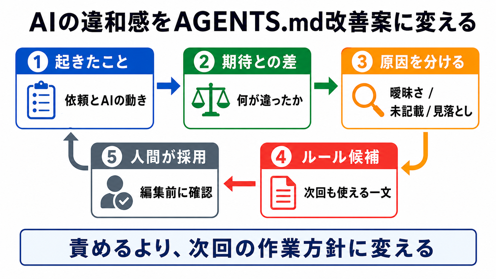

# 継続的に育てる

この章では、AIとの作業で見つかった改善点を、AGENTS.md、テンプレート、チェックリストへ反映します。

AI開発環境は、一度作って終わりではありません。
失敗や迷いを見つけたら、次に同じ失敗を減らせる形へ整理します。

## この章でできるようになること

- AIとの作業で見つかったルールを更新候補にできる
- AGENTS.md、テンプレート、チェックリストのどこを直すか判断できる
- ルールを増やしすぎない運用ができる

## 改善の入口

改善の入口は、失敗や違和感です。

たとえば、次のような場面です。

- AIが触ってほしくないファイルを編集した
- 毎回同じ確認を頼んでいる
- commit前に見るものを忘れた
- レビュー観点が毎回ぶれている
- 長期タスクで途中の条件が薄れた



## どこを直すか

見つかった改善点は、置き場所を分けます。

| 改善点 | 置き場所 |
| --- | --- |
| 常に守るルール | AGENTS.md |
| よく使う依頼文 | プロンプトテンプレート |
| commit前に見る項目 | チェックリスト |
| 特定作業の長い手順 | skill |
| まだ未確定の考え | 作業メモ |

何でもAGENTS.mdに入れると、読みづらくなります。
置き場所を分けながら育てます。

## AIに改善案を出させる

AIには、作業後に改善案を出させることができます。

```text
今回の作業を振り返り、AI開発環境に反映すべき改善案を出してください。

分類:
- AGENTS.mdに入れる候補
- プロンプトテンプレートに入れる候補
- チェックリストに入れる候補
- skill化を検討する候補
- 今は入れない候補

理由も短く説明してください。
まだファイル編集、削除、commit、pushはしないでください。
```

改善案は候補です。
採用するかどうかは、人間が決めます。

## ルールを増やしすぎない

改善したいことをすべてルールにすると、ルールが重くなります。

次の基準で絞ります。

- 同じ失敗がまた起きそうか
- 安全や公開に関わるか
- 毎回の作業で役に立つか
- 別ファイルに逃がしたほうがよいか
- 古くなったら消せるか

AI開発環境は、増やすだけでなく削ることも含めて育てます。

## やってみる

最近のAI作業を1つ振り返ります。

```text
起きたこと:

次に減らしたい失敗:

AGENTS.mdに入れる候補:

テンプレートに入れる候補:

チェックリストに入れる候補:

今は入れないこと:
```

「今は入れないこと」を決めると、ルールが増えすぎるのを防げます。

## AIに聞いてみよう

AIに、改善点の置き場所を一問一答で練習してもらいます。

```text
AI開発環境の改善点をどこに反映するか、5問の一問一答で練習したいです。

- 1問ずつ改善候補を出す
- その直下に A: AGENTS.md、B: プロンプトテンプレート、C: チェックリスト、D: skill、E: 今は入れない の選択肢を毎回表示する
- 私が回答するまで、答え、採点、解説を表示しない
- 私が回答したあと、その問題だけを採点し、理由を説明する
- 解説後に、次の問題を1問だけ出す
- ファイル編集、削除、commit、pushはしない
```

## 何が起きたのか

この章では、AI開発環境を継続的に育てる流れを扱いました。

作業で見つかった改善点を、AGENTS.md、テンプレート、チェックリスト、skill、作業メモに分けます。
次章では、第10部と発展編全体を振り返ります。

## 次へ

次は、発展編の確認です。

- [発展編の確認](07-review-ai-dev-environment.md)
