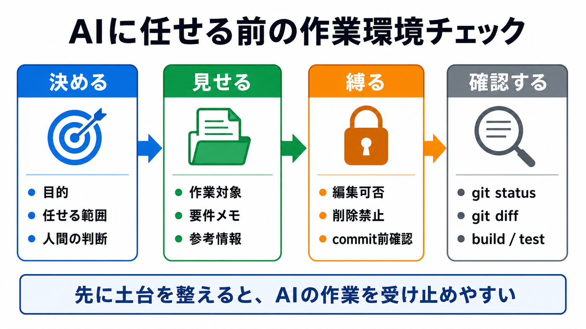

# 発展編の確認

この章では、第10部と発展編全体を振り返ります。

発展編では、AIに大きな作業を丸投げするのではなく、AIが迷わず安全に働ける作業環境を人間が設計してきました。
最後に、自分のプロジェクトで何をAIに任せ、何を人間が確認するかを説明します。

## この章でできるようになること

- 自分のAI開発環境の基本セットを説明できる
- AIに任せる範囲と人間が確認する範囲を分けられる
- 発展編の学びを自分のプロジェクトへ持ち帰れる

## 発展編で作ったもの

発展編では、次の要素を扱いました。

- AIに任せるための作業環境
- AGENTS.md
- コンテキストウィンドウと作業メモ
- プロンプトテンプレート
- skills
- 安全確認
- AIレビュー
- サブエージェント運用
- 長期タスクの進め方
- 自分用のAI開発環境



## 自分の基本セット

自分のプロジェクトでは、最初から全部を入れる必要はありません。

まずは、次の基本セットを目指します。

```text
AGENTS.md:
AIに常に守ってほしい方針

プロンプトテンプレート:
よく使う依頼文

確認手順:
差分、秘密情報、build、review、commit前確認

要件メモ:
長期タスクの正本
```

skillsやサブエージェントは、必要になってから増やします。

## AIに任せる範囲

AIに任せる範囲は、広げても構いません。
ただし、確認できる形にします。

```text
AIに任せる:
- 調査
- 下書き
- 小さな実装
- 差分レビュー
- 要件整理

人間が確認する:
- 目的
- 公開してよいか
- 秘密情報
- 採用判断
- commit、push、公開
```

AIに任せる量を増やしても、安全確認の軸を失わないことが大切です。

## やってみる

自分のプロジェクトで、AI開発環境の基本セットを説明します。

```text
プロジェクト名:

AIに任せる作業:

人間が確認する作業:

AGENTS.mdに書くこと:

テンプレートにする依頼:

確認手順:

今後育てる候補:
```

この表が書ければ、発展編の内容を自分の作業へ持ち帰る準備ができています。

## AIに聞いてみよう

AIに、発展編全体の理解確認を頼みます。

```text
AIと継続開発するための作業環境について、5問の一問一答で確認したいです。

- 1問ずつ問題を出す
- 各問題の直下に A/B/C の選択肢を毎回表示する
- 私が回答するまで、答え、採点、解説を表示しない
- 私が回答したあと、その問題だけを採点し、理由を説明する
- 解説後に、次の問題を1問だけ出す
- ファイル編集、削除、commit、pushはしない
```

## 何が起きたのか

この章では、第10部と発展編全体を振り返りました。

AI開発環境は、AIに判断を渡すためではなく、人間が目的、判断、責任を持ったまま、AIに任せられる範囲を広げるためのものです。

必要に応じて、基本編の成果物リポジトリや、自分の別プロジェクトに同じ考え方を適用していきます。

## 次へ

発展編はここで一区切りです。

- [発展編トップへ戻る](../index.md)
