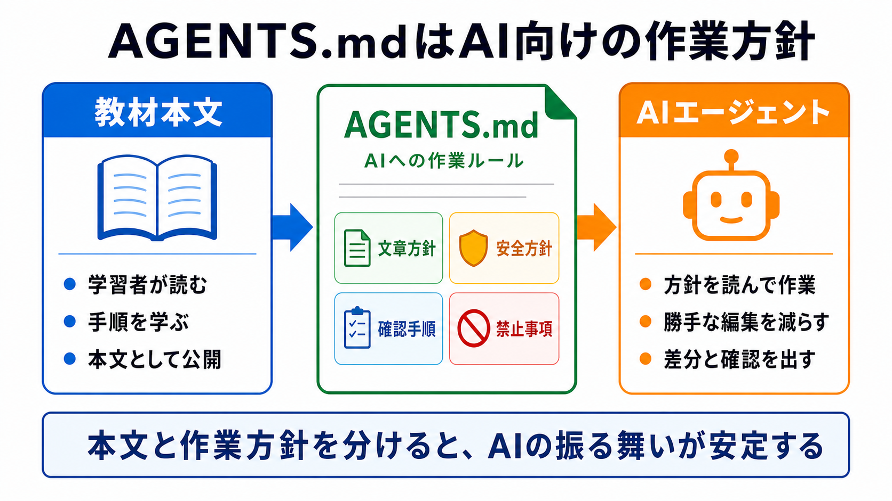

# AGENTS.mdの役割を確認する

この章では、AGENTS.mdが何のためのファイルなのかを確認します。

AGENTS.mdは、学習者が読む本文ではありません。
AIコーディングエージェントに向けて、このリポジトリではどう作業してほしいかを書くファイルです。

## この章でできるようになること

- AGENTS.mdと教材本文の役割の違いを説明できる
- AGENTS.mdに書くこと、書かないことを分けられる
- AIにAGENTS.mdの内容を確認させる依頼ができる

## AGENTS.mdはAI向けの作業方針

AGENTS.mdには、AIに毎回守ってほしい作業方針を書きます。

たとえば、次のような内容です。

- 学習者向け文章は日本語で書く
- コマンドを出すときは、目的と確認方法を説明する
- 危険な操作は事前に説明する
- 勝手にcommitやpushをしない
- 画像を追加するときは、指定された方法で作る

これは、教材本文とは役割が違います。
教材本文は学習者が読んで学ぶためのものです。
AGENTS.mdは、AIがこのリポジトリで作業するときに従うためのものです。



## 書くことと書かないこと

AGENTS.mdには、AIの作業に関係する方針を書きます。

| 書くこと | 例 |
| --- | --- |
| 文章の方針 | 学習者向けの文章は日本語で書く |
| 安全方針 | 削除、commit、pushの前に確認する |
| 編集手順 | 差分確認、build確認、画像追加時の確認 |
| 禁止事項 | SVGを勝手に作らない、秘密情報を書かない |

一方で、次のような内容はAGENTS.mdに長く書きすぎないほうがよいです。

| 書きすぎないこと | 理由 |
| --- | --- |
| 教材本文そのもの | 学習者向け本文と重複する |
| 学習ルートの詳細 | シラバスや各部indexとずれやすい |
| 長い背景知識 | リファレンスに分けたほうが読みやすい |
| 一度きりの作業メモ | 作業メモやIssueに置いたほうがよい |

AGENTS.mdは、AIが作業前に読み返す可能性があるファイルです。
長くなりすぎると、大事なルールが埋もれます。

## AIの出力はAGENTS.mdで変わる

同じ依頼でも、AGENTS.mdの内容が違うとAIの出力は変わります。

たとえば、AGENTS.mdに「ファイル編集前に変更予定を説明する」と書かれていれば、AIはすぐ編集せず、先に予定を説明しやすくなります。
逆にそのルールがなければ、AIは良かれと思ってすぐ編集するかもしれません。

これは、AIが賢いかどうかだけの問題ではありません。
人間が、AIに守ってほしい前提をどこまで明示しているかの問題でもあります。

## やってみる

教材リポジトリのルートで、AGENTS.mdを確認します。

```bash
pwd
ls AGENTS.md
```

ファイルがあることを確認したら、先頭を少しだけ見ます。

```bash
sed -n '1,80p' AGENTS.md
```

ここでは、全部を理解しなくて構いません。
次の3つを探します。

- AIが守る作業方針
- 書いてはいけないこと、やってはいけないこと
- commitやpushなど、確認が必要な操作

## AIに聞いてみよう

AIにAGENTS.mdを読ませるときは、いきなり編集させず、まず要約してもらいます。

```text
このリポジトリのAGENTS.mdの役割を確認したいです。

まず読み取りだけで、次の観点で要約してください。

- AIが守るべき作業方針
- 禁止されていること
- commitやpushの前に必要な確認
- 学習者向け本文とAGENTS.mdで分けている内容

まだファイル編集、削除、commit、pushはしないでください。
```

この依頼では、AIに「作業方針を理解したか」を確認させています。
AGENTS.mdを編集するのは、内容を把握してからです。

## 何が起きたのか

AGENTS.mdは、AIにとっての作業ルールです。

教材本文のように、学習者へ順番に説明するためのファイルではありません。
そのため、AGENTS.mdに教材内容を詰め込みすぎると、本文、シラバス、各部indexと役割が混ざります。

第2部では、このAGENTS.mdを小さく始め、AIとの作業で少しずつ育てる方法を扱います。

## 次へ

次は、最小のAGENTS.mdを書きます。
まずは少ないルールで始め、必要になったものだけを追加していきます。
