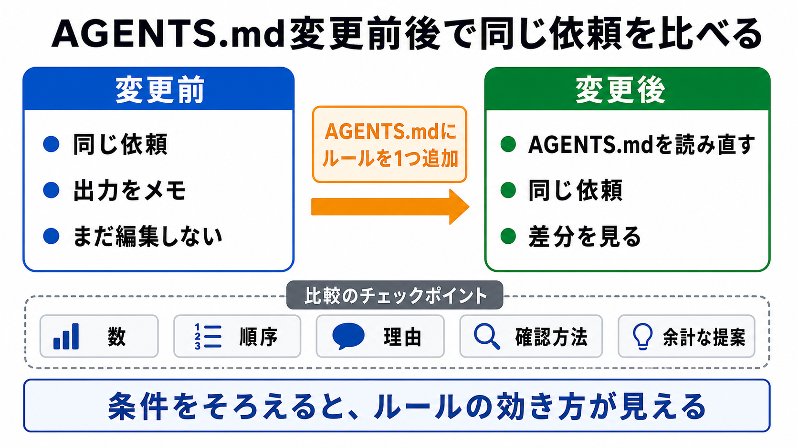

# 同じ依頼をAGENTS.md変更前後で比べる

この章では、AGENTS.mdの内容によってAIの出力が変わることを確認します。

AGENTS.mdは、書いて終わりではありません。
本当に効いているかを、同じ依頼で比べると理解しやすくなります。

## この章でできるようになること

- AGENTS.mdの変更前後でAIの出力を比較できる
- 同じ依頼で比べる理由を説明できる
- AGENTS.mdを変更したあと、AIに読み直してもらう確認ができる

## なぜ同じ依頼で比べるのか

AIの出力は、依頼文、見えているファイル、会話の流れ、作業方針の影響を受けます。

AGENTS.mdの効果を見たいなら、できるだけ他の条件をそろえます。
そのため、同じ依頼を2回出して比べます。

1回目は、AGENTS.mdのルールを追加する前の出力です。
2回目は、AGENTS.mdのルールを追加した後の出力です。



## 比べるときの流れ

安全に比べるために、まずは読み取りだけの依頼で試します。

たとえば、次のような依頼です。

```text
このプロジェクトのREADMEを改善するなら、どこを直すとよいか教えてください。
まだファイル編集はしないでください。
```

この依頼なら、AIの出力の違いを見やすく、ファイル変更も発生しません。

流れは次のとおりです。

1. 変更前のAGENTS.mdで、同じ依頼を出す
2. AIの出力をメモする
3. AGENTS.mdに小さなルールを1つ追加する
4. AIにAGENTS.mdを読み直したか確認する
5. 同じ依頼をもう一度出す
6. 出力の違いを比べる

ここで大事なのは、追加するルールを1つに絞ることです。
一度にたくさん変えると、どのルールが効いたのかわかりにくくなります。

## 追加するルールの例

たとえば、AGENTS.mdに次のようなルールを追加したとします。

```markdown
## 回答方針

- 改善案を出すときは、まず重要度が高い順に3つだけ挙げてください。
- それぞれについて、理由と確認方法を短く書いてください。
```

このルールを追加した後に同じ依頼を出すと、AIの出力が次のように変わる可能性があります。

- 改善案の数が絞られる
- 重要度順に並ぶ
- 理由と確認方法が入る
- 長い一般論が減る

このように、AGENTS.mdはAIの出力の形を整えるためにも使えます。

## 読み直しを確認する

AGENTS.mdを変更したあと、AIがすぐに新しい内容を読んでいるとは限りません。
ツールやセッションの状態によって、読み込みのタイミングは変わります。

そのため、教材では次のように確認します。

```text
AGENTS.mdを更新しました。
まず、最新のAGENTS.mdを読み直してください。
そのうえで、今回追加されたルールを3つ以内で要約してください。
まだファイル編集はしないでください。
```

AIが最新のルールを要約できれば、少なくともその会話では新しい内容を見ています。

うまく反映されていないように見える場合は、新しいセッションで試すか、AIにAGENTS.mdの該当箇所を読み直してもらいます。
どの方法で読み直されるかはツールによって違うため、思い込みで進めないことが大切です。

## やってみる

練習用のプロジェクトで、次のように比べます。

```text
変更前の依頼:
このプロジェクトのREADMEを改善するなら、どこを直すとよいか教えてください。
まだファイル編集はしないでください。

追加するAGENTS.mdのルール:
改善案を出すときは、重要度が高い順に3つだけ挙げ、理由と確認方法を短く書いてください。

変更後の依頼:
このプロジェクトのREADMEを改善するなら、どこを直すとよいか教えてください。
まだファイル編集はしないでください。
```

出力を比べるときは、次を見ます。

- 改善案の数は変わったか
- 重要度順になったか
- 理由が入ったか
- 確認方法が入ったか
- 余計な作業提案が減ったか

## AIに聞いてみよう

AIに比較表を作ってもらうと、違いを見やすくなります。

```text
AGENTS.md変更前後のAI出力を比較したいです。

これから、変更前の出力と変更後の出力を貼ります。
次の観点で比較表を作ってください。

- 改善案の数
- 重要度順になっているか
- 理由があるか
- 確認方法があるか
- 余計な作業提案が減ったか

比較だけをしてください。
まだファイル編集、削除、commit、pushはしないでください。
```

この依頼では、AIに採点や編集をさせるのではなく、出力の差を整理させています。

## 何が起きたのか

AGENTS.mdを変えると、AIへの依頼文を毎回長くしなくても、出力の前提を変えられます。

ただし、AGENTS.mdに書けば必ず完璧に守られるわけではありません。
AIが守っているかを、同じ依頼で比べ、差分として確認することが大切です。

次章では、実際にうまくいかなかったAIの振る舞いから、AGENTS.mdに追加するルールを考えます。

## 次へ

次は、AIにAGENTS.mdの改善案を出させます。
