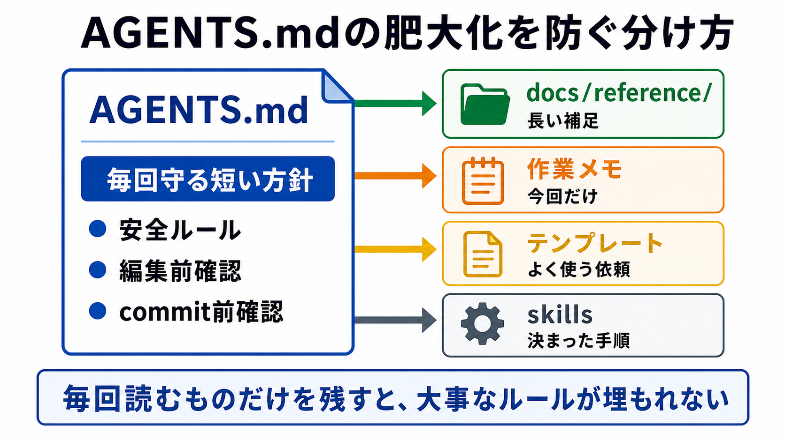

# AGENTS.mdの肥大化を防ぐ

この章では、AGENTS.mdに書くものと、外へ分けるものを整理します。

AGENTS.mdは、AIに毎回守ってほしい作業方針を書く場所です。
便利だからといって何でも入れると、長くなりすぎて、大事なルールが見つけにくくなります。

## この章でできるようになること

- AGENTS.mdに残すべき内容を判断できる
- リファレンス、作業メモ、テンプレート、skillsへ分ける考え方を説明できる
- AGENTS.mdやCLAUDE.mdが肥大化したときの整理方針を立てられる

## 常に読むものだけを残す

AGENTS.mdには、AIが毎回読んでほしい方針を残します。

たとえば、次のようなものです。

- 文章の基本方針
- 安全上の禁止事項
- commitやpushの前の確認
- 画像や問題の作り方の基本方針
- そのリポジトリで絶対に守る編集ルール

一方で、長い背景説明や、一度きりの作業メモまで入れると重くなります。



## 外へ分ける候補

AGENTS.mdから外へ分ける候補は、次のように考えます。

| 置き場所 | 向いている内容 |
| --- | --- |
| AGENTS.md | 毎回守る短い作業方針 |
| docs/reference/ | 背景知識、詳しい説明、長い補足 |
| 作業メモ | そのタスクだけで使う一時的な情報 |
| プロンプトテンプレート | 何度も使う依頼文の型 |
| skills | 決まった手順や専門的な作業のまとまり |

どこに置くか迷ったら、「AIが毎回読むべきか」を考えます。
毎回必要ないなら、AGENTS.mdから外へ出す候補です。

## CLAUDE.mdなども同じ問題を持つ

ツールによっては、AGENTS.mdとは別の名前の方針ファイルを使うことがあります。
たとえば、CLAUDE.mdのようなファイルを使う環境もあります。

名前が違っても、肥大化の問題は同じです。

毎回読む方針ファイルに、全部を詰め込みすぎると、次の問題が起きます。

- 重要な禁止事項が埋もれる
- 古いルールが残り続ける
- その場限りのメモが混ざる
- AIに読ませたい優先順位がわかりにくくなる

方針ファイルは、短く、更新しやすく保つほうが長く使えます。

## 分ける判断基準

AGENTS.mdに残すか迷ったら、次の質問で判断します。

- これは毎回の作業で必要か
- これは短い行動ルールとして書けるか
- これはプロジェクト全体に関係するか
- これは古くなっても気づけるか
- これは別ファイルへのリンクで足りるか

たとえば、次のように分けられます。

```text
AGENTS.mdに残す:
- ファイル編集前に、変更予定ファイルと理由を説明する

リファレンスへ分ける:
- このプロジェクトで使う画像生成手順の詳しい説明

作業メモへ分ける:
- 今回だけ使う第2部の章追加チェックリスト
```

## AIに整理案を出させる

AGENTS.mdが長くなってきたら、AIに整理案を出してもらいます。
ただし、最初から編集させません。

```text
AGENTS.mdが長くなってきたので、整理案を出してください。

次の観点で分類してください。

- AGENTS.mdに残すもの
- docs/reference/へ分けるとよいもの
- 作業メモへ分けるとよいもの
- プロンプトテンプレート化できるもの
- skills化を検討できるもの

条件:
- まだファイル編集はしない
- 削除案ではなく、移動または分離の案として出す
- 重要な安全ルールはAGENTS.mdに残す
- 理由を短く書く
```

AIに分類させると、人間が見落としていた重複や、一度きりのメモを見つけやすくなります。

## やってみる

自分のプロジェクトで、AGENTS.mdに入れたいと思った内容を3つ挙げます。
それぞれについて、置き場所を選びます。

```text
内容1:
置き場所: AGENTS.md / reference / 作業メモ / テンプレート / skills
理由:

内容2:
置き場所: AGENTS.md / reference / 作業メモ / テンプレート / skills
理由:

内容3:
置き場所: AGENTS.md / reference / 作業メモ / テンプレート / skills
理由:
```

最初は迷って構いません。
迷うこと自体が、AGENTS.mdを育てる練習になります。

## 何が起きたのか

AGENTS.mdは、AIに毎回守らせたい方針を置く場所です。

そこに背景知識、作業メモ、長い手順、テンプレートを全部入れると、方針ファイルとして読みにくくなります。
発展編では、AGENTS.mdだけでなく、リファレンス、テンプレート、skills、作業メモを使い分けていきます。

次章では、第2部全体を確認し、自分のプロジェクトでAGENTS.mdに残すものと外へ逃がすものを整理します。

## 次へ

次は、第2部の確認です。

- [第2部の確認](06-review-agents-md.md)
