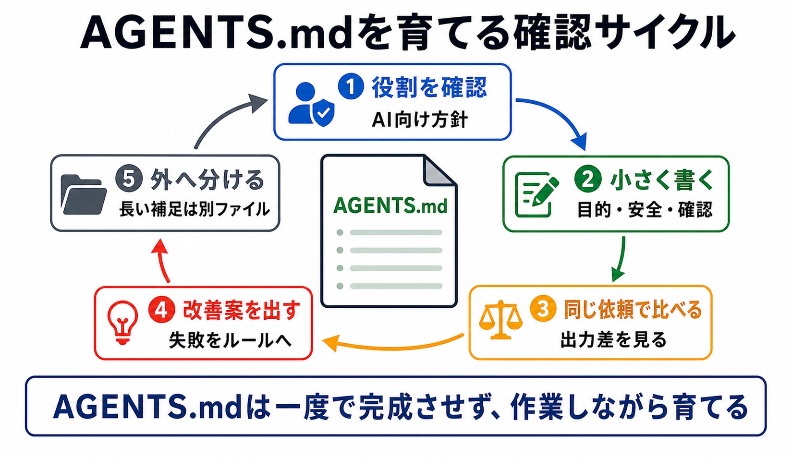

# 第2部の確認

この章では、第2部で扱ったAGENTS.mdの考え方を、自分のプロジェクトに当てはめて確認します。

AGENTS.mdは、AIのための作業方針です。
一度書いて終わりではなく、AIとの作業を通じて育てていきます。

## この章でできるようになること

- 自分のプロジェクトに必要なAGENTS.mdの項目を棚卸しできる
- AGENTS.mdに残すものと、外へ分けるものを判断できる
- AIにAGENTS.mdの点検を依頼できる

## 第2部で見たこと

第2部では、AGENTS.mdを次の順番で扱いました。

- 役割を確認する
- 最小構成を書く
- 変更前後で出力を比べる
- AIに改善案を出させる
- 肥大化を防ぐ

この流れは、そのままAGENTS.mdを育てる手順になります。



## 自分のAGENTS.mdを点検する

自分のプロジェクトにAGENTS.mdがある場合は、次の観点で確認します。

| 観点 | 確認すること |
| --- | --- |
| 役割 | AI向けの作業方針になっているか |
| 最小構成 | 目的、方針、安全、確認が入っているか |
| 効果 | 同じ依頼で出力差を確認できるか |
| 改善 | AIの失敗からルール候補を作れるか |
| 分離 | 長い補足や一時メモを外へ分けられるか |

まだAGENTS.mdがない場合は、全部を埋めようとしなくて構いません。
まずは、危険な操作、commit、push、秘密情報の扱いだけでも書けると十分です。

## 残すものと外へ分けるもの

次の表を使って、AGENTS.mdに残すかどうかを判断します。

```text
内容:

これは毎回必要か:

短い行動ルールとして書けるか:

プロジェクト全体に関係するか:

長い補足になっていないか:

置き場所:
AGENTS.md / docs/reference / 作業メモ / テンプレート / skills
```

AGENTS.mdに残す判断だけが正解ではありません。
外へ分ける判断も、AI作業を安定させるための大事な設計です。

## やってみる

自分のプロジェクトについて、次の3つを書き出します。

```text
AGENTS.mdにすでに書いてある、または書きたいルール:

外へ分けたほうがよさそうな長い説明:

AIに同じ失敗を繰り返してほしくないこと:
```

書き出したら、それぞれを次のどれかに分類します。

- AGENTS.mdに残す
- docs/reference/へ分ける
- 作業メモへ置く
- テンプレート化する
- skills化を検討する

## AIに聞いてみよう

AIにAGENTS.mdの棚卸しを頼む場合は、編集ではなく診断から始めます。

```text
このプロジェクトのAGENTS.mdを点検したいです。

まず読み取りだけで、次の観点で診断してください。

- AGENTS.mdに残すべき短い作業方針
- 長すぎる、または重複している可能性がある箇所
- docs/reference/へ分けるとよさそうな内容
- 作業メモへ分けるとよさそうな内容
- 次に追加するとよさそうな安全ルール

条件:
- まだファイル編集はしない
- 削除ではなく、整理案として出す
- 重要な安全ルールは残す前提で考える
- 理由を短く書く
```

この依頼では、AIにAGENTS.mdを勝手に直させません。
まず診断してもらい、人間が採用する整理方針を決めます。

## 何が起きたのか

第2部では、AGENTS.mdをAIに対する作業方針として扱いました。

重要なのは、AGENTS.mdを書くこと自体ではありません。
AIの出力を見て、うまくいったこと、危なかったこと、毎回伝えていることを、次の作業に活かせる形にすることです。

次の第3部では、会話の中に入る情報量、resume、compact、作業メモの扱いを整理します。

## 次へ

次は、コンテキストウィンドウと作業メモを理解します。

- [コンテキストウィンドウを理解する](../part-3-context-window-notes/01-context-window-basics.md)
