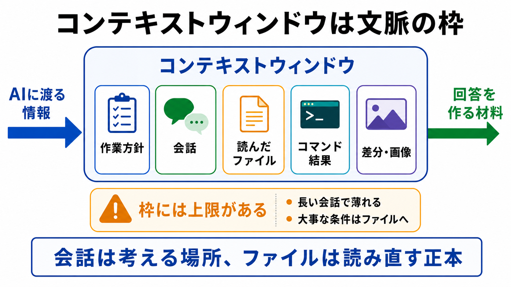

# コンテキストウィンドウを理解する

この章では、AIが一度に扱える文脈には上限があることを確認します。

AIと長く会話していると、最初に話した条件が薄れたり、途中の細かい決定が拾われにくくなったりします。
これは、AIが不誠実だからではなく、AIが扱う文脈に枠があるからです。

## この章でできるようになること

- コンテキストウィンドウを「AIが一度に参照する文脈の枠」として説明できる
- 長い会話で条件が抜けやすくなる理由を説明できる
- 大事な条件を会話だけでなくファイルに残す理由を説明できる

## コンテキストウィンドウとは

コンテキストウィンドウとは、AIが回答を作るときに一度に参照できる情報の枠です。

ここには、たとえば次のような情報が入ります。

- システムやリポジトリの作業方針
- ユーザーとの会話
- AIが読んだファイルの内容
- コマンドの実行結果
- 画像や差分など、会話に渡された情報

ただし、すべてが無限に入るわけではありません。
会話が長くなったり、大きなファイルをたくさん読ませたりすると、古い情報や細かい条件が扱いにくくなります。



## AIの記憶任せにしない

AIは、会話の流れを見ながら作業してくれます。
しかし、長い作業をすべて会話の記憶だけに頼ると、次のようなことが起きます。

- 最初に決めた条件が抜ける
- 途中で決めた「やらないこと」を忘れたように見える
- 似た話題が混ざる
- 最新の方針と古い方針が混ざる
- compactやresumeのあとに、前提が曖昧になる

この問題を避けるために、大事な条件はファイルに残します。

会話は、考える場所です。
ファイルは、あとで読み直すための正本です。

## 会話とファイルの役割を分ける

AIとの壁打ちでは、会話の中でたくさんのアイデアが出ます。
しかし、すべての会話ログがそのまま仕様になるわけではありません。

次のように分けると扱いやすくなります。

| 種類 | 役割 |
| --- | --- |
| 会話 | アイデア出し、質問、検討 |
| 要件メモ | 決まったこと、未決定のこと、やらないこと |
| AGENTS.md | AIに毎回守ってほしい作業方針 |
| 参考資料 | 必要なときに読む補助コンテキスト |

この分け方をすると、セッションが変わっても、AIにファイルを読ませ直して作業を再開しやすくなります。

## 長い会話で起きやすいこと

たとえば、会話の最初に次のように言ったとします。

```text
今回はスマホ対応はしません。
```

その後、要件の話、画面設計、実装方針、テスト方針を長く話しているうちに、AIがスマホ対応の提案をしてくることがあります。

このとき、毎回怒るよりも、次のように扱います。

```text
要件メモに「今回はスマホ対応しない」と明記します。
以後、このメモを読んでから提案してください。
```

重要な条件をファイルに残すと、AIに読み直してもらいやすくなります。

## やってみる

次の3つを、会話に置くものとファイルに残すものに分けてみます。

```text
1. その場で思いついたアイデア
2. 採用することが決まった要件
3. 今後もAIに守ってほしい作業方針
```

答えの一例です。

```text
1. 会話
2. 要件メモ
3. AGENTS.md
```

大事なのは、全部を会話に置きっぱなしにしないことです。

## AIに聞いてみよう

AIに、会話とファイルの分け方を確認してもらいます。

```text
これからAIとの会話で出た情報を整理したいです。

次の情報を、会話に残すもの、要件メモに書くもの、AGENTS.mdに書くもの、参考資料として扱うものに分類してください。

- その場で出たアイデア
- 採用することが決まった要件
- 今回はやらないこと
- AIに毎回守ってほしい作業方針
- 公式ドキュメントへのリンク
- 一度だけ使う作業メモ

分類だけをしてください。
まだファイル編集、削除、commit、pushはしないでください。
```

この依頼では、AIに作業を進めさせる前に、情報の置き場所を整理させています。

## 何が起きたのか

コンテキストウィンドウは、AIが一度に参照する文脈の枠です。

長い会話では、すべてを会話の流れだけに頼るのではなく、決まったことをファイルに残します。
これが、次章で扱う「AIに質問役を頼む」流れにつながります。

AIに質問してもらい、人間が回答し、その結果を要件メモに起こすことで、長い作業の土台を作ります。

## 次へ

次は、AIに質問役を頼みます。
