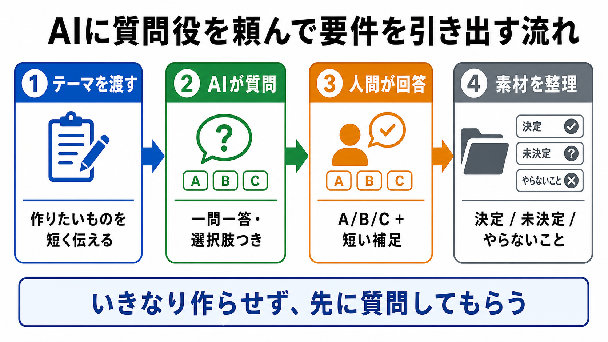

# AIに質問役を頼む

この章では、人間が最初から要件を全部書くのではなく、AIに質問役を頼んで要件を固める方法を扱います。

AIに「これを作って」といきなり頼むと、人間が書き忘れた前提をAIが推測で埋めることがあります。
発展編では、AIに先に質問してもらい、人間が答えながら要件を整理します。

## この章でできるようになること

- AIに質問役を頼む理由を説明できる
- 一問一答形式で要件を引き出してもらえる
- AIの質問から、要件メモに残す材料を集められる

## なぜAIに質問してもらうのか

人間は、自分にとって当たり前のことを書き忘れます。

たとえば、次のような前提です。

- 誰が使うのか
- どの画面が最初に必要か
- 何を今回はやらないのか
- どんな見た目にしたいのか
- どこまでAIに作業を任せるのか

AIに質問役を頼むと、こうした抜けを先に拾いやすくなります。



## 一問一答にする

質問は、一問一答形式にすると答えやすくなります。

AIにまとめて10問出されると、読むだけで大変です。
また、途中で答えが変わったり、前の回答を見て次の質問を調整してほしいこともあります。

そのため、次のように頼みます。

```text
一問一答形式にしてください。
1問ずつ質問し、私の回答を待ってください。
```

さらに、選択肢を毎回表示してもらうと、初学者でも答えやすくなります。

```text
各質問では、A/B/Cの選択肢も毎回表示してください。
A/B/Cだけで答えにくい場合は、短く自由記述してよいことも書いてください。
```

## 最初に頼むプロンプト

AIに質問役を頼むときは、次のように依頼できます。

```text
これから小さなWebアプリの要件を整理したいです。

私に質問して、要件を引き出してください。

条件:
- 質問は7問
- 一問一答形式にする
- 1問ずつ質問し、私の回答を待つ
- 各質問では、A/B/Cの選択肢も毎回表示する
- A/B/Cだけで答えにくい場合は、短く自由記述してよいことも書く
- 7問が終わったら、回答をもとに要件メモのたたき台をMarkdownで出す
- まだファイル編集、削除、commit、pushはしない

確認したい観点は、目的、利用者、最初に作る機能、やらないこと、見た目、確認方法、AIに任せる範囲です。
```

ここでは、AIに作業を始めさせていません。
まず質問してもらい、要件を引き出すことに集中しています。

## 質問数は少なめに始める

最初から20問も出してもらうと、回答する側が疲れます。

まずは5問から7問くらいで始めると扱いやすいです。
足りなければ、最後に追加質問をしてもらいます。

```text
ここまでの回答を見て、要件を固めるために追加で確認したいことがあれば、3問以内で質問してください。
```

質問を増やすことが目的ではありません。
AIが作業に入る前に、必要な前提をそろえることが目的です。

## 回答をそのまま正本にしない

一問一答で出た回答は、まだ素材です。

会話の中には、迷い、保留、仮の案も混ざります。
そのため、会話ログをそのまま正本にせず、次章で要件メモとして整理します。

分類するときは、次の4つに分けます。

- 決まったこと
- 未決定のこと
- やらないこと
- AIに任せること

この分類をしておくと、あとから別セッションで読み直しても作業を再開しやすくなります。

## やってみる

次のテーマで、AIに質問役を頼んでみます。

```text
テーマ:
学習ログを記録する小さなWebアプリを作りたい
```

AIに出す依頼は、前のプロンプトをそのまま使って構いません。
回答するときは、A/B/Cだけでもよいですし、必要なら短い補足を書きます。

## AIに聞いてみよう

AIに、質問の質をあとで振り返ってもらうこともできます。

```text
いまの一問一答で出た質問を振り返りたいです。

次の観点で評価してください。

- 要件を固めるために役立った質問
- まだ足りない質問
- 似た質問や重複していた質問
- 次に聞くならよい追加質問

評価だけをしてください。
まだファイル編集、削除、commit、pushはしないでください。
```

質問の質を振り返ると、自分のプロジェクトで使いやすい質問テンプレートが見えてきます。

## 何が起きたのか

この章では、AIに作業者ではなく質問役を頼みました。

AIに質問してもらうと、人間が書き忘れていた前提を拾いやすくなります。
ただし、会話で出た回答はまだ素材です。

次章では、この会話の結果をMarkdownの要件メモに整理し、あとから読み直せる正本にします。

## 次へ

次は、要件メモを正本にします。
