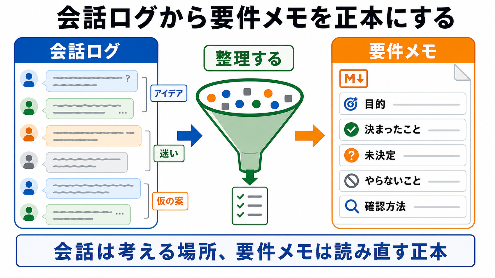

# 要件メモを正本にする

この章では、AIとの壁打ちで決まったことをMarkdownの要件メモに整理します。

会話は、考えるための場所です。
しかし、長い作業を進めるときは、会話ログそのものを正本にしないほうが安定します。
あとから読み直すための要件メモを作ります。

## この章でできるようになること

- 会話ログと要件メモの違いを説明できる
- 要件メモに入れる項目を分けられる
- AIに要件メモのたたき台を作らせる依頼ができる

## 正本とは何か

ここでいう正本とは、あとから作業の前提として読み直すファイルのことです。

AIとの会話では、途中で迷った案、採用しなかった案、あとで考えることが混ざります。
それをそのまま作業の前提にすると、AIも人間も迷います。

要件メモでは、会話の中から作業に必要な情報だけを取り出します。



## 要件メモに入れるもの

最初は、次の項目があれば十分です。

```markdown
# 要件メモ

## 目的

## 利用者

## 決まったこと

## 未決定のこと

## 今回やらないこと

## AIに任せること

## 人間が判断すること

## 確認方法
```

この構成は、完璧な仕様書ではありません。
AIに作業を始めてもらう前に、最低限の前提をそろえるためのメモです。

## 決定と未決定を分ける

要件メモで特に大事なのは、決まったことと未決定のことを分けることです。

たとえば、次のように書きます。

```markdown
## 決まったこと

- 学習ログを記録するWebアプリを作る
- 最初はログ一覧と新規追加だけを作る
- 見た目はシンプルで、スマホ最適化は後回しにする

## 未決定のこと

- ログの編集機能を最初から入れるか
- データをどこに保存するか
```

未決定のことを無理にAIに決めさせる必要はありません。
未決定として残すことで、あとから人間が判断できます。

## やらないことを書く

要件メモには、やることだけでなく、やらないことも書きます。

```markdown
## 今回やらないこと

- ログイン機能
- スマホ最適化
- 外部API連携
- 本番公開
```

やらないことを書くと、AIの提案が広がりすぎるのを防ぎやすくなります。
AIが良かれと思って追加提案してくる場合でも、要件メモを見れば止められます。

## 秘密情報は書かない

要件メモにも、秘密情報は書きません。

書かないものの例です。

- APIキー
- トークン
- パスワード
- 秘密鍵
- 認証コード
- `.env` の中身

要件メモは、AIに読ませる前提のファイルです。
AIに読ませる可能性があるファイルには、秘密情報を書かない習慣を保ちます。

## AIにたたき台を作らせる

AIとの一問一答が終わったら、要件メモのたたき台を作らせます。

```text
ここまでの一問一答をもとに、要件メモのたたき台をMarkdownで作ってください。

次の見出しで整理してください。

- 目的
- 利用者
- 決まったこと
- 未決定のこと
- 今回やらないこと
- AIに任せること
- 人間が判断すること
- 確認方法

条件:
- 会話に出ていないことを勝手に決めない
- 未決定のものは未決定として残す
- APIキー、トークン、パスワードなどの秘密情報は書かない
- まだファイル編集、削除、commit、pushはしない
```

最初は、AIに本文をファイルへ書かせず、画面上にたたき台を出してもらいます。
内容を確認してから、必要であればファイル化します。

## やってみる

前章でAIに質問してもらった内容を使い、要件メモのたたき台を作ります。

まだ実ファイルにしなくても構いません。
まずは、画面上で次の3つが分かれているかを確認します。

- 決まったこと
- 未決定のこと
- 今回やらないこと

この3つが混ざっている場合は、AIに整理し直してもらいます。

```text
決まったこと、未決定のこと、今回やらないことが混ざっているように見えます。
この3つを分け直してください。
会話に出ていないことは追加しないでください。
```

## AIに聞いてみよう

AIに要件メモをレビューしてもらうこともできます。

```text
この要件メモを、AIに作業を頼む前の前提としてレビューしてください。

次の観点で確認してください。

- 決まったことと未決定のことが分かれているか
- 今回やらないことが明記されているか
- AIに任せることと人間が判断することが分かれているか
- 確認方法が書かれているか
- 秘密情報が含まれていないか

レビューだけをしてください。
まだファイル編集、削除、commit、pushはしないでください。
```

レビューの目的は、要件メモを完璧にすることではありません。
AIが作業を始める前に、危ない抜けを見つけることです。

## 何が起きたのか

この章では、会話で出た情報をMarkdownの要件メモに整理しました。

会話ログは思考の流れです。
要件メモは作業の前提です。
この2つを分けることで、あとからセッションを再開したときにも、AIに同じ前提を読ませ直しやすくなります。

次章では、resumeやcompactのあとに、どのファイルをAIへ読み直させるかを扱います。

## 次へ

次は、resumeとcompactのあとに読み直します。

- [resumeとcompactのあとに読み直す](04-reread-after-resume-compact.md)
