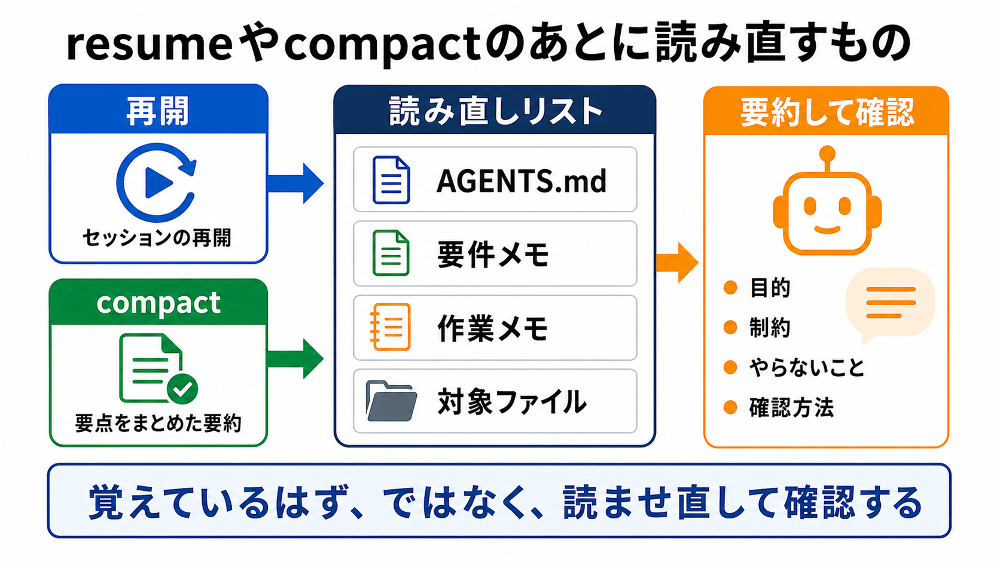

# resumeとcompactのあとに読み直す

この章では、セッションを再開したあとや、compactのあとに、AIへ何を読み直させるべきかを整理します。

AIとの作業が長くなると、会話を再開したり、途中で要約された状態から続けたりすることがあります。
そのときに、AIが必要な前提をすべて正確に持っているとは限りません。

## この章でできるようになること

- resumeとcompactを、作業再開時の文脈管理として説明できる
- 再開後にAIへ読ませ直すファイルを選べる
- AIが最新の方針を読んでいるか確認できる

## resumeとcompactを分けて考える

ツールによって名前や挙動は違いますが、大きく分けると次のように考えます。

| 用語 | ここでの意味 |
| --- | --- |
| resume | 以前のセッションや作業の続きを再開すること |
| compact | 長くなった文脈を要約し、続きの作業をしやすくすること |

どちらの場合も、「AIが全部を完全に覚えている」とは考えません。
作業の前提として重要なファイルを、明示的に読ませ直します。



## 読ませ直す候補

作業再開時に読ませ直す候補は、次のようなファイルです。

- AGENTS.md
- 要件メモ
- 作業メモ
- 直前の差分
- 関連する章や設計メモ

すべてを毎回読む必要はありません。
作業に必要なものを選びます。

たとえば、要件メモをもとに実装を続けるなら、要件メモとAGENTS.mdは読ませたい候補です。
文章修正なら、対象の章とAGENTS.mdを読ませます。

## 再開時の依頼

セッションを再開したら、いきなり作業を頼まず、まず前提を読み直してもらいます。

```text
作業を再開します。

まず次のファイルを読み直してください。

- AGENTS.md
- docs/notes/requirements.md
- これから修正する対象ファイル

読み直したあと、次を短く要約してください。

- 今回の目的
- 守るべき作業方針
- 今回やらないこと
- 変更前に確認すること

まだファイル編集、削除、commit、pushはしないでください。
```

この依頼では、AIに作業を始めさせる前に、前提をそろえています。

## 読み直せているか確認する

AIが「読みました」と言っても、どこまで読めているかは確認したほうが安全です。

次のように、要約させます。

```text
読み直した内容から、今回の作業で特に重要な制約を3つだけ挙げてください。
それぞれ、どのファイルに書かれていたかも添えてください。
```

ファイル名つきで要約できれば、AIが少なくともその情報を参照しています。
要約が曖昧なら、読むべきファイルを絞って再度依頼します。

## AGENTS.mdの読み直しも確認する

AGENTS.mdを更新したあと、AIが最新の内容を読んでいるかも確認します。

```text
AGENTS.mdを更新しました。
最新のAGENTS.mdを読み直して、今回追加または変更された作業方針を3つ以内で要約してください。
まだファイル編集はしないでください。
```

ツールによって、AGENTS.mdやCLAUDE.mdの読み込みタイミングは異なります。
そのため、「compactすれば必ず読み直される」と決めつけず、AIに最新内容を説明させて確認します。

## やってみる

次の状況を想定します。

```text
昨日、AIと壁打ちして要件メモを作った。
今日は別セッションで、その要件メモをもとに作業を再開したい。
```

この場合、AIに最初に頼むことを1つ書きます。

例です。

```text
作業を再開します。
まずAGENTS.mdとdocs/notes/requirements.mdを読み直し、今回の目的、やらないこと、確認方法を要約してください。
まだファイル編集はしないでください。
```

## AIに聞いてみよう

AIに、再開時の読み直しリストを作らせます。

```text
AIとの作業を別セッションで再開します。

再開前に、AIへ読ませ直すべきファイルの候補を整理してください。

次の観点で分類してください。

- 必ず読むもの
- 作業内容によって読むもの
- 読ませないほうがよいもの

条件:
- 作業対象と補助情報を混同しない
- 秘密情報を含むファイルは読ませない
- まだファイル編集、削除、commit、pushはしない
```

再開時の読み直しリストを作っておくと、作業の抜けや混乱を減らせます。

## 何が起きたのか

resumeやcompactは、長い作業を続けるために便利です。
しかし、AIが必要な前提を常に完全に持っているとは限りません。

重要な条件は、要件メモやAGENTS.mdのようなファイルに残します。
そして、再開時にはそれらを明示的に読ませ直し、要約させて確認します。

次章では、作業対象の外にある補助コンテキストをAIに読ませる方法を扱います。

## 次へ

次は、補助コンテキストを使います。

- [補助コンテキストを使う](05-use-supporting-context.md)
