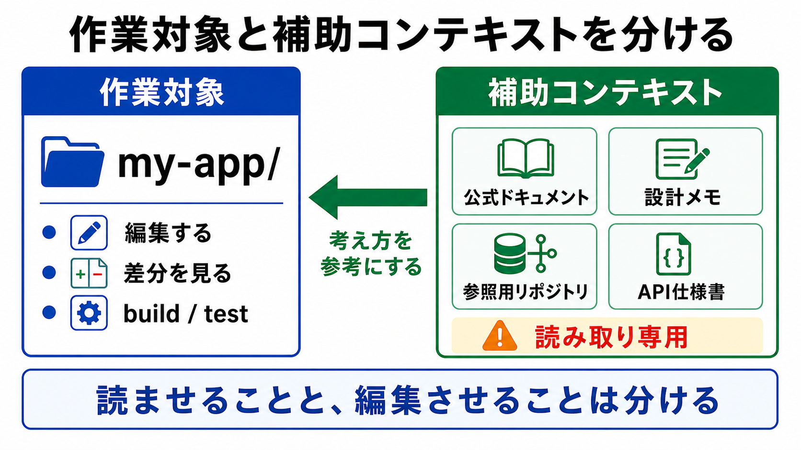

# 補助コンテキストを使う

この章では、作業対象の外にある情報を、補助コンテキストとしてAIに読ませる方法を扱います。

基本編では、AIに見せる範囲をむやみに広げないことを重視しました。
発展編では、その考え方を保ったまま、必要な参照情報を安全に追加する方法を学びます。

## この章でできるようになること

- 作業対象と補助コンテキストを区別できる
- AIに参照情報を読ませる依頼ができる
- 補助コンテキストを読み取り中心に扱う理由を説明できる

## 補助コンテキストとは

補助コンテキストとは、作業対象ではないけれど、AIが理解する助けになる情報です。

たとえば、次のようなものです。

- 公式ドキュメント
- 公式サンプル
- 設計メモ
- 過去の実装例
- 参照用にcloneしたリポジトリ
- チーム内のコーディング規約
- API仕様書

これらは、AIに作業してほしいファイルそのものではありません。
あくまで、判断の参考にするための情報です。



## 作業対象と混同しない

補助コンテキストを使うときに一番大事なのは、作業対象と混同しないことです。

たとえば、次のように分けます。

```text
作業対象:
my-app/

補助コンテキスト:
references/sample-app/
docs/reference/api-spec.md
```

AIには、次のように伝えます。

```text
作業対象は my-app/ です。
references/sample-app/ は参照専用です。
参照用リポジトリは読んで構いませんが、編集しないでください。
```

この一文がないと、AIが参照用のファイルまで作業対象だと誤解する可能性があります。

## 読み取り中心にする

補助コンテキストは、基本的に読み取り中心に扱います。

特に、参照用にcloneしたOSSリポジトリや公式サンプルは、自分のプロジェクトではありません。
AIに勝手に編集させる必要はありません。

```text
このリポジトリは参照専用です。
必要な実装パターンを読んで説明してください。
ファイル編集、削除、commit、pushはしないでください。
```

補助コンテキストから得た知識を、作業対象のリポジトリへどう反映するかは、人間が判断します。

## 参照情報を指定する

AIに「参考にして」とだけ言うと、何を見ればよいか曖昧です。

次のように、見る場所と目的を指定します。

```text
作業対象はこのリポジトリです。

補助コンテキストとして、次のファイルを読んでください。

- docs/reference/api-spec.md
- ../reference-repos/sample-app/src/routes/

目的:
- APIの呼び出し方を確認する
- 画面遷移の考え方を参考にする

注意:
- 補助コンテキストは編集しない
- 作業対象と補助コンテキストを混同しない
- 読んだ内容をそのままコピーせず、このプロジェクトに合う形を提案する
```

参照情報を指定すると、AIが読む範囲を絞りやすくなります。

## ライセンスと秘密情報に注意する

補助コンテキストを使うときは、ライセンスや秘密情報にも注意します。

OSSリポジトリを参考にする場合、そのコードをそのままコピーしてよいとは限りません。
また、社内資料や非公開の仕様書を扱う場合は、AIに見せてよいかを確認する必要があります。

この教材では、次の方針にします。

- 参照用コードは、まず読むだけにする
- そのままコピーせず、考え方や構造を参考にする
- 秘密情報や権限のない資料はAIに見せない
- 不安な場合は、人間が先に公開範囲やライセンスを確認する

## やってみる

自分のプロジェクトで、補助コンテキストになりそうなものを3つ挙げます。

```text
作業対象:

補助コンテキスト1:
目的:
編集してよいか: はい / いいえ

補助コンテキスト2:
目的:
編集してよいか: はい / いいえ

補助コンテキスト3:
目的:
編集してよいか: はい / いいえ
```

多くの場合、補助コンテキストは「編集してよいか: いいえ」になります。

## AIに聞いてみよう

AIに補助コンテキストの使い方を整理させます。

```text
この作業で使う補助コンテキストを整理したいです。

次の情報をもとに、作業対象と補助コンテキストを分けてください。

- 作業対象のリポジトリ:
- 参考にしたいファイルやリポジトリ:
- 参考にしたい理由:
- 絶対に編集してほしくない場所:

出力では、次の形で整理してください。

- 作業対象
- 補助コンテキスト
- AIが読んでよいもの
- AIが編集してはいけないもの
- 作業前に確認すること

まだファイル編集、削除、commit、pushはしないでください。
```

作業前にこの整理をしておくと、AIが参照情報を作業対象と誤解しにくくなります。

## 何が起きたのか

この章では、AIに見せる情報を作業対象の外へ広げました。

ただし、広げることと、何でも編集させることは違います。
補助コンテキストは、AIが理解するための参照情報です。
作業対象と区別し、読み取り中心に扱うことで、安全に文脈を広げられます。

次章では、第3部全体を確認し、質問役、要件メモ、resume、補助コンテキストをつなげて練習します。

## 次へ

次は、第3部の確認です。

- [第3部の確認](06-review-context-window-notes.md)
