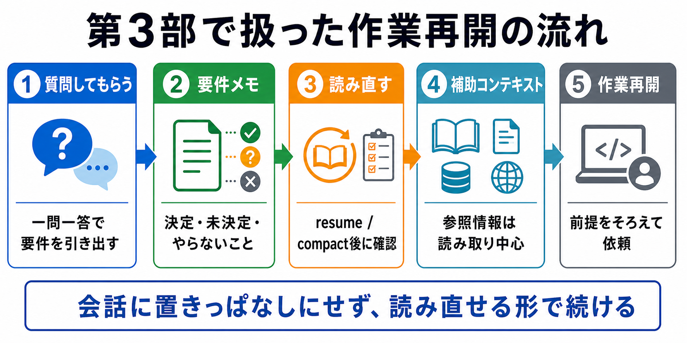

# 第3部の確認

この章では、第3部で扱った内容を一連の流れとして確認します。

AIに質問役を頼み、要件メモを作り、別セッションでも読み直して作業を再開できるかを確かめます。

## この章でできるようになること

- AIに質問役を頼んで要件を引き出せる
- 要件メモを読み直す正本として扱える
- resumeやcompact後に読ませ直すものを説明できる
- 補助コンテキストを作業対象と分けて扱える

## 第3部の流れ

第3部では、長い会話をAIの記憶任せにしない方法を扱いました。

流れは次のとおりです。

1. コンテキストウィンドウを理解する
2. AIに質問役を頼む
3. 要件メモを正本にする
4. resumeやcompactのあとに読み直す
5. 補助コンテキストを使う



## 確認すること

第3部の確認では、次の4つを見ます。

| 観点 | 確認すること |
| --- | --- |
| 質問 | AIが一問一答で要件を引き出せるか |
| メモ | 決定、未決定、やらないことが分かれているか |
| 再開 | 別セッションでも読ませ直せるか |
| 補助 | 作業対象と参照情報を区別できるか |

全部を本番プロジェクトで試す必要はありません。
まずは練習用テーマで、流れだけ体験します。

## やってみる

次のテーマで、一連の流れを試します。

```text
テーマ:
読んだ本を記録する小さなWebアプリを作りたい
```

まず、AIに質問役を頼みます。

```text
読書記録アプリの要件を整理したいです。

次の条件で、私に質問してください。

- 質問は5問
- 一問一答形式にする
- 1問ずつ質問し、私の回答を待つ
- 各質問では、A/B/Cの選択肢も毎回表示する
- A/B/Cだけで答えにくい場合は、短く自由記述してよいことも書く
- 5問が終わったら、要件メモのたたき台をMarkdownで出す
- まだファイル編集、削除、commit、pushはしない
```

要件メモのたたき台が出たら、次を確認します。

- 目的が書かれているか
- 決まったことがあるか
- 未決定のことがあるか
- 今回やらないことがあるか
- 確認方法があるか

## 別セッションで再開する想定

次に、別セッションで再開するつもりで、AIに読み直しを依頼します。

```text
作業を再開する想定で確認します。

この要件メモを読んだ前提で、次を要約してください。

- 今回の目的
- 決まったこと
- 未決定のこと
- 今回やらないこと
- 作業前に確認すること

まだファイル編集、削除、commit、pushはしないでください。
```

この要約ができれば、要件メモは再開時の正本として使いやすくなっています。

## 補助コンテキストを足す

最後に、補助コンテキストを足すなら何があり得るかを考えます。

```text
この読書記録アプリを作るときに、補助コンテキストとして読ませると役立ちそうな情報を3つ挙げてください。

出力では、次を分けてください。

- 補助コンテキスト
- 何のために読むか
- 編集してよいか

まだファイル編集、削除、commit、pushはしないでください。
```

ここでも、補助コンテキストは基本的に読み取り専用です。

## AIに聞いてみよう

第3部の理解を、AIにクイズ形式で確認してもらいます。

```text
コンテキストウィンドウ、要件メモ、resume、compact、補助コンテキストについて理解を確認したいです。

次の条件でクイズを出してください。

- 問題は5問
- 一問一答形式にする
- 1問ずつ出して、私の回答を待つ
- 各問題では、A/B/Cの選択肢も毎回表示する
- 私が回答するまで、その問題の答えと解説を表示しない
- 私が回答したあとで、その問題を採点し、理由を解説する
- 解説が終わったら、次の問題を1問だけ出す
- コマンドは実行しない
```

クイズでは、知識の暗記よりも、どの情報をどこに置くかを判断できるかを確認します。

## 何が起きたのか

第3部では、AIとの長い会話を、あとから読み直せる形に変える方法を扱いました。

会話は考える場所です。
要件メモは読み直す正本です。
AGENTS.mdはAIに毎回守らせる作業方針です。
補助コンテキストは、必要なときだけ読む参照情報です。

これらを分けると、AIに任せる作業が長くなっても、再開しやすくなります。

次の第4部では、よく使う依頼をプロンプトテンプレートとして整えます。

## 次へ

次は、プロンプトを作業テンプレートにします。

- [第4部：プロンプトを作業テンプレートにする](../part-4-prompt-templates/index.md)
