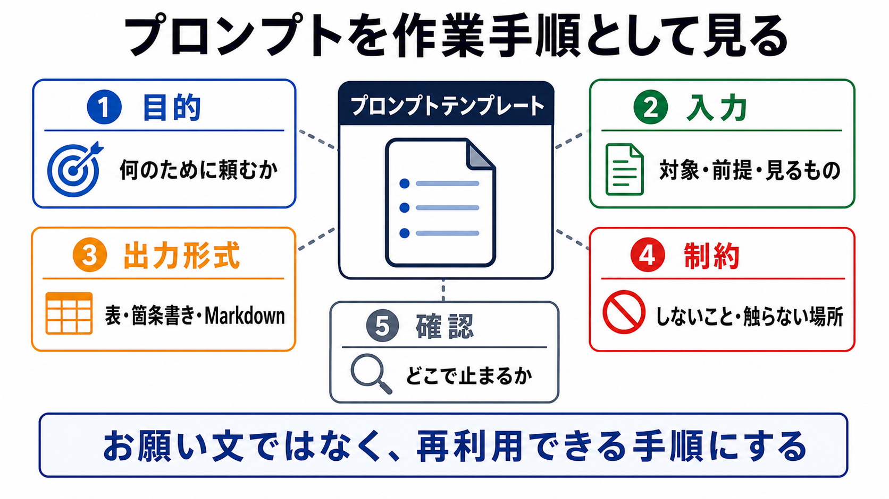

# プロンプトを作業手順として見る

この章では、プロンプトを一回限りのお願い文ではなく、再利用できる作業手順として扱います。

発展編で使うプロンプトは、うまい言い回しを探すためのものではありません。
AIにどの順番で考え、何を出し、どこで止まるかを指定するための手順です。

## この章でできるようになること

- プロンプトを作業手順として説明できる
- 再利用しやすいプロンプトの部品を分けられる
- AIに任せる範囲と止まる場所をプロンプトに書ける

## プロンプトは手順になる

短い依頼でも、AIはそれらしく答えてくれます。

```text
この文章を直して。
```

しかし、この依頼では次が曖昧です。

- 何を目的に直すのか
- どの観点で見るのか
- どの形式で返すのか
- ファイルを編集してよいのか
- いつ人間に確認するのか

発展編では、これらをプロンプトの中に入れて、作業手順として扱います。



## 5つの部品に分ける

再利用しやすいプロンプトは、次の5つに分けて考えます。

| 部品 | 書くこと |
| --- | --- |
| 目的 | 何のために頼むのか |
| 入力 | AIに見るもの、前提、対象 |
| 出力形式 | 箇条書き、表、Markdown、差分案など |
| 制約 | しないこと、触らないこと、秘密情報の扱い |
| 確認 | どこで止まり、人間に判断を返すか |

この5つがあると、AIの回答が安定しやすくなります。

## 悪い例とよい例

曖昧な例です。

```text
この章をいい感じに直して。
```

少し手順にした例です。

```text
この章を、初学者が迷わず読めるかという観点でレビューしてください。

目的:
- 説明が薄い箇所を見つける
- 画像があると理解しやすい箇所を見つける
- メタすぎる説明を減らす

出力形式:
- 指摘は重要度順
- 各指摘に、該当箇所、理由、修正案を書く

制約:
- まだファイル編集はしない
- commitやpushもしない
```

このように書くと、AIが何をすればよいか、人間がどこで判断するかが見えやすくなります。

## 止まる場所を書く

AIに長めの作業を頼む場合は、どこで止まるかを書きます。

たとえば、次のように指定します。

```text
まず修正方針だけを出してください。
私が了承するまで、ファイル編集はしないでください。
```

または、変更後の確認まで含めます。

```text
編集後に、変更したファイル、変更理由、確認コマンドの結果を報告してください。
```

止まる場所がないと、AIが良かれと思って作業を進めすぎることがあります。

## テンプレートとして残す

よく使う依頼は、テンプレートとして残します。

たとえば、次のような依頼です。

- AIに質問役を頼む
- 修正観点を洗い出す
- レビューを依頼する
- 練習問題を出してもらう
- commit前の確認を頼む

テンプレートにしておくと、毎回ゼロから依頼文を考えなくてよくなります。
さらに、使いにくかった回答があれば、テンプレートを少しずつ改善できます。

## やってみる

次の曖昧な依頼を、5つの部品に分けて書き直します。

```text
このドキュメントを直して。
```

書き直すときは、次の枠を使います。

```text
目的:

入力:

出力形式:

制約:

確認:
```

最初から完璧にしなくて構いません。
空欄があるところが、AIに質問してもらう候補です。

## AIに聞いてみよう

AIに、曖昧な依頼をテンプレート化してもらいます。

```text
次の曖昧な依頼を、再利用できるプロンプトテンプレートに直してください。

依頼:
このドキュメントを直して。

次の5つの部品に分けてください。

- 目的
- 入力
- 出力形式
- 制約
- 確認

条件:
- 初学者が使える具体性にする
- ファイル編集、削除、commit、pushはまだ行わない前提にする
- 足りない前提があれば、テンプレートの中で質問する形にする
```

AIにテンプレート化を頼むと、自分では曖昧だった依頼の抜けが見つかります。

## 何が起きたのか

この章では、プロンプトを作業手順として扱いました。

良いプロンプトは、長い文章という意味ではありません。
目的、入力、出力形式、制約、確認が分かれている依頼です。

次章では、この考え方を使って、AIに質問役を頼むテンプレートを作ります。

## 次へ

次は、AIに質問役を頼むテンプレートを作ります。

- [AIに質問役を頼むテンプレート](02-question-facilitator-template.md)
