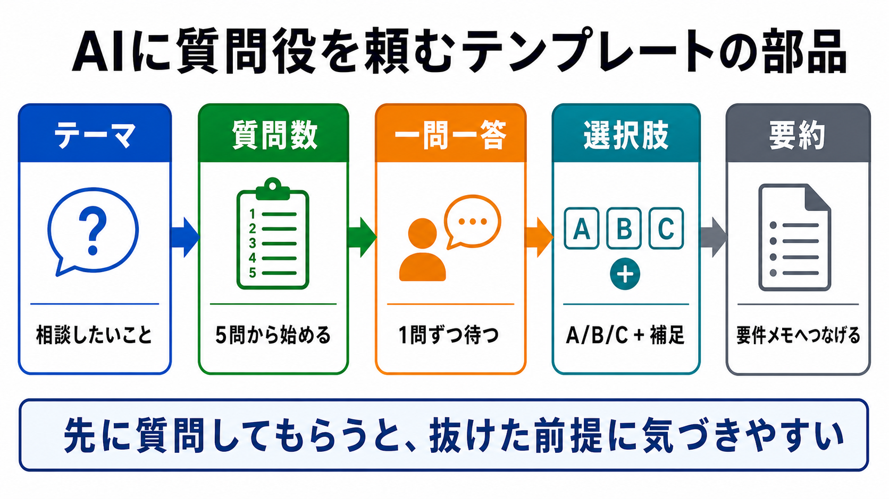

# AIに質問役を頼むテンプレート

この章では、AIに質問役を頼むプロンプトをテンプレート化します。

要件定義や壁打ちでは、人間が最初から全部を説明するより、AIに質問してもらうほうが整理しやすいことがあります。
ただし、質問の出し方を指定しないと、長すぎたり、答えにくかったりします。

## この章でできるようになること

- AIに質問役を頼むテンプレートを使える
- 一問一答、選択肢、最後の要約を指定できる
- 質問数や観点を作業に合わせて調整できる

## テンプレートの部品

AIに質問役を頼むテンプレートには、次の部品を入れます。

- テーマ
- 質問数
- 一問一答形式
- 選択肢の表示
- 回答後の要約
- まだ作業しない制約



## 基本テンプレート

まずは、次の形を使います。

```text
これから次のテーマについて要件を整理したいです。

テーマ:
（ここに作りたいものや相談したいことを書く）

次の条件で、私に質問してください。

- 質問は5問
- 一問一答形式にする
- 1問ずつ質問し、私の回答を待つ
- 各質問では、A/B/Cの選択肢も毎回表示する
- A/B/Cだけで答えにくい場合は、短く自由記述してよいことも書く
- 5問が終わったら、回答をもとに要件メモのたたき台をMarkdownで出す
- まだファイル編集、削除、commit、pushはしない

確認したい観点:
- 目的
- 利用者
- 最初に作る機能
- 今回やらないこと
- 確認方法
```

このテンプレートは、AIに作業を進めさせるためではなく、質問してもらうためのものです。

## 質問数を調整する

質問数は、作業の大きさで変えます。

| 状況 | 質問数の目安 |
| --- | --- |
| 小さな修正 | 3問 |
| 小さな機能追加 | 5問 |
| 新しい画面や小さなアプリ | 7問 |
| まだ曖昧な企画 | 10問以内 |

質問が多すぎると回答が大変になります。
最初は少なめにして、足りなければ追加質問を頼みます。

```text
ここまでの回答を見て、追加で確認したいことがあれば3問以内で質問してください。
```

## 選択肢を毎回表示する

選択肢は、回答しやすくするための足場です。

```text
各質問では、A/B/Cの選択肢も毎回表示してください。
```

ただし、選択肢だけでは答えにくいこともあります。
そのため、自由記述も許可します。

```text
A/B/Cだけで答えにくい場合は、短く自由記述してよいことも書いてください。
```

この2行を入れると、AIの質問が答えやすくなります。

## 最後に要件メモへつなげる

質問が終わったら、回答を要件メモのたたき台にしてもらいます。

```text
5問が終わったら、回答をもとに要件メモのたたき台をMarkdownで出してください。
```

ここで重要なのは、「会話に出ていないことを勝手に決めない」と添えることです。

```text
会話に出ていないことは勝手に決めず、未決定として残してください。
```

AIが空白を想像で埋めるのを防ぎやすくなります。

## やってみる

次のテーマで、基本テンプレートを使ってみます。

```text
テーマ:
家計簿をつける小さなWebアプリを作りたい
```

質問が出たら、A/B/Cで答えます。
答えにくい場合は、短く補足を書きます。

5問が終わったら、要件メモのたたき台が次を含んでいるか確認します。

- 目的
- 利用者
- 最初に作る機能
- 今回やらないこと
- 確認方法

## AIに聞いてみよう

AIに、質問役テンプレートを改善してもらいます。

```text
次の質問役テンプレートを改善したいです。

改善観点:
- 初学者が答えやすいか
- 質問数が多すぎないか
- A/B/Cの選択肢が毎回表示される指定になっているか
- 回答後に要件メモへつながるか
- まだ作業しない制約が入っているか

出力形式:
- 改善点を3つ以内
- 改善後のテンプレート

まだファイル編集、削除、commit、pushはしないでください。
```

テンプレートは、一度作って終わりではありません。
実際に使って答えにくかったところを、少しずつ直します。

## 何が起きたのか

この章では、AIに質問役を頼む依頼をテンプレート化しました。

ポイントは、AIにいきなり作らせないことです。
先に質問してもらい、回答し、最後に要件メモへつなげます。

次章では、修正観点を洗い出すテンプレートを作ります。

## 次へ

次は、修正観点を洗い出すテンプレートを作ります。
