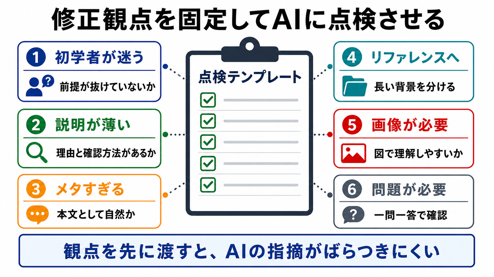

# 修正観点を洗い出すテンプレート

この章では、AIに修正観点を漏れなく洗い出してもらうテンプレートを作ります。

AIに「この章を見て」とだけ頼むと、目についたところだけが返ってくることがあります。
発展編では、見てほしい観点を先に並べ、AIにその観点で点検させます。

## この章でできるようになること

- 修正観点を固定してAIに点検を頼める
- 初学者視点、説明の厚み、画像、問題、リファレンス導線を分けて確認できる
- 修正前に、修正候補だけを出させる依頼ができる

## 観点を先に渡す

AIにドキュメントを見てもらうときは、何を見てほしいのかを先に渡します。

特に、この教材では次の観点が重要です。

- 初学者が迷う箇所
- 説明が薄い箇所
- メタすぎる箇所
- リファレンスに逃がすべき箇所
- 画像があると理解しやすい箇所
- AIへの頼み方や練習問題が必要な箇所



## 基本テンプレート

次のテンプレートを使うと、AIに修正観点を洗い出してもらえます。

```text
次のドキュメントを、初学者が迷わず進められるかという観点で点検してください。

対象:
（ファイル名や章名を書く）

特に、次の観点を漏れなく見てください。

- 初学者が迷う箇所
- 説明が薄い箇所
- メタすぎる箇所
- リファレンスに逃がすべき箇所
- 画像があると理解しやすい箇所
- AIへの頼み方や練習問題が必要な箇所

出力形式:
- 重要度が高い順に並べる
- 各項目に、該当箇所、理由、修正案を書く
- 画像が必要な場合は、画像で説明する内容も書く
- 練習問題が必要な場合は、問題形式も書く

制約:
- まだファイル編集はしない
- commitやpushもしない
```

この依頼では、AIに修正を始めさせません。
まず、修正候補を出させます。

## 画像の要否も聞く

画像については、単に「画像いる？」ではなく、何を図にするかまで聞きます。

```text
画像が必要な箇所については、次も書いてください。

- 画像で説明する概念
- 画像内に入れる主要なテキスト
- 画像を入れる位置
- 既存画像を再利用できるか
```

こうしておくと、雰囲気だけの画像ではなく、本文理解を助ける画像にしやすくなります。

## 問題の要否も聞く

練習問題についても、形式まで指定します。

```text
練習問題が必要な箇所については、次の形式を優先してください。

- 問題は5問程度
- 一問一答形式
- 1問ずつ出して回答を待つ
- 各問題ではA/B/Cの選択肢を毎回表示する
- 回答後に採点と解説をする
```

この形式にしておくと、学習者が答えやすくなります。

## 修正前に止める

修正観点の洗い出しでは、AIにいきなり編集させません。

最初は、次のように止めます。

```text
まず修正候補だけを出してください。
私が了承するまで、ファイル編集はしないでください。
```

修正候補を見て、人間が採用するものを選びます。
そのあとで、編集を依頼します。

## やってみる

自分が書いた短い文章を1つ選び、AIに修正観点を洗い出してもらいます。

対象がない場合は、次の文章を使います。

```text
AIに作業を頼むときは、ちゃんと説明しましょう。
作業が終わったら確認しましょう。
```

この文章に対して、基本テンプレートを使って点検を頼みます。
返ってきた指摘のうち、どれが本当に必要かを人間が判断します。

## AIに聞いてみよう

AIに、テンプレートそのものを改善してもらうこともできます。

```text
修正観点を洗い出すためのプロンプトテンプレートを改善したいです。

次の観点でレビューしてください。

- 初学者視点が入っているか
- 説明の薄さを見つけられるか
- メタすぎる説明を見つけられるか
- リファレンスへ分ける判断ができるか
- 画像と練習問題の必要性を確認できるか
- まだ編集しない制約が入っているか

出力形式:
- 改善点を3つ以内
- 改善後のテンプレート

まだファイル編集、削除、commit、pushはしないでください。
```

テンプレートも、実際に使いながら育てます。

## 何が起きたのか

この章では、AIに修正観点を洗い出してもらうテンプレートを作りました。

重要なのは、AIに「見て」と頼むのではなく、見てほしい観点を渡すことです。
観点があると、AIの指摘がばらつきにくくなります。

次章では、レビュー依頼テンプレートを作ります。

## 次へ

次は、レビュー依頼テンプレートを作ります。

- [レビュー依頼テンプレート](04-review-request-template.md)
