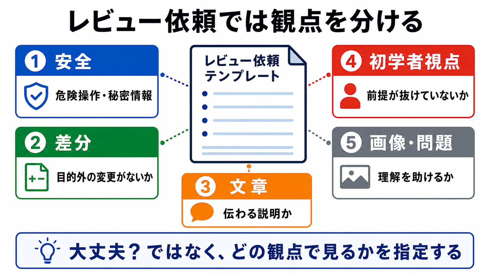

# レビュー依頼テンプレート

この章では、AIにレビューを依頼するテンプレートを作ります。

レビューでは、AIに「大丈夫？」と聞くだけでは足りません。
どの観点で見てほしいのか、何を優先してほしいのか、まだ編集してよいのかを指定します。

## この章でできるようになること

- AIにレビュー観点を分けて依頼できる
- 安全、差分、文章、初学者視点を分けて確認できる
- レビューだけを頼み、勝手な編集を止められる

## レビュー観点を分ける

レビューでは、見る観点を分けると指摘が読みやすくなります。

たとえば、次のように分けます。

- 安全
- 差分
- 文章
- 初学者視点
- 画像や問題



## 基本テンプレート

次のテンプレートを使います。

```text
次の変更をレビューしてください。

対象:
（ファイル名、差分、章名などを書く）

レビュー観点:
- 安全上の問題がないか
- 変更範囲が目的に合っているか
- 文章が初学者に伝わるか
- 説明が薄い箇所がないか
- 画像や練習問題が必要な箇所がないか
- リファレンスへ分けたほうがよい長い説明がないか

出力形式:
- 指摘は重要度が高い順
- 各指摘に、該当箇所、理由、修正案を書く
- 問題がない観点は「問題なし」と書く

制約:
- まだファイル編集はしない
- commitやpushもしない
```

この依頼では、AIにレビューだけを頼んでいます。
修正するかどうかは、人間が判断します。

## 安全レビューを入れる

AIへのレビュー依頼では、安全観点を外さないようにします。

たとえば、次を確認させます。

- 危険なコマンドを雑に実行させていないか
- 秘密情報を貼る流れになっていないか
- commitやpushのタイミングが早すぎないか
- 作業対象と参照情報を混同していないか

安全レビューは、コードだけでなくドキュメントにも必要です。
教材内の説明が危ない手順になっていないかを確認します。

## 差分レビューを入れる

実際の変更がある場合は、差分を見てもらいます。

```text
まず `git diff` の内容を読み、変更範囲が目的に合っているかレビューしてください。
不要な変更、混ざっている変更、意図が不明な変更があれば指摘してください。
まだファイル編集はしないでください。
```

差分レビューでは、内容の良し悪しだけでなく、余計なファイルが混ざっていないかも見ます。

## 文章レビューを入れる

教材やドキュメントでは、文章レビューも大切です。

```text
文章をレビューしてください。

観点:
- 初学者が前提知識なしで読めるか
- 未説明の用語がないか
- メタ的な説明が多すぎないか
- 手順と理由が分かれているか
- 次に何をすればよいか分かるか

まだ編集はしないでください。
```

文章レビューでは、「うまい文章か」だけでなく、学習者が迷わないかを見ます。

## やってみる

次の短い文章を、レビュー依頼テンプレートでAIに見てもらいます。

```text
AIにコードを書いてもらいましょう。
うまく動かなかったら直してもらいましょう。
```

レビュー観点には、少なくとも次を入れます。

- 初学者が迷う箇所
- 説明が薄い箇所
- 安全面で危ない箇所
- 追加したほうがよい説明

AIが修正案を出してきても、すぐ採用せず、人間が判断します。

## AIに聞いてみよう

AIに、自分のレビュー依頼を改善してもらいます。

```text
次のレビュー依頼テンプレートを改善したいです。

観点:
- 安全レビューが入っているか
- 差分レビューが入っているか
- 文章レビューが入っているか
- 初学者視点が入っているか
- まだ編集しない制約があるか

出力形式:
- 改善点を3つ以内
- 改善後のテンプレート

まだファイル編集、削除、commit、pushはしないでください。
```

レビュー依頼テンプレートも、実際に使いながら改善していきます。

## 何が起きたのか

この章では、AIにレビューを頼むテンプレートを作りました。

レビューでは、AIに「見て」と頼むだけではなく、観点を分けます。
安全、差分、文章、初学者視点を分けることで、指摘が読みやすくなります。

次章では、練習問題を出してもらうテンプレートを作ります。

## 次へ

次は、練習問題テンプレートを作ります。

- [練習問題テンプレート](05-exercise-template.md)
