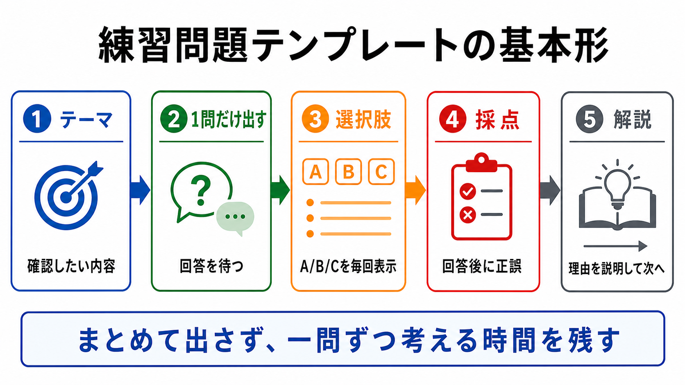

# 練習問題テンプレート

この章では、AIに練習問題を出してもらうテンプレートを作ります。

AIは説明するだけでなく、学習者に質問する役にもできます。
ただし、問題の出し方を指定しないと、まとめて問題が出て読みにくくなったり、選択肢が見えづらくなったりします。

## この章でできるようになること

- AIに一問一答形式の練習問題を出してもらえる
- 選択肢を毎回表示させられる
- 回答後に採点と解説をしてもらえる

## 問題の形式を固定する

この教材では、AIに問題を出してもらうとき、基本的に次の形式を使います。

- 5問程度
- 一問一答形式
- 1問ずつ出して、回答を待つ
- 各問題でA/B/Cの選択肢を毎回表示する
- 回答するまで答えを表示しない
- 回答後に採点と解説をする



## 基本テンプレート

次のテンプレートを使います。

```text
次のテーマについて、理解を確認する練習問題を出してください。

テーマ:
（確認したいテーマを書く）

条件:
- 問題は5問
- 一問一答形式にする
- 1問ずつ出して、私の回答を待つ
- 各問題では、A/B/Cの選択肢も毎回表示する
- 私はA/B/Cだけで回答する
- 私が回答するまで、その問題の答えと解説を表示しない
- 私が回答したあとで、その問題を採点し、理由を解説する
- 解説が終わったら、次の問題を1問だけ出す
- コマンドは実行しない
```

この形式にすると、問題を読む、答える、解説を見る、次へ進む、という流れが作れます。

## 選択肢を毎回表示する

選択肢を最初に一度だけ表示すると、学習者は上に戻って確認する必要があります。

そのため、テンプレートには次を入れます。

```text
各問題では、A/B/Cの選択肢も毎回表示する
```

この指定を入れると、問題ごとに選択肢を見ながら回答できます。

## 答えを先に出させない

練習問題では、答えを先に出させないことが大切です。

```text
私が回答するまで、その問題の答えと解説を表示しない
```

この行がないと、AIが親切心で答えや解説まで先に出してしまうことがあります。
学習者が考える時間を残すために、明示しておきます。

## 採点と解説をセットにする

回答後は、正誤だけでなく理由も聞きます。

```text
私が回答したあとで、その問題を採点し、理由を解説する
```

理由があると、間違えたときにどこで考え違いをしたか確認できます。

## やってみる

次のテーマで、AIに問題を出してもらいます。

```text
テーマ:
AIに作業を頼む前に確認すること
```

問題が出たら、A/B/Cで答えます。
もし選択肢が毎回表示されなかったり、答えが先に出たりした場合は、テンプレートの条件を追加します。

## AIに聞いてみよう

AIに、練習問題テンプレートを改善してもらいます。

```text
次の練習問題テンプレートを改善したいです。

観点:
- 一問一答形式になっているか
- A/B/Cの選択肢が毎回表示されるか
- 回答前に答えや解説を出さない指定があるか
- 回答後に採点と解説があるか
- 問題数が多すぎないか
- コマンドを実行しない指定があるか

出力形式:
- 改善点を3つ以内
- 改善後のテンプレート

まだファイル編集、削除、commit、pushはしないでください。
```

問題テンプレートも、実際に使って答えにくかったところを直していきます。

## 何が起きたのか

この章では、AIに練習問題を出してもらうテンプレートを作りました。

大切なのは、問題をまとめて出させないことです。
一問一答で、選択肢を毎回表示し、回答後に採点と解説をしてもらいます。

次章では、第4部全体を確認し、自分がよく使う依頼をテンプレート化します。

## 次へ

次は、第4部の確認です。
