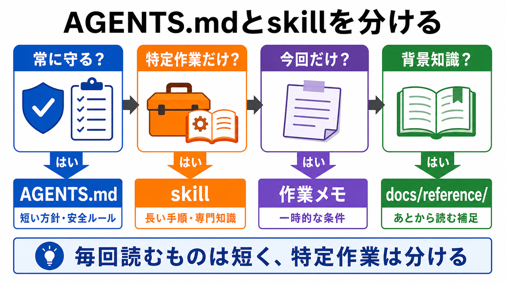

# AGENTS.mdとskillを分ける

この章では、AGENTS.mdに残す内容と、skillへ切り出す内容を分けます。

AGENTS.mdもskillも、AIに作業方針を伝えるために使えます。
ただし、役割を混ぜると、AGENTS.mdが長くなりすぎたり、skillが増えすぎたりします。

## この章でできるようになること

- AGENTS.mdに残す内容を判断できる
- skillへ切り出す内容を判断できる
- 迷ったときの置き場所を、理由つきで説明できる

## 毎回必要か、特定作業だけか

分け方の基本は、AIが毎回読むべきかどうかです。

AGENTS.mdには、リポジトリ全体で常に守ってほしい方針を残します。
skillには、特定の作業でだけ必要になる手順を置きます。



たとえば、「ユーザーの変更を勝手に戻さない」は、どの作業でも守ってほしい方針です。
これはAGENTS.mdに残します。

一方で、「教材画像を作るときは、生成後に日本語の誤字とMarkdown参照を確認する」は、画像作成のときに必要な手順です。
これはskill化の候補です。

## AGENTS.mdに残すもの

AGENTS.mdに向いているのは、短く、常に守る方針です。

例です。

- 学習者向け文章は日本語で書く
- ユーザーの変更を勝手に戻さない
- ファイル編集前に、変更予定を説明する
- commit前に `git status --short` とビルドを確認する
- 秘密情報をドキュメントに書かない
- SVG画像はユーザーが明示した場合だけ使う

これらは、作業の種類に関係なく効いてほしいルールです。

AGENTS.mdに書くときは、長い背景説明よりも、AIが実行できる短い行動ルールにします。

```text
よい例:
ファイル編集前に、変更予定ファイルと理由を説明する。

重くなりやすい例:
このプロジェクトでは、過去にファイル編集の事故があり、そのときに...
```

背景が長くなる場合は、リファレンスや作業メモに分けます。

## skillへ切り出すもの

skillに向いているのは、特定作業で使うまとまった手順です。

例です。

- 教材画像を生成して、保存、参照、表示確認まで行う手順
- 章本文を初学者視点でレビューする観点
- 公開前にリンク、画像、ビルド、差分を確認する手順
- 特定のフレームワークで、よく使う実装パターン
- PRレビューで見る観点とコメントの書き方

これらは毎回必要ではありません。
しかし、その作業をするときには、何度も同じ手順を使います。

skillにするときは、「いつ使うか」がわかる名前にします。

```text
よい例:
教材画像を追加するときに使うskill

広すぎる例:
ドキュメント作業全部をするskill
```

広すぎるskillは、AGENTS.mdと同じように読みにくくなります。

## 迷ったときの判断

置き場所に迷ったら、次の順に考えます。

1. どの作業でも常に守る必要があるか
2. その作業だけで使う長い手順か
3. 一度きりの情報か
4. 背景知識としてあとから参照できればよいか

それぞれの置き場所は、次のように考えます。

| 判断 | 置き場所 |
| --- | --- |
| 常に守る短い方針 | AGENTS.md |
| 特定作業の長い手順 | skill |
| 今回だけの条件 | 作業メモ |
| 詳しい背景知識 | docs/reference/ |
| 会話で使う依頼文の型 | プロンプトテンプレート |

大切なのは、正解を一度で決めることではありません。
使ってみて重い、探しにくい、毎回必要ではないと感じたら、置き場所を見直します。

## 具体例で分ける

次のように分けられます。

| 内容 | 置き場所 | 理由 |
| --- | --- | --- |
| 「ユーザーの変更を勝手に戻さない」 | AGENTS.md | 常に守る安全ルール |
| 「画像は文字入りインフォグラフィックにする」 | AGENTS.md | 教材全体の画像方針 |
| 「画像生成後に保存、参照、表示確認をする手順」 | skill | 画像作成時だけ使う長い手順 |
| 「今回の第5部2章で入れる画像の文言」 | 作業メモ | 今回だけの具体条件 |
| 「skillとは何かの詳しい仕様」 | docs/reference/ | 必要なときに読む背景知識 |

AGENTS.mdは、入口の方針です。
skillは、作業ごとの詳しい手順です。
この距離感を保つと、どちらも育てやすくなります。

## やってみる

次の内容を、AGENTS.md、skill、作業メモ、docs/reference/のどこに置くか考えます。

```text
内容1:
「commit前には、ビルド結果とgit statusを確認する」

内容2:
「教材画像を生成したあと、画像内の日本語、保存先、Markdown参照、ビルドを確認する」

内容3:
「今回の作業では、第5部の章だけを編集し、docs/index.mdは触らない」
```

それぞれについて、置き場所と理由を1行で書きます。

## AIに聞いてみよう

AIに、置き場所の判断を練習問題として出してもらいます。

```text
AGENTS.mdとskillの分け方を練習したいです。

次の条件でお願いします。

- 問題は5問
- 一問一答形式にする
- 1問ずつ「方針や手順の例」を表示し、その直下に選択肢も毎回表示する
- 選択肢は、A: AGENTS.md、B: skill、C: 作業メモ、D: docs/reference/、にする
- 私は各問題に対してA/B/C/Dだけで回答します
- 私が回答するまで、その問題の答え、採点、解説を表示しないでください
- 私が回答したあとで、その問題を採点し、理由も解説してください
- 解説が終わったら、次の問題を1問だけ出してください
- ファイル編集、削除、commit、pushはしないでください
```

この練習では、AIに答えを先に出させません。
自分で分類してから解説を聞くことで、判断基準が身につきます。

## 何が起きたのか

この章では、AGENTS.mdとskillを分ける判断基準を確認しました。

AGENTS.mdは、どの作業でも常に守ってほしい短い方針に向いています。
skillは、特定作業だけで使う長い手順や専門的な知識に向いています。

次章では、実際に小さなskillを設計するために、名前、使う場面、入力、手順、確認方法を整理します。
