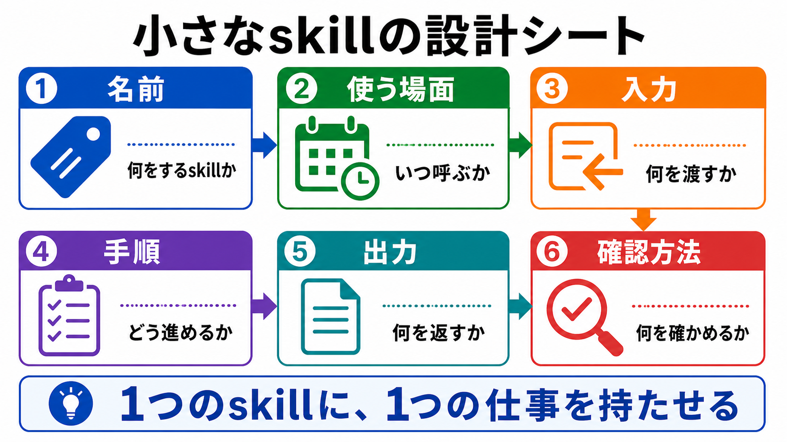

# 小さなskillを設計する

この章では、小さなskillを設計する考え方を扱います。

skillは、便利そうな知識を何でも詰め込む場所ではありません。
1つのskillには、1つの仕事を持たせます。

## この章でできるようになること

- skillに入れる項目を説明できる
- 小さなskillの設計メモを書ける
- 広すぎるskillを、小さな単位へ分けられる

## まず設計メモを書く

いきなりskillファイルを書き始めると、範囲が広がりすぎます。
まずは、次の項目をメモします。

- 名前
- 使う場面
- 入力
- 手順
- 出力
- 確認方法
- 使わない場面

このメモがあると、skillに何を書くべきかが見えやすくなります。



## 名前は作業内容で決める

skillの名前は、何をするためのものかがわかる名前にします。

たとえば、次のような名前です。

- 教材画像を追加する
- 初学者向けに章本文をレビューする
- 公開前チェックを行う
- PRコメントに対応する

反対に、次のような名前は広すぎます。

- ドキュメント作業
- レビュー全般
- AI開発
- 便利ツール

名前が広いと、入れる内容も広がります。
「このskillは、いつ呼べばよいのか」がすぐわかる名前にします。

## 使う場面を先に決める

skillには、使う場面を明確に書きます。

例です。

```text
使う場面:
教材本文に新しい説明画像を追加するとき。
```

使う場面が曖昧だと、AIが関係ない作業でもskillを使ってしまいます。

使わない場面も書いておくと、さらに安全です。

```text
使わない場面:
既存のSVGやロゴを微修正するだけのとき。
```

これは、skillを増やしすぎないためにも役立ちます。

## 入力と出力を決める

skillは、AIに何を渡すと、何を返すのかを決めておくと使いやすくなります。

例です。

```text
入力:
- 対象の章ファイル
- 画像で説明したい概念
- 入れたい日本語テキスト

出力:
- 画像ファイル
- Markdownへの画像参照
- 確認結果
```

入力が曖昧だと、AIが勝手に前提を補いやすくなります。
出力が曖昧だと、欲しい形で結果が返ってきません。

## 手順は短く分ける

skillの手順は、長い文章よりも、短い手順に分けます。

例です。

```text
手順:
1. 本文を読み、画像で補う箇所を決める
2. 画像内に入れる日本語テキストを決める
3. imagegenで画像を生成する
4. 生成画像をdocs/images/配下に保存する
5. Markdownから相対パスで参照する
6. 画像内の文字とビルドを確認する
```

手順に番号があると、AIも人間も進捗を確認しやすくなります。

ただし、何十項目もあるskillは読みづらくなります。
手順が長くなったら、別のskillに分けられないかを考えます。

## 確認方法を入れる

skillには、作業後に何を確認するかも書きます。

例です。

```text
確認方法:
- 画像内の日本語が読めるか
- Markdownの画像パスが正しいか
- Docusaurusビルドが通るか
- git diffが意図した範囲に収まっているか
```

AIに作業を頼むときは、作る手順だけでなく、確認する手順も同じくらい重要です。

## やってみる

自分がskill化したい作業を1つ選び、次の形で設計メモを書きます。

```text
skill名:

使う場面:

使わない場面:

入力:

手順:
1.
2.
3.

出力:

確認方法:
```

最初は短くて構いません。
実際に使ったあとで、足りない項目を増やします。

## AIに聞いてみよう

AIに、skill設計の質問役を頼みます。

```text
小さなskillを設計したいです。

次の条件で、質問役になってください。

- 1問ずつ質問してください
- 質問は最大7問
- 目的、使う場面、使わない場面、入力、手順、出力、確認方法を順番に聞いてください
- 私が答えるまで、次の質問に進まないでください
- すべての回答が終わったら、skill設計メモとしてMarkdownでまとめてください
- まだskillファイルの作成、ファイル編集、commit、pushはしないでください
```

AIにいきなりskillを書かせるのではなく、先に質問してもらいます。
回答をまとめた設計メモを見てから、実際にskill化するかを判断します。

## 何が起きたのか

この章では、小さなskillを作るための設計メモを扱いました。

skillには、名前、使う場面、入力、手順、出力、確認方法を書きます。
特に大切なのは、使う場面と使わない場面を分けることです。

次章では、便利だからといってskillを書きすぎると何が起きるかを確認します。
