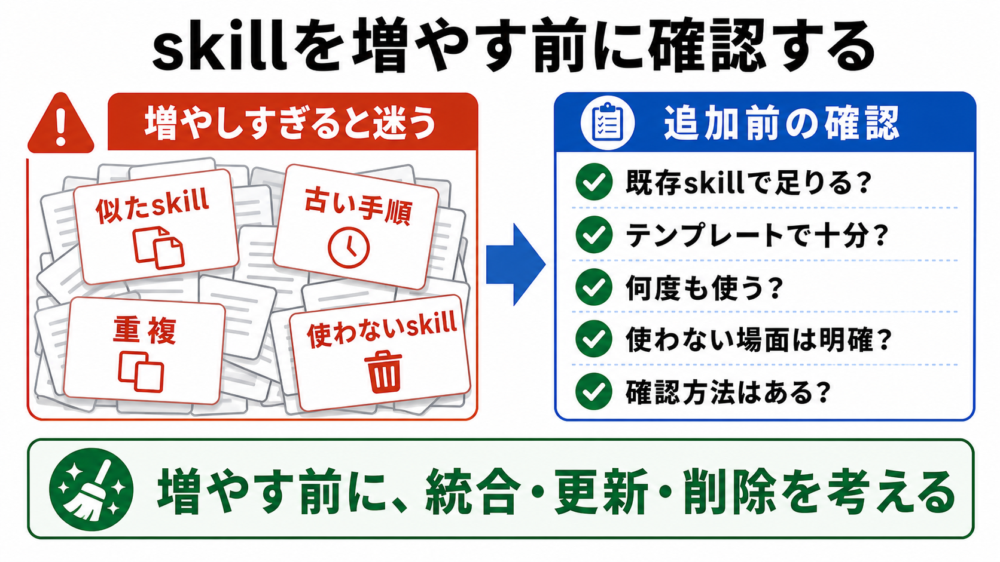

# skillを書きすぎない

この章では、skillを増やしすぎないための考え方を扱います。

skillは便利ですが、増やせば増やすほど作業がよくなるわけではありません。
使い分けが難しくなったり、古い手順が残ったり、似たskillが重複したりします。

## この章でできるようになること

- skillを増やしすぎると起きる問題を説明できる
- skillを追加する前に確認する観点を持てる
- 既存skillの統合、削除、更新を検討できる

## skillが多すぎると迷う

skillが多すぎると、AIも人間も迷います。

たとえば、次のような状態です。

- 似た名前のskillが複数ある
- どのskillを使うべきか判断しにくい
- 古い手順が残っている
- 同じ確認項目が別々のskillに重複している
- 使わないskillが残り続けている

これは、AGENTS.mdが長くなりすぎる問題と似ています。
「分けたから安心」ではなく、分けたあとも整理が必要です。



## 追加する前に確認する

新しいskillを作りたくなったら、まず次を確認します。

- 既存のskillで足りないか
- プロンプトテンプレートで十分ではないか
- AGENTS.mdに短い方針として書けば足りないか
- 作業メモに一度だけ残せばよい内容ではないか
- 本当に何度も使う作業か

特に大事なのは、最後の「本当に何度も使う作業か」です。

一度だけの作業なら、skillにする必要はありません。
そのタスクの作業メモに残せば十分です。

## 似たskillは統合する

似たskillが増えてきたら、統合を考えます。

たとえば、次の2つがあるとします。

```text
教材画像を追加するskill
教材画像をレビューするskill
```

この2つがいつも同時に使われるなら、1つにまとめたほうがよいかもしれません。

反対に、次のように作業が明確に違うなら、分けても構いません。

```text
画像を生成して保存するskill
生成済み画像の品質をレビューするskill
```

統合するか分けるかは、名前だけで決めません。
実際に使うタイミングが同じかどうかで判断します。

## 古いskillを残し続けない

skillは、一度作ったら終わりではありません。

次のようなskillは、見直しの対象です。

- しばらく使っていない
- いまのプロジェクト構成と合っていない
- 手順の一部が古くなっている
- AGENTS.mdや別skillと内容が重複している
- 読んでも何に使うかわからない

古いskillが残っていると、AIが古い前提で作業する可能性があります。
使わないskillは削除するか、アーカイブするか、AGENTS.mdから参照しないようにします。

## skillの棚卸しをする

skillが増えてきたら、定期的に棚卸しします。

棚卸しでは、次を確認します。

| 観点 | 見ること |
| --- | --- |
| 使っているか | 最近の作業で使ったか |
| 重複しているか | 似たskillがないか |
| 古くないか | 手順やパスが今も正しいか |
| 広すぎないか | 1つのskillに複数の仕事が混ざっていないか |
| 確認できるか | 作業後の確認方法があるか |

棚卸しは、skillを減らすためだけの作業ではありません。
本当に使うskillを、もっと使いやすくするための作業です。

## やってみる

自分が作りたいskill候補を1つ選びます。
次の質問に答えます。

```text
skill候補:

これは何度も使う作業か:

既存のAGENTS.mdやテンプレートで足りない理由:

似たskillがある場合、分ける理由:

使わなくなったときの見直し方:
```

すべてに答えられない場合は、まだskill化しなくても構いません。
まずはプロンプトテンプレートや作業メモとして試してから、必要になったらskillにします。

## AIに聞いてみよう

AIに、skill候補を増やすべきかをレビューしてもらいます。

```text
次のskill候補をレビューしてください。

観点:
- 本当に何度も使う作業か
- AGENTS.mdに短く書けば足りない内容ではないか
- プロンプトテンプレートで十分ではないか
- 既存skillと重複しないか
- 使う場面と使わない場面が明確か

出力形式:
- skill化してよさそうな理由
- まだskill化しないほうがよい理由
- 先に試すなら、AGENTS.md / プロンプトテンプレート / 作業メモ のどれがよいか

まだファイル編集、削除、commit、pushはしないでください。
```

AIに判断させきるのではなく、判断材料を出してもらいます。
最終的にskillを増やすかどうかは、人間が決めます。

## 何が起きたのか

この章では、skillを増やしすぎないための考え方を扱いました。

skillは、特定作業を安定させるための道具です。
しかし、増えすぎると、どれを使うべきか、どれが最新かがわかりにくくなります。

次章では、第5部全体を確認し、自分の作業でskill化したい候補を整理します。
