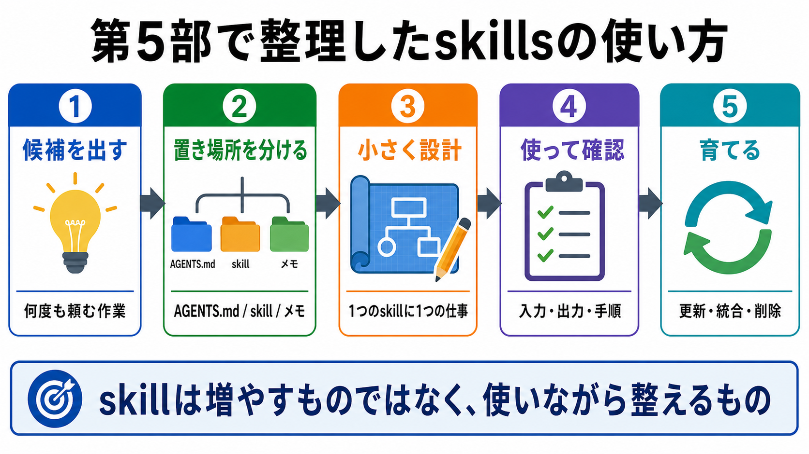

# 第5部の確認

この章では、第5部で扱ったskillsの考え方を振り返ります。

skillは、AIを便利にするための魔法ではありません。
繰り返し使う特定作業を、AIが迷わず実行できるようにするための小さな手順書です。

## この章でできるようになること

- skill化したい候補を洗い出せる
- AGENTS.mdに残すものとskillに切り出すものを分けられる
- skillを作る前に、設計メモを書ける

## 第5部で確認したこと

第5部では、次の順に確認しました。

- skillは特定作業用の手順書である
- AGENTS.mdには、常に守る短い方針を残す
- skillには、特定作業で使う長い手順を切り出す
- skillを作る前に、名前、使う場面、入力、手順、出力、確認方法を整理する
- skillを増やしすぎると、かえって使い分けが難しくなる

大切なのは、AIに見せる情報を増やすことではありません。
必要な情報を、必要な場所に置くことです。



## skill化候補を棚卸しする

まず、自分がAIに何度も頼みそうな作業を洗い出します。

例です。

- 章本文を初学者向けにレビューする
- 教材画像を追加する
- commit前チェックを行う
- PRコメントに対応する
- 特定のフレームワークの作法に沿って実装する

次に、それぞれをskill化するか判断します。

```text
作業名:

何度も使うか:

AGENTS.mdに短く書けば足りるか:

プロンプトテンプレートで十分か:

skill化するなら、使う場面:

使わない場面:
```

ここで「まだ迷う」と思ったものは、すぐskillにしなくても構いません。
まずはプロンプトテンプレートや作業メモで試し、何度も使うとわかってからskill化します。

## AGENTS.mdに残すものを分ける

skill候補を出したら、AGENTS.mdに残すべきものも確認します。

AGENTS.mdに残すのは、どの作業でも常に守ってほしい短い方針です。

例です。

```text
AGENTS.mdに残す:
- ユーザーの変更を勝手に戻さない
- ファイル編集前に変更予定を説明する
- 秘密情報を書かない

skill化を検討する:
- 教材画像を追加する手順
- 章本文を初学者視点でレビューする手順
- 公開前チェックの詳細手順
```

AGENTS.mdとskillを分けると、AIに毎回読ませる方針を短く保てます。

## 小さく始める

最初から完璧なskillを作る必要はありません。

次のように、小さく始めます。

1. 何度も使う作業を1つ選ぶ
2. 使う場面と使わない場面を書く
3. 入力と出力を書く
4. 手順を3から6個に分ける
5. 確認方法を書く
6. 使ってから直す

使ってみて、まだ毎回説明が必要なら追記します。
逆に使わない項目が多ければ削ります。

## やってみる

第5部の最後に、自分用のskill候補を1つだけ設計します。

```text
skill候補:

なぜskill化したいか:

AGENTS.mdに残す方針:

skillに切り出す手順:

使う場面:

使わない場面:

確認方法:
```

1つだけに絞ることで、skillを増やしすぎることを防ぎます。

## AIに聞いてみよう

AIに、skill候補をレビューしてもらいます。

```text
次のskill候補をレビューしてください。

観点:
- 本当に何度も使う作業か
- AGENTS.mdに残す方針と、skillに切り出す手順が分かれているか
- 使う場面と使わない場面が明確か
- 入力、手順、出力、確認方法が足りているか
- skillを増やしすぎる原因にならないか

出力形式:
- よい点を3つ以内
- 迷う点を3つ以内
- まだskill化しない場合の置き場所
- 改善後のskill設計メモ

まだファイル編集、削除、commit、pushはしないでください。
```

この依頼では、AIに作成ではなくレビューを頼みます。
skillを作る前に一度レビューを挟むと、広すぎるskillを防ぎやすくなります。

## 何が起きたのか

第5部では、AIを自分の作業に合わせるために、skillsという切り出し方を学びました。

AGENTS.md、プロンプトテンプレート、作業メモ、docs/reference/、skillは、それぞれ役割が違います。
置き場所を分けることで、AIに見せる情報を整理できます。

次の第6部では、AIが出した変更を安全に受け止めるための確認手順を作ります。

## 次へ

次は、安全装置と確認手順を作ります。

- [第6部：安全装置と確認手順を作る](../part-6-safety-checks/index.md)
