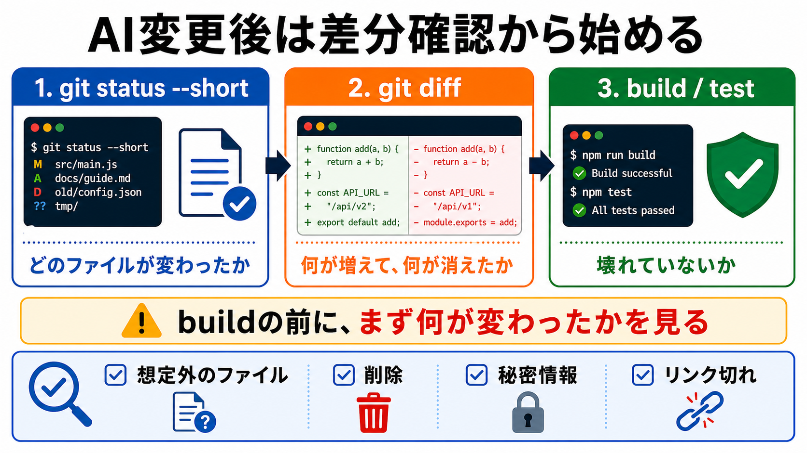

# 差分確認を入口にする

この章では、AIが変更した内容を受け入れる前に、まず差分を確認する流れを作ります。

AIに作業を頼むと、ファイルが変わることがあります。
そのとき、buildやtestへ進む前に「どのファイルが変わったか」「何が変わったか」を確認します。

## この章でできるようになること

- `git status` と `git diff` の役割を説明できる
- AIの変更を受け入れる前に、差分確認を入口にできる
- 予想外のファイル変更に気づける

## 最初に見るのは差分

AIが作業したあと、最初に見るのは結果の雰囲気ではありません。
まず、差分を見ます。

```bash
git status --short
```

`git status --short` は、どのファイルが変更されたかを短く表示します。

次に、変更の中身を見ます。

```bash
git diff
```

`git diff` は、ファイルの中で増えた行、消えた行を表示します。



## なぜbuildより先に見るのか

buildが通っても、意図しない変更が入っていることがあります。

たとえば、次のような変更です。

- 関係ないファイルが編集されている
- 画像や章ファイルが追加されたまま参照されていない
- 本文の言い回しが変わりすぎている
- 秘密情報に近い文字列が入っている
- 古い説明を消してしまっている

buildは、サイトやプログラムが壊れていないかを見る確認です。
差分確認は、そもそも何を変えたかを見る確認です。

順番としては、まず差分を見てから、buildやtestへ進みます。

## `git status --short` の見方

`git status --short` では、ファイルの左側に記号が出ます。

例です。

```text
 M docs/advanced/example.md
?? docs/images/advanced/example.png
```

よく見る記号は次の通りです。

| 表示 | 意味 |
| --- | --- |
| `M` | 変更されたファイル |
| `A` | 追加されたファイル |
| `D` | 削除されたファイル |
| `??` | Gitがまだ追跡していない新しいファイル |

この時点では、すべての意味を完全に覚えなくても構いません。
まずは、「想定していないファイルが混ざっていないか」を見ます。

## `git diff` の見方

`git diff` では、増えた行と消えた行が表示されます。

```diff
- 古い文章
+ 新しい文章
```

`-` は消えた行、`+` は増えた行です。

差分を見るときは、次の観点で確認します。

- 自分が頼んだ範囲に収まっているか
- 関係ないファイルが変わっていないか
- 重要な説明が消えていないか
- 画像やリンクの参照が正しいか
- 秘密情報や個人情報が入っていないか

読みにくい場合は、AIに差分の要約を頼んでも構いません。
ただし、AIの要約だけで判断せず、必要なところは自分でも見ます。

## AIに差分を説明させる

AIに変更を頼んだ場合は、commit前に差分を説明させます。

```text
今の差分を確認してください。

次の観点で要約してください。

- 変更されたファイル
- 追加されたファイル
- 削除されたファイル
- 変更理由
- 想定外の変更がないか
- 次に確認すべきコマンド

まだcommit、push、削除、追加の編集はしないでください。
```

この依頼では、AIに次の作業へ進ませず、まず差分を説明させます。

## やってみる

教材リポジトリで、今の状態を確認します。

```bash
git status --short
```

変更がある場合は、次も見ます。

```bash
git diff
```

表示された内容を見て、次の3つに分けます。

```text
想定している変更:

想定していない変更:

まだ判断できない変更:
```

「まだ判断できない変更」がある場合は、AIに説明を頼むか、該当ファイルを開いて確認します。

## 何が起きたのか

この章では、AIの変更を受け入れる前の入口として、差分確認を扱いました。

`git status --short` で変更ファイルを見て、`git diff` で中身を見ます。
buildやtestは重要ですが、その前に「何が変わったか」を確認します。

次章では、build、test、lintがそれぞれ何を確認するものなのかを分けて考えます。

## 次へ

次は、build、test、lintを分けます。

- [build、test、lintを分ける](02-build-test-lint.md)
