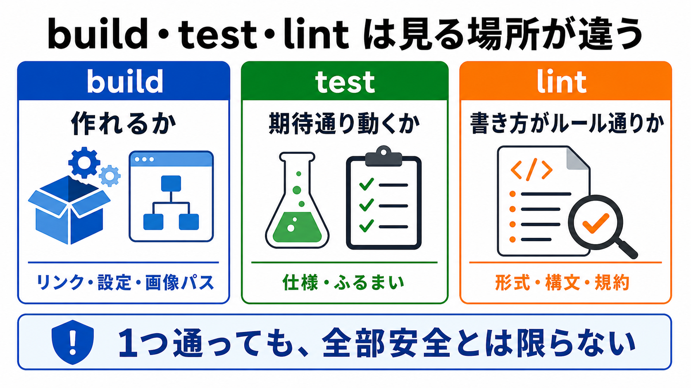

# build、test、lintを分ける

この章では、build、test、lintがそれぞれ何を確認するものなのかを分けて考えます。

AIの変更を受け入れる前には、差分を見るだけでなく、動作確認も必要です。
ただし、確認コマンドはどれも同じ意味ではありません。

## この章でできるようになること

- build、test、lintの役割を説明できる
- どの確認が足りていないかを判断できる
- AIに確認コマンドを頼むときの聞き方を作れる

## 3つは見ている場所が違う

build、test、lintは、確認しているものが違います。

| 確認 | 見ていること |
| --- | --- |
| build | サイトやアプリを作れるか |
| test | 期待した動きが保たれているか |
| lint | 書き方やルール違反がないか |

どれか1つが通ったからといって、すべて安全とは限りません。



## buildは作れるかを見る

buildは、サイトやアプリを本番用に作れるかを見る確認です。

この教材サイトでは、Docusaurusのビルドを実行します。

```bash
npm run build
```

buildが失敗した場合、次のような問題が考えられます。

- Markdownのリンクが壊れている
- 画像パスが間違っている
- 設定ファイルにエラーがある
- 必要なファイルが存在しない

buildが通ると、「少なくともサイトとして生成できる」ことがわかります。
ただし、文章がわかりやすいか、内容が正しいかまでは保証しません。

## testは期待した動きを見る

testは、プログラムが期待通りに動くかを見る確認です。

プロジェクトによっては、次のようなコマンドがあります。

```bash
npm test
```

ただし、すべてのプロジェクトにtestがあるとは限りません。
testがない場合は、無理に作ったふりをせず、「このプロジェクトにはまだtestがない」と判断します。

testが通っても、すべての不具合が消えるわけではありません。
testに書かれている範囲だけを確認しているからです。

## lintは書き方を見る

lintは、コードや文章の書き方がルールに合っているかを見る確認です。

プロジェクトによっては、次のようなコマンドがあります。

```bash
npm run lint
```

lintでは、次のような問題を見つけることがあります。

- 使っていない変数
- フォーマットの乱れ
- ルールに反した書き方
- 設定で禁止されている構文

lintが通っても、アプリが期待通りに動くとは限りません。
lintは主に書き方の確認です。

## まずpackage.jsonを見る

Node.js系のプロジェクトでは、確認コマンドは `package.json` に書かれていることが多いです。

```bash
cat package.json
```

ただし、全部を読む必要はありません。
まず `scripts` という項目を探します。

```json
"scripts": {
  "build": "docusaurus build",
  "serve": "docusaurus serve"
}
```

この例では、`npm run build` はありますが、`npm test` や `npm run lint` はありません。

ないコマンドを実行して失敗するより、まず何が用意されているかを確認します。

## AIに確認コマンドを調べさせる

AIに確認を頼むときは、いきなり全部実行させるのではなく、まず候補を調べさせます。

```text
このプロジェクトで使える確認コマンドを調べてください。

次の順でお願いします。

1. package.jsonや設定ファイルを読み、build、test、lintに相当するコマンドを探す
2. 見つかったコマンドを一覧にする
3. それぞれが何を確認するものか説明する
4. 実行すると状態を変える可能性があるものがあれば明記する

まだコマンドは実行しないでください。
ファイル編集、削除、commit、pushもしないでください。
```

確認コマンドを実行する前に、何を実行するのかを説明させます。

## やってみる

教材サイトの確認コマンドを調べます。

```bash
cd site
cat package.json
```

`scripts` の中にあるコマンドを見ます。

次の形で整理します。

```text
buildに相当するコマンド:

testに相当するコマンド:

lintに相当するコマンド:

まだ用意されていない確認:
```

用意されていない確認があっても、失敗ではありません。
今のプロジェクトで何を確認できるかを把握することが目的です。

## 何が起きたのか

この章では、build、test、lintの役割を分けました。

buildは作れるか、testは期待した動きが保たれているか、lintは書き方のルールに合っているかを見ます。
AIに確認を頼むときも、まず何のコマンドがあり、何を確認するのかを説明させます。

次章では、秘密情報が差分や公開対象に入っていないかを確認します。
