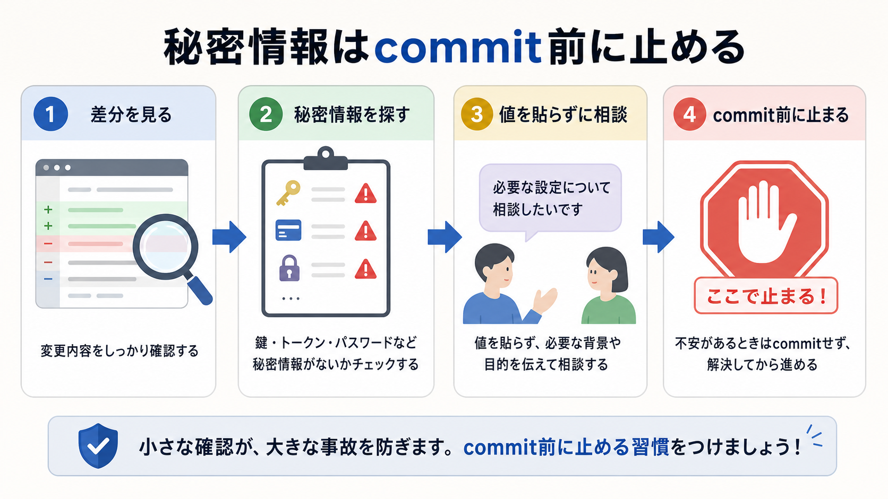

# 秘密情報を確認する

この章では、AIが変更した差分や公開対象に、秘密情報が入っていないかを確認します。

秘密情報は、あとから削除すれば必ず安全になるものではありません。
Gitの履歴や外部サービスのログに残ることがあるため、commitやpushの前に止めることが大切です。

## この章でできるようになること

- 秘密情報に近いものを見分けられる
- 差分と公開対象を分けて確認できる
- AIに秘密情報チェックを頼むときの安全な聞き方を作れる

## 先に知っておくこと

この章では、パスワード、APIキー、トークン、秘密鍵、認証コードの中身はAIに貼りません。

確認したいのは、秘密情報そのものではなく、「秘密情報らしきものがファイルに入っていないか」です。
もし見つかった場合は、値を貼って相談するのではなく、ファイル名、行番号、種類だけを伝えます。



## 秘密情報に近いもの

秘密情報には、次のようなものがあります。

| 種類 | 例 |
| --- | --- |
| パスワード | ログイン用の文字列 |
| APIキー | 外部サービスを使うための鍵 |
| トークン | GitHubやAIサービスの認証情報 |
| 秘密鍵 | SSHや署名に使う非公開の鍵 |
| 認証コード | 一時的なログイン確認コード |

`.env` という名前のファイルも注意が必要です。
`.env` には、ローカルだけで使う設定や秘密情報が入ることがあります。

## 差分を見る

まず、変更されたファイルを確認します。

```bash
git status --short
```

次に、差分を見ます。

```bash
git diff
```

差分を見るときは、次の観点で確認します。

- `.env` や秘密鍵らしいファイルが追加されていないか
- `password`、`token`、`secret`、`api_key` に近い文字列がないか
- 長いランダムな文字列が本文や設定に入っていないか
- 公開してよいメールアドレスやURLだけが入っているか

ここで大事なのは、見つけた値をAIに貼らないことです。
AIに相談するときは、値を伏せて説明します。

## 公開対象も見る

差分に秘密情報がなくても、公開対象に入っている場合があります。

たとえば、Webサイトでは `dist/` や `build/` のような生成物に、公開されるファイルが入ります。
GitHub Pagesで公開する場合は、公開される内容に秘密情報が入っていないかも確認します。

発展編では、まず次の考え方だけ押さえれば十分です。

```text
commit前: Gitに記録する内容を見る
公開前: 外から見える内容を見る
```

commit前と公開前は、似ていますが同じ確認ではありません。

## AIに確認を頼む

AIに秘密情報チェックを頼むときは、値を見せず、探す観点を指定します。

```text
今の差分に、秘密情報や公開してはいけない情報が含まれていないか確認してください。

次の観点で見てください。

- .env、秘密鍵、トークン、APIキーらしいファイルが追加されていないか
- password、token、secret、api_key に近い名前や文字列がないか
- 公開してよい内容か迷う個人情報がないか
- 見つけた場合は、値を表示せず、ファイル名、行番号、種類だけを説明する

まだファイル編集、削除、commit、pushはしないでください。
```

AIが「この値を貼ってください」と言ってきた場合も、貼りません。
必要なのは、秘密そのものではなく、どこに何の種類の情報があるかです。

## やってみる

教材リポジトリで、差分に秘密情報らしいものがないかを確認します。

```bash
git status --short
git diff
```

次の形で整理します。

```text
秘密情報らしい変更:

公開してよいか迷う変更:

問題なさそうな変更:
```

迷うものがある場合は、値を伏せてAIに相談します。

## 何が起きたのか

この章では、秘密情報をcommit前と公開前に止める考え方を扱いました。

AIに確認を頼むことはできますが、秘密情報そのものを貼ってはいけません。
ファイル名、行番号、種類だけで相談し、値は自分の手元で確認します。

次章では、公開前に見る項目をチェックリストとしてまとめます。

## 次へ

次は、公開前チェックリストを作ります。

- [公開前チェックリストを作る](04-publication-checklist.md)
