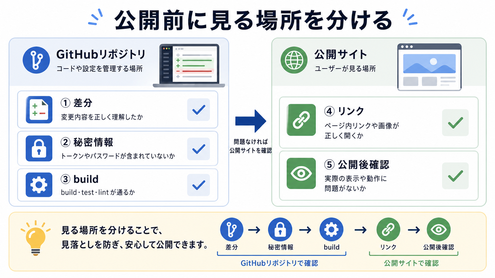

# 公開前チェックリストを作る

この章では、GitHub Pagesや公開リポジトリに出す前の確認項目を、チェックリストとしてまとめます。

公開前確認は、作業の最後に思い出すものではありません。
AIに実装を頼む前から、最後に何を見るかを決めておくと、途中の判断も安定します。

## この章でできるようになること

- commit前確認と公開前確認を分けられる
- 自分のプロジェクト用の公開前チェックリストを作れる
- AIに公開前レビューを頼むときの観点を指定できる

## まず公開の意味を分ける

公開には、少なくとも2つの意味があります。

| 確認する場所 | 見ること |
| --- | --- |
| GitHubリポジトリ | ファイル、履歴、README、Issue、Pull Request |
| 公開サイト | ブラウザから見えるページ、画像、リンク |

GitHubにpushしたファイルは、公開リポジトリなら他の人が見られます。
GitHub Pagesで公開したサイトは、ブラウザから見られます。



## チェックリストの基本形

公開前チェックリストは、短くても構いません。

たとえば、次のように分けます。

```text
差分:
- 頼んだ範囲の変更か
- 不要なファイルが混ざっていないか

秘密情報:
- .env、トークン、APIキー、秘密鍵が入っていないか
- 個人情報や業務情報が入っていないか

表示:
- buildが通るか
- 主要ページをブラウザで見たか
- 画像とリンクが壊れていないか

公開後:
- 公開URLを開いたか
- 修正が必要な場合の戻し方を知っているか
```

全部を完璧にするためではなく、見落としを減らすための道具です。

## プロジェクトごとに変える

チェックリストは、プロジェクトによって変わります。

教材サイトなら、Markdownリンク、画像参照、章の順番が重要です。
Webアプリなら、ログイン、フォーム、保存処理、環境変数が重要になるかもしれません。
ローカル自動化なら、公開よりも、実行権限、対象ディレクトリ、削除操作の有無が重要です。

チェックリストは固定の正解ではなく、そのプロジェクトで事故が起きやすい場所を先に見るためのものです。

## AIに公開前レビューを頼む

AIに頼むときは、公開前の観点を具体的に渡します。

```text
公開前レビューをしてください。

次の観点で確認してください。

- Git差分が依頼した範囲に収まっているか
- 秘密情報、個人情報、業務情報が含まれていないか
- 公開サイトで壊れそうなリンクや画像参照がないか
- buildや確認コマンドで見るべきものは何か
- 公開後に確認すべきURLや画面は何か

見つけた問題は、重要度の高い順に並べてください。
まだファイル編集、commit、push、公開設定の変更はしないでください。
```

AIのレビュー結果は、判断材料です。
最後に公開するかどうかを決めるのは人間です。

## やってみる

自分のプロジェクトを1つ思い浮かべ、公開前チェックリストを作ります。

```text
プロジェクト名:

commit前に見ること:

公開前に見ること:

公開後に見ること:

迷ったら止まる条件:
```

まだ公開する予定がなくても構いません。
将来公開するなら、何を見ればよいかを先に言葉にします。

## 何が起きたのか

この章では、公開前確認をチェックリストにしました。

公開前確認では、GitHubリポジトリに見えるものと、公開サイトで見えるものを分けます。
AIには観点を渡してレビューさせ、人間が採用判断をします。

次章では、AIの変更が崩れたときの立て直し方を扱います。

## 次へ

次は、失敗した変更を立て直します。

- [失敗した変更を立て直す](05-recover-failed-change.md)
