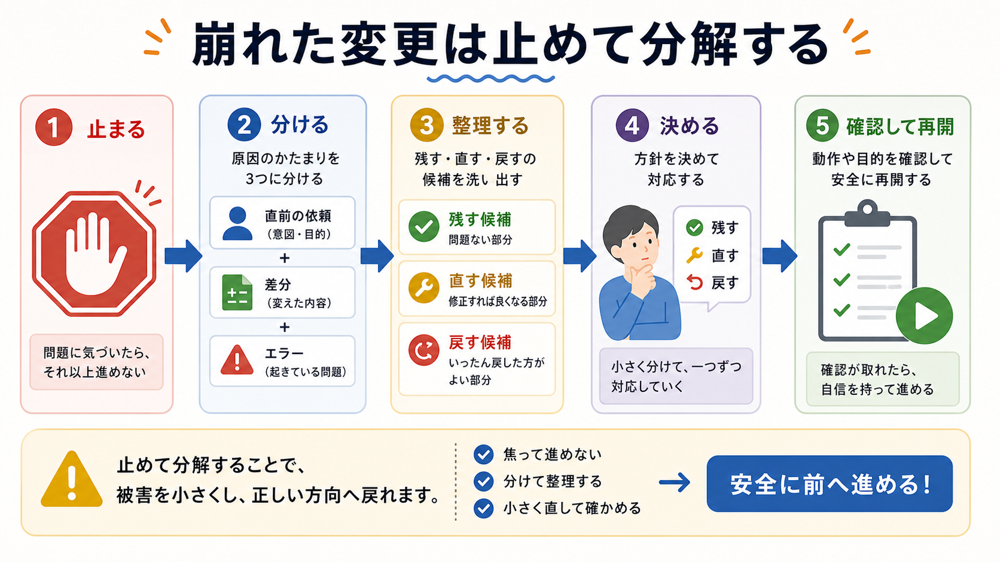

# 失敗した変更を立て直す

この章では、AIの変更が崩れたときに、何を止め、何を確認し、どこからやり直すかを整理します。

AIに任せる作業では、失敗をゼロにするより、失敗したときに安全に止まれることが大切です。
焦って追加の修正を重ねると、どこで崩れたのかが見えにくくなります。

## この章でできるようになること

- 失敗した変更を広げる前に止まれる
- 差分、エラー、直前の依頼を分けて確認できる
- AIに立て直し計画を頼める

## まず止まる

エラーが出たとき、すぐに次の修正を頼みたくなります。
しかし、まず止まります。

止まるとは、次のようなことです。

- 追加の編集を頼まない
- commitしない
- pushしない
- 削除やリセットを急がない
- 今の差分を確認する



## 3つに分けて見る

立て直すときは、次の3つを分けます。

| 見るもの | 確認すること |
| --- | --- |
| 直前の依頼 | 何を頼んだか、範囲は明確だったか |
| 差分 | どのファイルが変わったか、想定外はあるか |
| エラー | どの確認で失敗したか、再現できるか |

この3つを混ぜると、「AIが失敗した」「壊れた」とだけ感じてしまいます。
分けて見ると、依頼が曖昧だったのか、実装が違ったのか、確認コマンドが足りなかったのかを判断しやすくなります。

## 戻す前に読む

Gitには変更を戻す方法があります。
しかし、戻し方を間違えると、必要な変更まで消すことがあります。

そのため、戻す前にまず読みます。

```bash
git status --short
git diff
```

この段階で、AIに「戻して」とだけ頼むのは危険です。
どのファイルを戻すのか、どの変更は残すのかを決めてから頼みます。

## AIに立て直し計画を頼む

AIには、すぐ修正させるのではなく、まず立て直し計画を出させます。

```text
直前の変更で問題が起きました。
まだファイル編集、削除、commit、pushはしないでください。

次の順で立て直し計画を出してください。

1. 今の差分で変更されたファイルを分類する
2. 直前の依頼と関係がある変更、関係が薄い変更を分ける
3. 失敗している確認コマンドとエラー内容を整理する
4. 残す変更、直す変更、戻す候補を分ける
5. 実行前に人間が確認すべきことを列挙する

値が秘密情報に見える場合は、値を表示せず種類だけ説明してください。
```

この依頼では、AIを修正役ではなく、整理役として使います。

## やってみる

失敗した変更がある想定で、次の表を埋めます。

```text
直前に頼んだこと:

起きた問題:

変更されたファイル:

残したい変更:

戻すか迷う変更:

次に確認するコマンド:
```

実際に失敗していなくても、練習として書いてみると、止まり方を覚えやすくなります。

## 何が起きたのか

この章では、失敗した変更をすぐ直そうとせず、止めて分解する流れを扱いました。

直前の依頼、差分、エラーを分けると、立て直しの判断がしやすくなります。
AIには、まず計画と分類を頼み、実際に戻す操作は人間が確認してから進めます。

次章では、第6部全体を振り返り、自分の安全確認手順を作ります。

## 次へ

次は、第6部の確認です。

- [第6部の確認](06-review-safety-checks.md)
