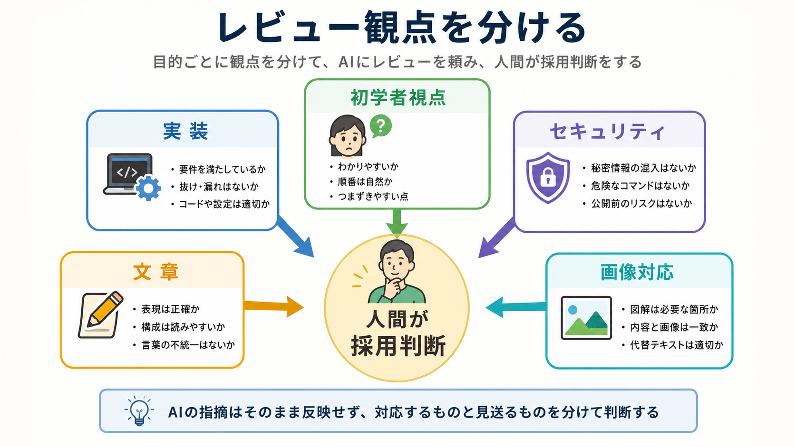

# レビュー観点を分ける

この章では、AIにレビューを頼む前に、何を見てほしいのかを観点ごとに分けます。

レビューは「よさそうか」を聞く作業ではありません。
安全、動作、文章、初学者視点、画像との対応など、見る場所を分けるほど、AIの指摘を判断しやすくなります。

## この章でできるようになること

- レビュー観点を分けてAIに依頼できる
- 1回のレビューに詰め込みすぎない判断ができる
- レビュー結果を人間の判断材料として扱える

## レビューは目的を分ける

同じ差分でも、見る人の目的によって指摘は変わります。

| 観点 | 見ること |
| --- | --- |
| 実装レビュー | 依頼通りに変わっているか、壊れやすくないか |
| 初学者視点レビュー | 説明の順番、未説明の用語、迷う箇所 |
| セキュリティレビュー | 秘密情報、危険な操作、公開してよい内容 |
| 文章レビュー | 表現、重複、読みやすさ |
| 画像レビュー | 本文と画像が対応しているか |



## 1回で全部見させない

AIに「全部レビューして」と頼むと、指摘が広く浅くなりがちです。
重要な観点が混ざると、何を優先すべきかも見えにくくなります。

たとえば、セキュリティの問題と文章の言い回しが同じ重さで並ぶと、先に対応すべきものを見失います。
だから、レビュー観点を分けます。

まず安全や壊れやすさを見て、そのあと文章や読みやすさを見る、という順番にすると判断しやすくなります。

## レビュー依頼の基本形

レビュー依頼では、次の4つを入れます。

```text
対象:
観点:
出力形式:
禁止すること:
```

たとえば、次のように頼みます。

```text
今の差分をレビューしてください。

観点は「初学者にとって説明の順番が自然か」に限定してください。
セキュリティや文章表現の細かい言い換えは、今回は見なくて構いません。

指摘は、重要度の高い順に並べてください。
各指摘には、対象ファイル、理由、修正方針を含めてください。

まだファイル編集、削除、commit、pushはしないでください。
```

観点を限定すると、AIの出力を読みやすくなります。

## 人間が採用判断する

AIレビューの指摘は、すべて正しいとは限りません。
教材の意図に合わない指摘や、別の章で扱うべき指摘もあります。

レビュー結果は、次の3つに分けます。

```text
対応する:

見送る:

別章・別タスクに回す:
```

この分類を人間が行うことで、AIレビューを作業の主導権にしないで済みます。

## やってみる

最近AIに頼んだ変更を1つ思い出し、レビュー観点を3つに分けます。

```text
変更内容:

最初に見る観点:

次に見る観点:

今回は見ない観点:
```

「今回は見ない観点」を決めることも大切です。
全部を同時に見ると、作業が散らかります。

## AIに聞いてみよう

AIに、レビュー観点の分け方を練習してもらいます。

```text
AIレビューの観点を分ける練習をしたいです。

5問の一問一答でお願いします。

- 1問ずつ変更内容の例を出す
- その直下に A: 実装レビュー、B: 初学者視点レビュー、C: セキュリティレビュー、D: 文章レビュー の選択肢を毎回表示する
- 私が回答するまで、答え、採点、解説を表示しない
- 私が回答したあと、その問題だけを採点し、理由を説明する
- 解説後に次の問題を1問だけ出す
- ファイル編集、削除、commit、pushはしない
```

## 何が起きたのか

この章では、AIレビューを観点ごとに分けました。

レビューの目的を分けると、AIの指摘が読みやすくなり、人間が採用判断しやすくなります。
次章では、実装レビューを差分ベースで頼む方法を扱います。

## 次へ

次は、実装レビューを頼みます。

- [実装レビューを頼む](02-implementation-review.md)
