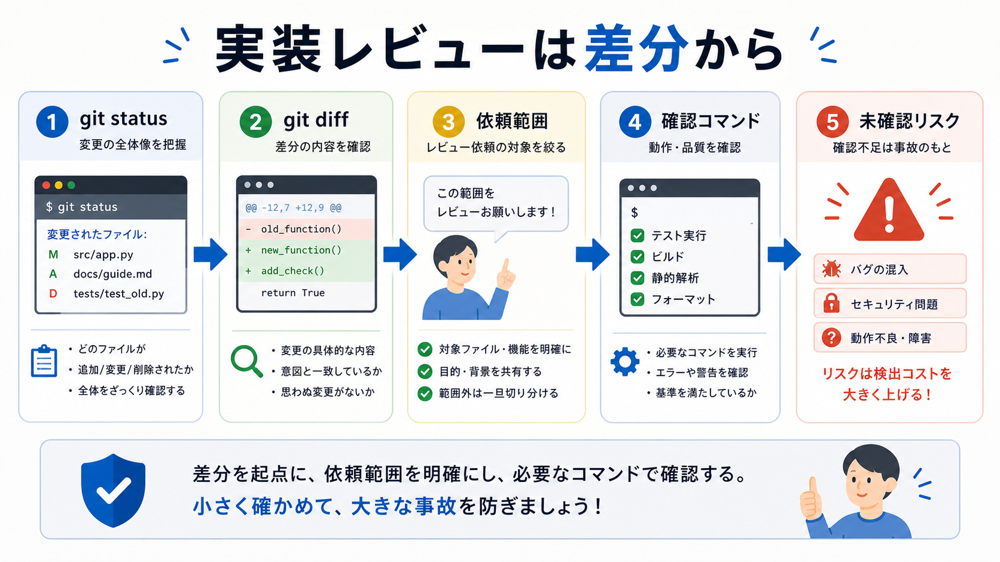

# 実装レビューを頼む

この章では、AIが変更したコードや文書を、差分ベースでレビューさせます。

実装レビューでは、作業が依頼通りか、壊れやすい変更がないか、確認コマンドが足りているかを見ます。
文章の細かい言い換えよりも、まず動くか、意図から外れていないかを優先します。

## この章でできるようになること

- 差分を対象に実装レビューを依頼できる
- 依頼範囲から外れた変更を見つけられる
- 確認コマンドと未確認リスクを整理できる

## 実装レビューの入口

実装レビューは、差分から始めます。

```bash
git status --short
git diff
```

AIにレビューさせる場合も、まず何が変わったかを対象にします。
「今のプロジェクト全体を見て」ではなく、「今の差分を見て」と頼むほうが、レビューの範囲が安定します。



## 見る観点

実装レビューでは、次の観点を見ます。

- 依頼した範囲に収まっているか
- 変更理由が説明できるか
- 既存の構成や文体から大きく外れていないか
- 確認コマンドがあるか
- 未確認のリスクが残っていないか

AIが作った変更でも、人間が説明できない変更はそのまま受け入れません。
説明できない場合は、AIに理由を聞くか、差分を小さくします。

## レビュー依頼の例

実装レビューは、次のように頼みます。

```text
今の差分を実装レビューしてください。

観点は次に限定してください。

- 依頼した範囲に収まっているか
- 既存の構成や命名に合っているか
- 壊れやすい変更や不足している確認がないか
- build、test、lintなど次に実行すべき確認は何か

指摘は重要度の高い順に並べてください。
問題がない場合は、残るリスクと未実行の確認だけを説明してください。

まだファイル編集、削除、commit、pushはしないでください。
```

レビューと修正を同時に頼まないことがポイントです。
まずレビューだけを受け取り、人間が対応するものを選びます。

## 変更理由を説明させる

AIの実装レビューでは、変更理由も確認します。

```text
変更されたファイルごとに、なぜその変更が必要だったのかを1行で説明してください。
説明できない変更があれば、想定外の変更候補として分けてください。
```

理由が説明できない変更は、不要な変更かもしれません。
その場合、追加修正に進む前に、差分を読み直します。

## やってみる

小さな差分を想定し、実装レビューの観点を整理します。

```text
依頼したこと:

変更されたファイル:

期待する確認コマンド:

実装レビューで見てほしいこと:

今回は見なくてよいこと:
```

観点を言葉にしてからAIに渡すと、レビュー結果を読みやすくなります。

## AIに聞いてみよう

AIに、実装レビューの依頼文を点検してもらいます。

```text
次の実装レビュー依頼文を、AIが誤解しにくい形に改善してください。

目的:
差分を実装レビューしてほしい

条件:
- 観点を増やしすぎない
- レビューだけを頼み、修正はさせない
- 指摘は重要度順にする
- ファイル編集、削除、commit、pushは禁止する

改善案を出したあと、なぜその形にしたか説明してください。
```

## 何が起きたのか

この章では、差分を対象に実装レビューを頼む方法を扱いました。

実装レビューでは、依頼範囲、既存構成との整合、確認コマンド、未確認リスクを見ます。
次章では、初学者視点で説明の順番や前提知識をレビューします。

## 次へ

次は、初学者視点レビューを頼みます。

- [初学者視点レビューを頼む](03-beginner-review.md)
