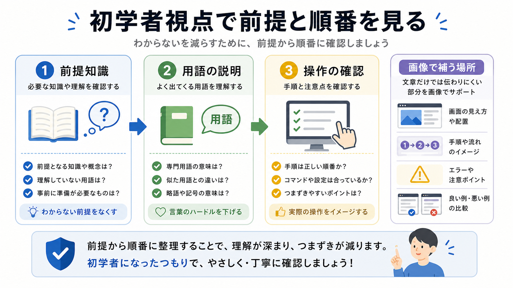

# 初学者視点レビューを頼む

この章では、説明不足、順序の違和感、画像が必要な箇所を、AIに初学者視点でレビューさせます。

初学者向けの教材では、正しい情報を並べるだけでは足りません。
その時点で前提知識が揃っているか、知らない用語を突然使っていないかを見る必要があります。

## この章でできるようになること

- 初学者視点のレビュー観点を指定できる
- 未説明の用語や飛躍した説明を見つけられる
- 本文と画像の役割を分けて確認できる

## 初学者視点で見ること

初学者視点レビューでは、次のような点を見ます。

- この章の前に必要な前提があるか
- 初めて出る用語を放置していないか
- 操作の前に危ない点を説明しているか
- コマンドの結果をどう確認するか書いているか
- 画像が理解を助ける場所に置かれているか



## 正しさとわかりやすさを分ける

技術的に正しい説明でも、初学者には読みにくいことがあります。

たとえば、まだGitを学んでいない段階で、いきなり「branchを切ってPRを出します」と書くと、前提が足りません。
逆に、すでに学んだ内容を毎回長く説明すると、本文が重くなります。

初学者視点レビューでは、次の2つを分けます。

```text
この章で短く説明すること:

後の章やリファレンスへ逃がすこと:
```

全部をその場で説明しようとしないことも、読みやすさにつながります。

## レビュー依頼の例

初学者視点レビューは、次のように頼みます。

```text
今の章本文を、初学者視点でレビューしてください。

観点は次に限定してください。

- この章の前提知識が足りているか
- 初めて出る用語が放置されていないか
- 操作や判断の順番が自然か
- 危ない操作の前に注意があるか
- 画像が本文の理解を助けているか

指摘は、対象箇所、理由、修正方針に分けてください。
文章の好みだけの言い換えは、重要なものだけにしてください。

まだファイル編集、削除、commit、pushはしないでください。
```

この依頼では、AIに「読み手のつまずき」を探してもらいます。

## 画像の必要性を見る

画像は、雰囲気づくりではなく、理解の補助として使います。

初学者視点レビューでは、次のように聞くとよいです。

```text
この章で、本文だけだと取り違えやすい概念はありますか。
画像で補うなら、何を比較または流れとして見せるべきですか。
既存画像で足りる場合は、新規画像を増やさない判断も含めてください。
```

画像を増やすこと自体が目的ではありません。
本文と画像が、同じ理解を別の角度から支えているかを見ます。

## やってみる

自分が書いた説明やAIが書いた説明を1つ選び、次の観点で見直します。

```text
初めて出る用語:

説明が飛んでいる場所:

危ない操作の前に注意があるか:

画像があると助かる場所:

後の章に逃がす内容:
```

全部に完璧に答えられなくても構いません。
つまずきそうな場所に気づくことが目的です。

## AIに聞いてみよう

AIに、初学者視点レビューの練習問題を出してもらいます。

```text
初学者向け教材のレビュー観点について、5問の一問一答で練習したいです。

- 1問ずつ短い本文例を出す
- その直下に A/B/C の選択肢を毎回表示する
- 私が回答するまで、答え、採点、解説を表示しない
- 私が回答したあと、その問題だけを採点し、理由を説明する
- 解説後に、次の問題を1問だけ出す
- コマンド実行、ファイル編集、commit、pushはしない
```

## 何が起きたのか

この章では、初学者視点レビューを扱いました。

初学者視点では、前提知識、用語、順序、危ない操作、画像の必要性を見ます。
次章では、秘密情報や危険な操作を中心にセキュリティレビューを頼みます。

## 次へ

次は、セキュリティレビューを頼みます。

- [セキュリティレビューを頼む](04-security-review.md)
