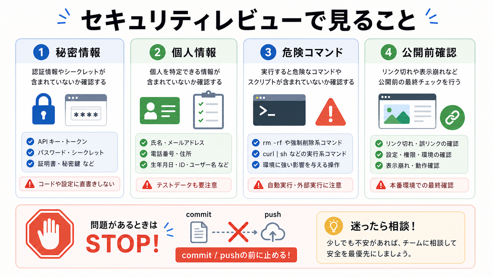

# セキュリティレビューを頼む

この章では、秘密情報、危険なコマンド、公開前確認の観点から、AIにセキュリティレビューを頼みます。

セキュリティレビューは、怖い言葉を並べるためのものではありません。
公開してはいけない情報や、環境を壊しやすい操作を、実行前または公開前に止めるための確認です。

## この章でできるようになること

- セキュリティレビューの観点を具体的に指定できる
- AIに値を貼らずに秘密情報チェックを頼める
- 危険な操作を実行前に止められる

## 見る観点

セキュリティレビューでは、次の観点を見ます。

- `.env`、トークン、APIキー、秘密鍵が入っていないか
- 個人情報や業務情報が公開対象に入っていないか
- `sudo`、`rm`、`chmod`、`chown`、`curl | sh` などの危険操作があるか
- GitHubへpushする内容に問題がないか
- GitHub Pagesで公開される内容に問題がないか



## 値を貼らない

セキュリティレビューで一番大事なのは、秘密情報そのものをAIに貼らないことです。

AIには、次のように頼みます。

```text
秘密情報らしい値を見つけた場合は、値を表示しないでください。
ファイル名、行番号、種類だけを説明してください。
```

AIが値を表示してしまう可能性もあるため、最初から差分に秘密情報を入れないことが重要です。
もし入ってしまった場合は、追加の公開やpushを止めます。

## レビュー依頼の例

セキュリティレビューは、次のように頼みます。

```text
今の差分をセキュリティ観点でレビューしてください。

次の観点に限定してください。

- 秘密情報、トークン、APIキー、秘密鍵らしいものが含まれていないか
- 個人情報や業務情報が公開対象に入っていないか
- 危険なコマンドや環境を変える操作が説明なしに出ていないか
- GitHubへpushまたはGitHub Pagesで公開する前に止まるべき点があるか

秘密情報らしい値を見つけても、値は表示せず、ファイル名、行番号、種類だけを説明してください。
まだファイル編集、削除、commit、push、公開設定の変更はしないでください。
```

セキュリティレビューでは、指摘が少なくても油断しません。
AIが見落とすこともあるため、人間も差分を確認します。

## 危険な操作を見つける

教材やREADMEにコマンドを書く場合は、次を確認します。

```text
何をするコマンドか:
なぜ必要か:
何が起きると困るか:
結果をどう確認するか:
戻せるか:
```

特に、環境そのものに影響するコマンドは、実行前に説明が必要です。
AIに「このコマンドを実行して」と頼む前に、何を変えるのかを説明させます。

## やってみる

次の観点で、自分のプロジェクトの危険箇所を洗い出します。

```text
秘密情報が入りやすいファイル:

公開してよいか迷う情報:

危険なコマンドが出やすい作業:

AIに実行前説明を求める操作:

人間が最後に見る場所:
```

プロジェクトによって危険箇所は違います。
自分の作業で起きやすい失敗を言葉にします。

## AIに聞いてみよう

AIに、危険な操作の見分けを練習してもらいます。

```text
AIが提案する操作の安全確認について、5問の一問一答で練習したいです。

- 1問ずつコマンドや操作例を出す
- その直下に A: そのまま実行してよい、B: 意味を確認してから実行する、C: 実行せず止まる の選択肢を毎回表示する
- 私が回答するまで、答え、採点、解説を表示しない
- 私が回答したあと、その問題だけを採点し、理由を説明する
- 解説後に、次の問題を1問だけ出す
- コマンドは実行しない
- ファイル編集、削除、commit、pushはしない
```

## 何が起きたのか

この章では、セキュリティレビューを秘密情報、危険操作、公開前確認に分けました。

AIにレビューを頼むことはできますが、秘密情報の値は貼りません。
次章では、AIレビューの結果を、対応するものと見送るものに分けます。

## 次へ

次は、レビュー結果を採用判断します。

- [レビュー結果を採用判断する](05-adopt-review-results.md)
