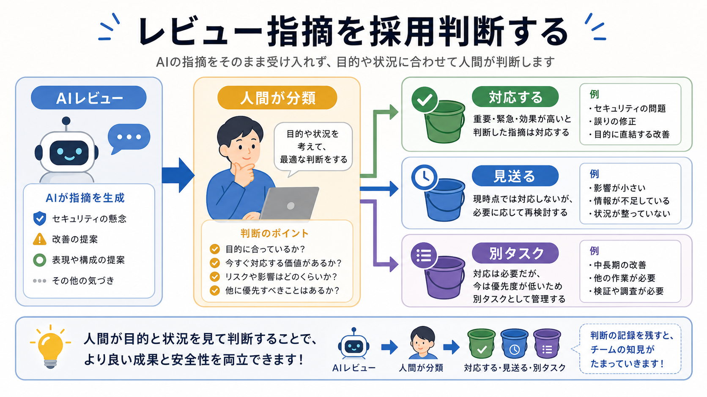

# レビュー結果を採用判断する

この章では、AIレビューの指摘をそのまま反映せず、対応するものと見送るものに分けます。

レビューは、判断をAIに渡すためのものではありません。
人間が判断する材料を増やすためのものです。

## この章でできるようになること

- AIレビューの指摘を分類できる
- 対応するもの、見送るもの、別タスクに回すものを分けられる
- レビュー対応後に再確認する流れを作れる

## 指摘を3つに分ける

AIレビューの結果は、次の3つに分けます。

| 分類 | 意味 |
| --- | --- |
| 対応する | 今の目的に合っていて、直す価値がある |
| 見送る | 意図に合わない、または今は直さない |
| 別タスクに回す | 重要だが、今回の範囲を超える |



## 重要度と範囲を見る

レビュー指摘を見るときは、重要度だけでなく範囲も見ます。

たとえば、秘密情報が混ざっている指摘は重要度が高く、すぐ止まる必要があります。
一方で、「全体の章構成を見直すべき」という指摘は重要でも、今の小さな修正範囲を超えるかもしれません。

その場合は、今すぐ反映するのではなく、別タスクに回します。

## 採用判断のメモ

レビュー結果は、短くてもよいので分類して残します。

```text
対応する:
- 指摘:
  理由:
  対応方針:

見送る:
- 指摘:
  理由:

別タスク:
- 指摘:
  後で扱う場所:
```

このメモがあると、あとで「なぜその指摘を無視したのか」が説明しやすくなります。

## AIに分類を手伝わせる

AIには、レビュー指摘の分類を手伝わせることができます。

```text
次のレビュー指摘を、対応する、見送る、別タスクに回す、の3つに分類してください。

判断基準は次の通りです。

- 今回の目的に直接関係するものは対応候補
- 安全や公開に関わるものは優先度を高くする
- 今回の範囲を超える大きな改善は別タスク候補
- 教材の意図に合わない指摘は見送り候補

分類理由も短く書いてください。
まだファイル編集、削除、commit、pushはしないでください。
```

分類案をAIに出させても、最後の判断は人間がします。

## 対応後に再レビューする

レビュー指摘に対応したら、もう一度確認します。

ただし、最初と同じ大きさでレビューし直す必要はありません。
対応した差分に限定して見ます。

```text
直前のレビュー指摘への対応差分だけを確認してください。

見る観点は次の通りです。

- 指摘に対応できているか
- 新しい問題を増やしていないか
- 次に実行すべき確認コマンドはあるか

まだ追加編集、commit、pushはしないでください。
```

レビュー対応も、差分を小さく保つと安全です。

## やってみる

AIからレビュー指摘が3つ来た想定で、次の表を埋めます。

```text
指摘1:
分類:
理由:

指摘2:
分類:
理由:

指摘3:
分類:
理由:
```

「全部対応する」以外の判断を練習します。

## AIに聞いてみよう

AIに、レビュー指摘の採用判断を練習してもらいます。

```text
AIレビュー指摘の採用判断を、5問の一問一答で練習したいです。

- 1問ずつレビュー指摘の例を出す
- その直下に A: 今回対応する、B: 見送る、C: 別タスクに回す の選択肢を毎回表示する
- 私が回答するまで、答え、採点、解説を表示しない
- 私が回答したあと、その問題だけを採点し、理由を説明する
- 解説後に、次の問題を1問だけ出す
- ファイル編集、削除、commit、pushはしない
```

## 何が起きたのか

この章では、AIレビューの指摘を採用判断する流れを扱いました。

レビュー指摘は、対応する、見送る、別タスクに回す、に分類します。
次章では、第7部全体を振り返り、複数観点レビューの依頼文を作ります。

## 次へ

次は、第7部の確認です。

- [第7部の確認](06-review-ai-review.md)
