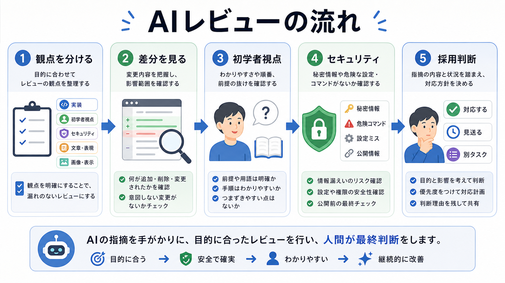

# 第7部の確認

この章では、第7部で扱ったAIレビューの設計をまとめます。

AIレビューは、AIの答えを信じるためではなく、人間が判断する材料を増やすために使います。
観点を分け、結果を分類し、対応後に再確認する流れを作ります。

## この章でできるようになること

- 複数観点のレビュー依頼文を作れる
- 実装AIとレビューAIを分ける意味を説明できる
- レビュー結果を採用判断までつなげられる

## 第7部で扱ったこと

第7部では、次の流れを扱いました。

1. レビュー観点を分ける
2. 実装レビューを差分ベースで頼む
3. 初学者視点レビューで前提と順番を見る
4. セキュリティレビューで秘密情報と危険操作を見る
5. レビュー結果を採用判断する



## 実装AIとレビューAIを分ける

同じAIに実装とレビューを頼むこともできます。
ただし、役割を分けると、見る観点を切り替えやすくなります。

```text
実装AI:
目的に沿って変更を作る

レビューAI:
変更を疑い、リスクや不足を探す

人間:
目的、採用判断、公開判断を持つ
```

役割を分けても、責任がAIに移るわけではありません。
最後に受け入れるかどうかは、人間が判断します。

## レビュー依頼セットを作る

自分がよく使うレビュー依頼を、短くまとめます。

```text
実装レビュー:

初学者視点レビュー:

セキュリティレビュー:

レビュー指摘の採用判断:
```

この依頼セットは、プロンプトテンプレートやAGENTS.mdの候補になります。
どこに置くかは、第10部で整理します。

## やってみる

同じ差分に対して、観点の違うレビュー依頼を2つ作ります。

```text
対象の差分:

レビュー1の観点:

レビュー1の依頼文:

レビュー2の観点:

レビュー2の依頼文:

レビュー結果を分類する方法:
```

レビュー依頼を分けるだけで、AIの見方が変わることを確認します。

## AIに聞いてみよう

AIに、レビュー設計の練習問題を出してもらいます。

```text
AIレビューの設計について、5問の一問一答で練習したいです。

- 1問ずつ状況を出す
- その直下に A/B/C の選択肢を毎回表示する
- 私が回答するまで、答え、採点、解説を表示しない
- 私が回答したあと、その問題だけを採点し、理由を説明する
- 解説後に、次の問題を1問だけ出す
- ファイル編集、削除、commit、pushはしない
```

## 何が起きたのか

この章では、第7部の内容をレビュー設計としてまとめました。

AIレビューは、観点を分けるほど使いやすくなります。
次の部では、サブエージェントを使える環境で、探索、実装、レビューの役割分担を扱います。

## 次へ

次は、サブエージェントで役割分担します。

- [第8部：サブエージェントで役割分担する](../part-8-subagents/index.md)
