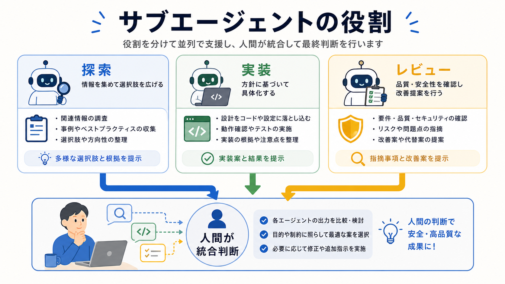

# サブエージェントの役割を理解する

この章では、サブエージェントを、作業を並列化するための相手として理解します。

サブエージェントを増やせば、自動的に安全になるわけではありません。
役割、書き込み範囲、統合判断を人間が設計する必要があります。

## この章でできるようになること

- サブエージェントの役割を説明できる
- 並列化してよい作業と危ない作業を分けられる
- 人間が統合判断を持つ理由を説明できる

## サブエージェントとは

サブエージェントは、メインのAIとは別に、特定の作業を任せるAIです。

たとえば、次のように使います。

- 探索役に、関連ファイルを調べてもらう
- 実装役に、範囲を限定して変更してもらう
- レビュー役に、差分を別観点で見てもらう



## 役割を分ける理由

サブエージェントを使うと、複数の作業を同時に進められることがあります。
しかし、同じファイルを複数のAIが編集すると、変更が衝突したり、意図が混ざったりします。

そのため、最初に役割を分けます。

| 役割 | 向いていること |
| --- | --- |
| 探索 | 読み取り中心の調査、関連ファイル探し |
| 実装 | 書き込み範囲を限定した変更 |
| レビュー | 変更後の確認、別観点の指摘 |

役割を分けると、AIに任せる内容を小さくできます。

## 並列化してよい作業

並列化しやすいのは、互いにぶつからない作業です。

たとえば、次のような作業です。

- 別々の章の読み取りレビュー
- 画像候補の洗い出し
- 既存コードの関連箇所調査
- 実装後の別観点レビュー

読み取り中心の作業は、比較的並列化しやすいです。

## 並列化しないほうがよい作業

次のような作業は、慎重に扱います。

- 同じファイルを複数のAIに編集させる
- 設計方針がまだ決まっていない実装を同時に進める
- migrationや削除のように戻しにくい変更を任せる
- 公開、push、commitを複数のAIに任せる

判断が固まっていない作業を並列化すると、早く進むより先に混乱が増えます。

## 人間が統合する

サブエージェントの結果は、最後に人間が統合します。

```text
サブエージェント:
調査、実装、レビューの材料を出す

人間:
採用するもの、見送るもの、次に頼むことを決める
```

サブエージェントを使っても、目的、判断、責任は人間に残ります。

## やってみる

自分の作業を、サブエージェントに任せられる単位に分けます。

```text
作業全体:

探索役に任せること:

実装役に任せること:

レビュー役に任せること:

人間が最後に決めること:
```

分けにくい場合は、まだサブエージェントに向いていない作業かもしれません。

## AIに聞いてみよう

AIに、サブエージェントへ渡す作業の切り分けを練習してもらいます。

```text
サブエージェントに任せる作業の切り分けを、5問の一問一答で練習したいです。

- 1問ずつ作業例を出す
- その直下に A: 探索向き、B: 実装向き、C: レビュー向き、D: 並列化しない の選択肢を毎回表示する
- 私が回答するまで、答え、採点、解説を表示しない
- 私が回答したあと、その問題だけを採点し、理由を説明する
- 解説後に、次の問題を1問だけ出す
- ファイル編集、削除、commit、pushはしない
```

## 何が起きたのか

この章では、サブエージェントを役割分担の相手として扱いました。

探索、実装、レビューの役割を分け、人間が統合判断を持ちます。
次章では、読み取り中心の探索をサブエージェントに任せる方法を扱います。

## 次へ

次は、探索を任せます。

- [探索を任せる](02-delegate-exploration.md)
