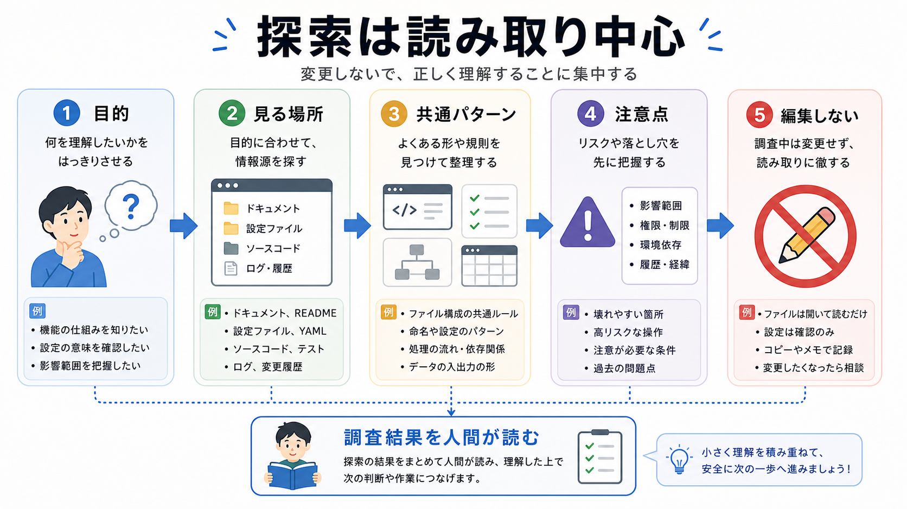

# 探索を任せる

この章では、コードベースの調査や関連ファイルの確認を、読み取り中心でサブエージェントに任せます。

探索は、サブエージェントに任せやすい作業です。
まだ編集せず、どこを見ればよいか、何が関係しているかを調べてもらいます。

## この章でできるようになること

- 探索タスクを読み取り中心で依頼できる
- 調査結果に必要な出力形式を指定できる
- 探索結果をそのまま実装判断にしないで扱える

## 探索で任せること

探索役には、次のような作業が向いています。

- 関連ファイルを探す
- 既存の命名や文体を調べる
- 設定ファイルや確認コマンドを探す
- 似た実装や既存パターンを探す
- 変更候補を整理する



## 編集させない

探索では、まだファイルを編集させません。

理由は、調査結果を見てから方針を決めるためです。
探索の段階で編集まで進むと、調査と実装が混ざり、あとから判断しにくくなります。

探索依頼には、必ず次のような制約を入れます。

```text
読み取り中心で調査してください。
まだファイル編集、削除、commit、pushはしないでください。
```

## 探索依頼の例

サブエージェントに探索を頼むときは、対象と出力を絞ります。

```text
このリポジトリで、Advanced第7部の章本文に近い文体や構成を調査してください。

読み取り中心でお願いします。

確認してほしいこと:
- 既存の発展編章でよく使われている見出し構成
- 画像参照の置き方
- AIに聞いてみようの書き方
- 次章リンクの書き方

出力:
- 参考になるファイル
- 共通パターン
- 今回の実装で守るべき注意点

まだファイル編集、削除、commit、pushはしないでください。
```

探索結果は、メインの作業者が読んで採用判断します。

## よい探索結果

よい探索結果には、次の要素があります。

- どのファイルを見たか
- 何が共通していたか
- 何が例外だったか
- 今回の作業にどう影響するか
- まだ不明な点は何か

「見ました。問題ありません」だけでは、判断材料が足りません。
探索役には、根拠と対象を短く出してもらいます。

## やってみる

自分のプロジェクトで、探索役に頼む調査を1つ書きます。

```text
調査目的:

見てほしい場所:

見なくてよい場所:

出力してほしい形式:

禁止すること:
```

「見なくてよい場所」も書くと、探索範囲が広がりすぎるのを防げます。

## AIに聞いてみよう

AIに、探索依頼文を改善してもらいます。

```text
サブエージェントに読み取り中心の探索を頼む依頼文を作りたいです。

次の条件で、依頼文を改善してください。

- 目的、対象、見なくてよい場所、出力形式を含める
- ファイル編集、削除、commit、pushは禁止する
- 実装判断は人間が行う前提にする
- 曖昧なところがあれば、先に質問すべき点も出す
```

## 何が起きたのか

この章では、探索をサブエージェントに任せる方法を扱いました。

探索は読み取り中心にし、対象、出力、禁止事項を明確にします。
次章では、書き込み範囲を限定して実装を任せる方法を扱います。

## 次へ

次は、実装を任せます。

- [実装を任せる](03-delegate-implementation.md)
