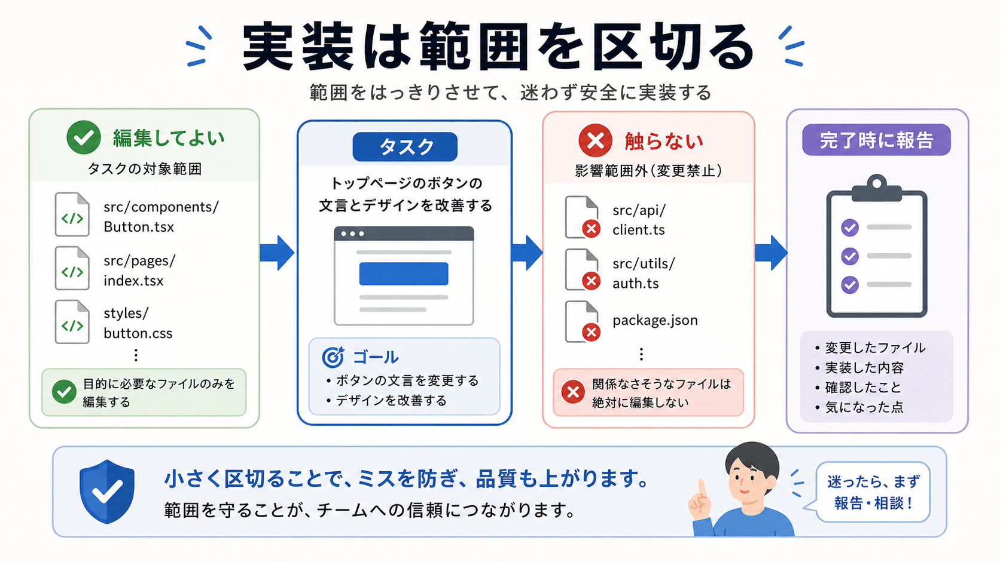

# 実装を任せる

この章では、書き込み範囲を限定して、サブエージェントに実装作業を任せます。

実装を任せるときは、「何を作るか」だけでなく、「どこを編集してよいか」を決めます。
複数のAIが同じ場所を触ると、衝突や意図しない上書きが起きやすくなります。

## この章でできるようになること

- 実装サブエージェントに書き込み範囲を指定できる
- 触ってよい場所と触らない場所を分けられる
- 実装結果を統合前に確認できる

## 書き込み範囲を決める

実装を任せる前に、次を決めます。

```text
目的:
編集してよいファイル:
編集しないファイル:
確認方法:
完了時に報告してほしいこと:
```



書き込み範囲が曖昧なままだと、サブエージェントが関係ないファイルまで直すことがあります。
良かれと思った変更でも、今回の目的から外れることがあります。

## 実装依頼の例

実装サブエージェントには、次のように頼みます。

```text
Advanced第8部の「探索を任せる」章だけを改善してください。

担当範囲:
- docs/advanced/part-8-subagents/02-delegate-exploration.md

やること:
- 初学者向けに説明の順番を整える
- AIへの依頼例を読み取り中心にする
- 次章へのつながりを自然にする

触らないこと:
- 他の章ファイル
- sidebars.js
- 画像ファイル

完了時:
- 変更したファイル
- 変更理由
- 未確認のこと
を報告してください。
```

このように、担当範囲を具体的にします。

## 他の作業者がいる前提

複数のサブエージェントを使う場合は、他の作業者がいる前提を伝えます。

```text
同じリポジトリで他の作業も並行しています。
担当範囲外の変更はしないでください。
既にある変更を勝手に戻さないでください。
```

これにより、他の変更を消したり、関係ない整形をしたりするリスクを減らします。

## 実装後に見ること

実装が返ってきたら、すぐ統合せず、次を確認します。

- 指定したファイルだけが変わっているか
- 目的に沿っているか
- 既存の文体や構成に合っているか
- 確認コマンドが必要か
- 追加レビューが必要か

実装サブエージェントの完了報告だけで判断せず、差分を見ます。

## やってみる

実装サブエージェントに任せる依頼文を書きます。

```text
目的:

編集してよいファイル:

編集しないファイル:

完了条件:

完了時の報告:
```

編集してよいファイルを1つか2つに絞ると、最初は安全です。

## AIに聞いてみよう

AIに、実装依頼文の危ない曖昧さを指摘してもらいます。

```text
次の実装依頼文をレビューしてください。

観点:
- 書き込み範囲が明確か
- 触らない場所が明確か
- 完了条件が曖昧ではないか
- 他の作業者の変更を壊さない指示があるか

まだファイル編集、削除、commit、pushはしないでください。
```

## 何が起きたのか

この章では、実装サブエージェントに書き込み範囲を指定する方法を扱いました。

実装を任せるときは、目的だけでなく、触ってよい場所、触らない場所、完了時の報告を決めます。
次章では、実装とは別の役割としてレビューを任せます。

## 次へ

次は、レビューを任せます。

- [レビューを任せる](04-delegate-review.md)
