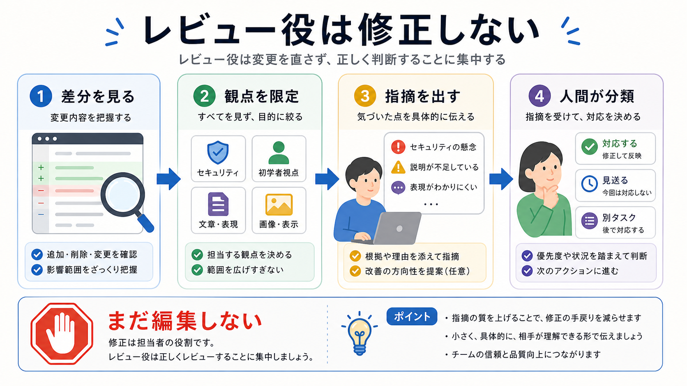

# レビューを任せる

この章では、実装とは別の観点で、変更内容をサブエージェントにレビューさせます。

レビュー役は、実装を進める相手ではありません。
差分を読み、リスクや不足を探し、人間が採用判断するための材料を出す役割です。

## この章でできるようになること

- レビュー役に観点を限定して依頼できる
- 実装役とレビュー役を分けられる
- レビュー結果を差分確認につなげられる

## レビュー役に向く作業

レビュー役には、次のような作業が向いています。

- 差分が依頼範囲に収まっているかを見る
- 初学者視点で説明の飛躍を探す
- 秘密情報や危険操作を探す
- 画像と本文が対応しているかを見る
- buildやtestの未確認を整理する



## 修正まで頼まない

レビュー役には、まず修正させません。

理由は、レビューと実装が混ざると、どの指摘に対応したのか見えにくくなるためです。
レビュー役は、指摘と理由を出します。
人間が対応するものを選び、その後で実装を頼みます。

## レビュー依頼の例

レビューサブエージェントには、次のように頼みます。

```text
今の差分をレビューしてください。

あなたの役割はレビューです。
修正はしないでください。

観点:
- 指定された章だけが変更されているか
- 初学者にとって説明の順番が自然か
- 画像参照が本文の理解を助けているか
- 秘密情報や危険な操作が混ざっていないか

出力:
- 重大な問題
- 改善したほうがよい問題
- 問題なしだが残るリスク

まだファイル編集、削除、commit、pushはしないでください。
```

レビュー役には、出力の分類も指定します。

## レビュー結果を読む

レビュー結果を受け取ったら、次の形で整理します。

```text
対応する:

見送る:

別タスク:

追加で確認する:
```

この分類は、第7部で扱った採用判断と同じです。
サブエージェントを使っても、レビュー結果は人間が判断します。

## やってみる

レビュー役に渡す依頼文を作ります。

```text
対象:

レビュー観点:

出力形式:

禁止すること:

人間が最後に判断すること:
```

レビュー観点は、最初は2つか3つに絞ります。

## AIに聞いてみよう

AIに、レビュー役への依頼文を改善してもらいます。

```text
サブエージェントにレビューだけを任せる依頼文を作りたいです。

次の条件で改善してください。

- 修正はさせない
- 観点を明確にする
- 指摘を重要度で分ける
- 採用判断は人間が行う前提にする
- ファイル編集、削除、commit、pushは禁止する
```

## 何が起きたのか

この章では、レビューサブエージェントの使い方を扱いました。

レビュー役には、観点を限定して差分を見てもらいます。
修正はすぐ頼まず、まず指摘を人間が分類します。

次章では、複数のサブエージェントの結果を統合する方法を扱います。

## 次へ

次は、結果を統合します。

- [結果を統合する](05-integrate-results.md)
