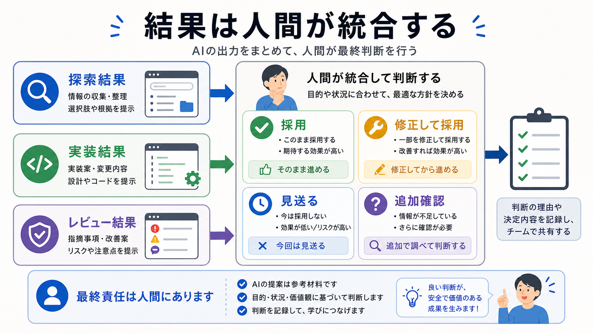

# 結果を統合する

この章では、サブエージェントの結果を人間が読み、採用するものと見送るものを判断します。

探索、実装、レビューを分けても、最後に結果をつなぐ作業が必要です。
ここをAI任せにすると、目的からずれた変更が混ざりやすくなります。

## この章でできるようになること

- サブエージェントの結果を統合前に分類できる
- 探索、実装、レビューの結果を混ぜずに読める
- 次に進む条件と止まる条件を決められる

## 統合で見ること

統合では、次を確認します。

- 探索結果は、実装方針の根拠になっているか
- 実装結果は、指定した範囲に収まっているか
- レビュー結果に、対応すべき問題があるか
- 未確認のコマンドやリンクが残っていないか
- 人間が説明できる状態か



## 結果を分類する

複数の結果を受け取ったら、まず分類します。

```text
採用する:

修正して採用する:

見送る:

追加確認する:
```

探索結果、実装結果、レビュー結果を一緒に貼り合わせないようにします。
種類ごとに見てから、採用判断をします。

## 次に進む条件

次に進んでよい条件を決めます。

たとえば、次のような条件です。

- 差分が担当範囲に収まっている
- 重大なレビュー指摘が残っていない
- 必要な確認コマンドが通っている
- 人間が変更理由を説明できる

条件を満たさない場合は、commitやpushへ進みません。

## 止まる条件

止まる条件も決めます。

- 触ってはいけないファイルが変わっている
- 秘密情報らしいものが見つかった
- レビュー指摘の重要度が高い
- buildやtestが失敗して理由がわからない
- サブエージェント同士の結果が矛盾している

止まることは、失敗ではありません。
確認できないまま進めるほうが危険です。

## AIに統合メモを作らせる

AIには、統合判断の下書きを作らせることができます。

```text
複数のサブエージェント結果を統合するためのメモを作ってください。

次の形で整理してください。

- 採用する内容
- 修正して採用する内容
- 見送る内容
- 追加確認が必要な内容
- commitやpushへ進む前に人間が見ること

まだファイル編集、削除、commit、pushはしないでください。
```

ただし、統合メモの最終判断は人間がします。

## やってみる

サブエージェント結果が3つ来た想定で、次の表を埋めます。

```text
探索結果から採用すること:

実装結果で確認すること:

レビュー結果で対応すること:

止まる条件:

次に進む条件:
```

この表を作ると、作業の終わり方が見えます。

## AIに聞いてみよう

AIに、統合判断の練習問題を出してもらいます。

```text
サブエージェント結果の統合判断について、5問の一問一答で練習したいです。

- 1問ずつ、探索・実装・レビュー結果の短い例を出す
- その直下に A: 採用する、B: 修正して採用する、C: 見送る、D: 追加確認する の選択肢を毎回表示する
- 私が回答するまで、答え、採点、解説を表示しない
- 私が回答したあと、その問題だけを採点し、理由を説明する
- 解説後に、次の問題を1問だけ出す
- ファイル編集、削除、commit、pushはしない
```

## 何が起きたのか

この章では、サブエージェントの結果を統合する流れを扱いました。

複数の結果は、採用、修正して採用、見送り、追加確認に分けます。
次章では、第8部全体を振り返り、探索、実装、レビューの依頼文を作ります。

## 次へ

次は、第8部の確認です。

- [第8部の確認](06-review-subagents.md)
