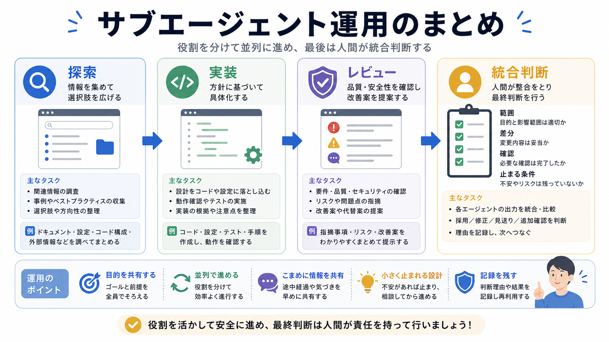

# 第8部の確認

この章では、第8部で扱ったサブエージェントの役割分担をまとめます。

サブエージェントは、作業を雑に投げる相手ではありません。
探索、実装、レビューの役割を分け、人間が統合判断を持つことで、安全に使いやすくなります。

## この章でできるようになること

- 探索、実装、レビューの依頼文を分けて作れる
- 書き込み範囲を指定する理由を説明できる
- 統合判断を人間が持つ流れを作れる

## 第8部で扱ったこと

第8部では、次の流れを扱いました。

1. サブエージェントの役割を理解する
2. 探索を読み取り中心で任せる
3. 実装を範囲限定で任せる
4. レビューを別観点で任せる
5. 結果を人間が統合する



## 依頼文セットを作る

次の3つの依頼文を作ります。

```text
探索役への依頼:

実装役への依頼:

レビュー役への依頼:
```

それぞれに、対象、出力形式、禁止事項を入れます。
実装役には、編集してよいファイルと編集しないファイルを必ず書きます。

## 人間の役割を残す

サブエージェントを使うほど、人間の役割は薄くなるのではなく、整理と判断に移ります。

```text
人間が決めること:
- 何を達成したいか
- どこまで任せるか
- どの結果を採用するか
- いつ止まるか
- いつcommitやpushへ進むか
```

AIが増えても、目的と責任は人間が持ちます。

## やってみる

小さな作業を1つ選び、サブエージェント用に分解します。

```text
作業名:

探索役:

実装役:

レビュー役:

統合時に見ること:

止まる条件:
```

これを書けない場合は、作業がまだ大きすぎるか、方針が曖昧かもしれません。

## AIに聞いてみよう

AIに、サブエージェント運用の練習問題を出してもらいます。

```text
サブエージェント運用について、5問の一問一答で練習したいです。

- 1問ずつ状況を出す
- その直下に A/B/C/D の選択肢を毎回表示する
- 私が回答するまで、答え、採点、解説を表示しない
- 私が回答したあと、その問題だけを採点し、理由を説明する
- 解説後に、次の問題を1問だけ出す
- ファイル編集、削除、commit、pushはしない
```

## 何が起きたのか

この章では、第8部の内容を、サブエージェント運用としてまとめました。

探索、実装、レビューを分け、結果を人間が統合します。
次の部では、ここまでの道具を使って、長期タスクを小さな確認単位に分けて進めます。

## 次へ

次は、長期タスクをAIに任せる方法を扱います。

- [第9部：長期タスクをAIに任せる](../part-9-long-tasks/index.md)
