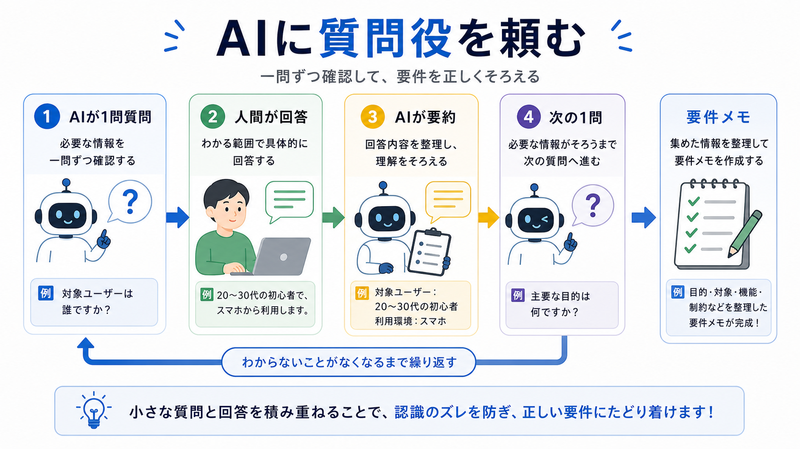

# AIに質問してもらう

この章では、AIに質問役を頼み、人間が回答する形で要件を引き出します。

長期タスクでは、最初から完璧な依頼文を書く必要はありません。
AIに質問してもらい、自分の回答を材料にして要件を整理します。

## この章でできるようになること

- AIに質問役を頼める
- 回答を要件メモにまとめる流れを作れる
- 未決定のことを未決定として残せる

## AIを質問役にする

AIには、すぐ解決策を出させるのではなく、まず質問役を頼みます。

```text
これから長期タスクの要件を整理したいです。
あなたは質問役になってください。

条件:
- 質問は1回に1つだけ
- 私の回答を待つ
- 回答後に要約し、次の質問を1つだけ出す
- まだ解決策や実装案は出さない
- ファイル編集、削除、commit、pushはしない
```



## 質問してもらう項目

質問役には、次のようなことを確認してもらいます。

- 何を達成したいか
- 誰が使うか
- 今困っていることは何か
- 完了したと言える状態は何か
- 触ってよい範囲はどこか
- 触ってはいけない範囲はどこか
- 確認方法は何か
- 期限や優先順位はあるか

全部を一度に聞かせる必要はありません。
1問ずつ進めることで、人間が考えやすくなります。

## 回答をメモにする

質問と回答は、あとで要件メモにまとめます。

```text
目的:

背景:

決まったこと:

未決定:

やらないこと:

完了条件:
```

会話だけに置いておくと、長くなったときに条件が薄れます。
重要なことはファイルやメモに残します。

## 秘密情報を書かない

要件メモにも、秘密情報は書きません。

次のような情報は、メモに直接書かないようにします。

- パスワード
- APIキー
- トークン
- 秘密鍵
- ログイン認証コード

必要な場合は、「環境変数で管理する」「手元の `.env` に置く」のように、扱い方だけを書きます。

## やってみる

AIに質問してもらう前に、最初の依頼文を作ります。

```text
相談したいタスク:

AIに質問してほしいこと:

まだ出してほしくないもの:

秘密情報として貼らないもの:
```

これを書いてからAIに渡すと、質問役として動かしやすくなります。

## AIに聞いてみよう

AIに、質問役の練習を頼みます。

```text
長期タスクの要件整理をしたいです。
あなたは質問役になってください。

条件:
- 1問ずつ質問する
- 私の回答を待つ
- 回答後、その回答だけを短く要約する
- そのあと次の質問を1問だけ出す
- まだ実装案、ファイル編集、削除、commit、pushはしない
- パスワード、APIキー、トークン、秘密鍵、認証コードは貼らないように注意してください
```

## 何が起きたのか

この章では、AIに質問役を頼んで要件を引き出す方法を扱いました。

次章では、要件メモを読み、調査、設計、実装、レビュー、検証に分けます。

## 次へ

次は、要件メモから計画を作ります。

- [要件メモから計画を作る](03-requirements-to-plan.md)
