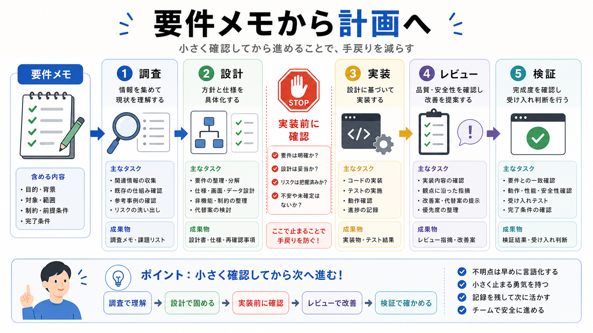

# 要件メモから計画を作る

この章では、要件メモを読み、調査、設計、実装、レビュー、検証に分けます。

要件メモは、作業の正本です。
会話の流れではなく、ファイルに残した要件をもとに計画を作ります。

## この章でできるようになること

- 要件メモを作業計画に変換できる
- 調査、設計、実装、レビュー、検証を分けられる
- 実装前に変更予定を確認できる

## 5つに分ける

長期タスクの計画は、次の5つに分けると扱いやすくなります。

| 段階 | すること |
| --- | --- |
| 調査 | 関連ファイル、既存パターン、確認コマンドを探す |
| 設計 | どう変えるか、触る範囲を決める |
| 実装 | 小さな単位で変更する |
| レビュー | 観点を分けて確認する |
| 検証 | build、test、lint、手動確認をする |



## 実装前に止める

計画を作ったら、実装前に一度止まります。

この時点で確認するのは、次のことです。

- 目的に合っているか
- やらないことを守っているか
- 変更予定ファイルが妥当か
- 確認方法があるか
- 作業単位が大きすぎないか

実装前に止まることで、方針違いの変更を減らせます。

## AIに計画を頼む

AIには、要件メモを読ませて計画を作らせます。

```text
要件メモをもとに、作業計画を作ってください。

次の形で整理してください。

- 調査
- 設計
- 実装
- レビュー
- 検証
- 変更予定ファイル
- 実装前に確認すべき不明点

まだファイル編集、削除、commit、pushはしないでください。
```

計画に不明点が残る場合は、実装へ進まず、人間が回答します。

## 計画を小さくする

計画が大きすぎる場合は、分割します。

```text
この計画を、1回の差分が小さくなるように分割してください。
各ステップごとに、変更予定ファイル、確認方法、止まる条件を出してください。
```

長期タスクでは、一度に終わらせることより、確認できる単位に分けることを優先します。

## やってみる

小さな要件メモを想定し、計画に変換します。

```text
要件メモの要約:

調査:

設計:

実装:

レビュー:

検証:

実装前に確認すること:
```

この形にできれば、実装へ進む準備が整ってきます。

## AIに聞いてみよう

AIに、要件メモから計画を作る練習をしてもらいます。

```text
要件メモを作業計画に変換する練習をしたいです。

5問の一問一答でお願いします。

- 1問ずつ短い要件メモを出す
- その直下に A: 調査、B: 設計、C: 実装、D: レビュー、E: 検証 の選択肢を毎回表示する
- 私が回答するまで、答え、採点、解説を表示しない
- 私が回答したあと、その問題だけを採点し、理由を説明する
- 解説後に、次の問題を1問だけ出す
- ファイル編集、削除、commit、pushはしない
```

## 何が起きたのか

この章では、要件メモから作業計画を作りました。

調査、設計、実装、レビュー、検証を分け、実装前に止まります。
次章では、各作業をさらに展開できる再帰型ToDoリストにします。

## 次へ

次は、再帰型ToDoリストを作ります。

- [再帰型ToDoリストを作る](04-recursive-todo.md)
