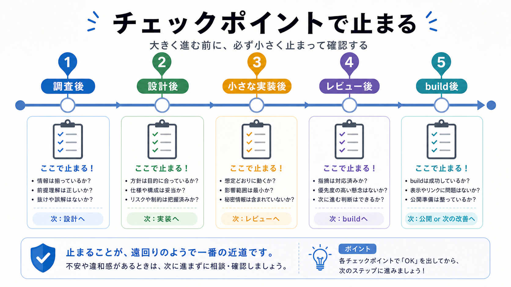

# チェックポイントで止める

この章では、一定の作業ごとに差分、build、レビューを確認するチェックポイントを置きます。

長期タスクでは、最後まで走り切ってから確認すると、問題の場所がわかりにくくなります。
小さな区切りで止まり、次へ進むか判断します。

## この章でできるようになること

- 長期タスクにチェックポイントを置ける
- 次へ進む条件と止まる条件を決められる
- AIに中間確認を頼める

## チェックポイントの役割

チェックポイントは、作業を止める場所です。

```text
調査が終わったら止まる
設計が出たら止まる
数ファイル変更したら止まる
レビュー指摘に対応したら止まる
buildが通ったら止まる
```



止まる場所を決めておくと、AIが先へ進みすぎるのを防げます。

## チェックポイントで見ること

チェックポイントでは、次を見ます。

- 目的からずれていないか
- 差分が大きくなりすぎていないか
- やらないことを守っているか
- 確認コマンドは必要か
- レビューを挟むべきか
- 次に進んでよいか

チェックポイントは、進捗報告ではありません。
次へ進む判断のための確認です。

## AIに中間確認を頼む

AIには、チェックポイントで中間確認を頼みます。

```text
ここでチェックポイントとして止まってください。

次の観点で現在の状態を整理してください。

- 完了したこと
- まだ残っていること
- 今の差分
- 目的からずれていないか
- やらないことを守っているか
- 次に進む前に確認すべきこと

まだ追加編集、削除、commit、pushはしないでください。
```

この依頼で、AIの作業を一度止めます。

## 進む条件と止まる条件

チェックポイントには、進む条件と止まる条件をセットで書きます。

```text
進む条件:
- 差分が予定範囲に収まっている
- 重大なレビュー指摘がない
- 必要なbuildが通っている

止まる条件:
- 予定外のファイルが変わっている
- 秘密情報らしいものがある
- エラー原因がわからない
```

条件を書いておくと、迷ったときに戻れる基準になります。

## やってみる

自分の長期タスクに、チェックポイントを3つ置きます。

```text
チェックポイント1:
見ること:
進む条件:

チェックポイント2:
見ること:
進む条件:

チェックポイント3:
見ること:
進む条件:
```

最初のチェックポイントは、実装前に置くのがおすすめです。

## AIに聞いてみよう

AIに、チェックポイント設計の練習問題を出してもらいます。

```text
長期タスクのチェックポイント設計について、5問の一問一答で練習したいです。

- 1問ずつ作業状況を出す
- その直下に A: 次へ進む、B: レビューを挟む、C: 止まって立て直す の選択肢を毎回表示する
- 私が回答するまで、答え、採点、解説を表示しない
- 私が回答したあと、その問題だけを採点し、理由を説明する
- 解説後に、次の問題を1問だけ出す
- ファイル編集、削除、commit、pushはしない
```

## 何が起きたのか

この章では、長期タスクにチェックポイントを置きました。

チェックポイントでは、差分、目的、やらないこと、確認コマンド、次に進む条件を見ます。
次章では、長期タスクが崩れたときに立て直す方法を扱います。

## 次へ

次は、崩れた長期タスクを立て直します。

- [崩れた長期タスクを立て直す](06-recover-long-task.md)
