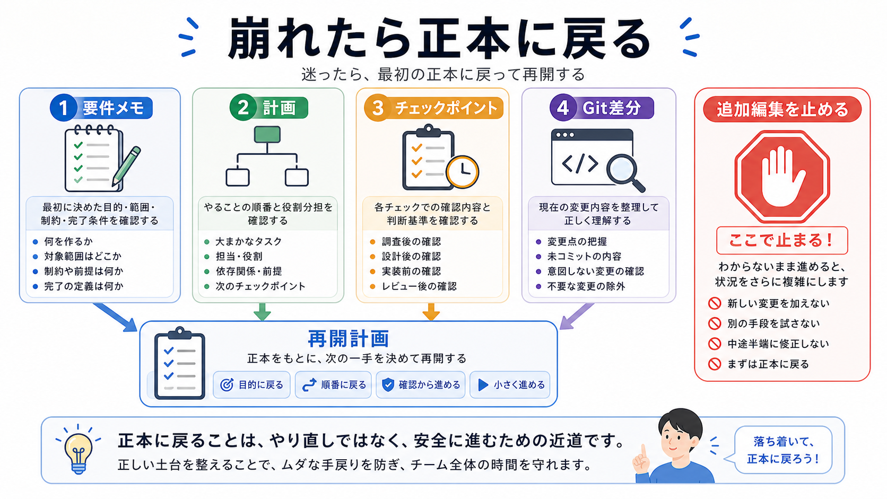

# 崩れた長期タスクを立て直す

この章では、方針がずれたときに、どこまで戻るか、何を読み直すかを整理します。

長期タスクでは、途中で会話が長くなったり、条件が増えたり、AIが先へ進みすぎたりします。
崩れたと感じたら、追加の作業を止めて、正本に戻ります。

## この章でできるようになること

- 長期タスクが崩れたサインに気づける
- 要件メモと差分に戻って立て直せる
- AIに再開計画を作らせることができる

## 崩れたサイン

次のような状態になったら、一度止まります。

- 何を完了したいのか説明できない
- 差分が大きすぎて読めない
- やらないことに手を出している
- 直前の依頼と違う変更が混ざっている
- エラー修正を重ねて原因が見えなくなっている
- AIの説明と実際の差分が合っていない



## 正本に戻る

立て直すときは、会話の勢いではなく、正本に戻ります。

正本の候補は、次のようなものです。

- 要件メモ
- AGENTS.md
- 変更前の計画
- チェックポイントのメモ
- Git差分

まず、何が正本なのかを確認します。
会話で増えた条件がある場合は、必要なものだけ正本に反映します。

## AIに再開計画を頼む

AIには、すぐ修正させず、再開計画を作らせます。

```text
長期タスクが崩れてきたので、ここで止まります。

まだファイル編集、削除、commit、pushはしないでください。

次の順で立て直し計画を作ってください。

1. 要件メモと現在の差分を照らし合わせる
2. 完了していること、未完了のことを分ける
3. やらないことに触れていないか確認する
4. 残す変更、戻す候補、追加確認を分ける
5. 次に進むための最小ステップを提案する
```

この依頼では、AIを実装者ではなく、整理役に戻します。

## 戻る場所を決める

立て直しでは、戻る場所を決めます。

```text
戻る場所:
- 要件メモまで戻る
- 計画まで戻る
- 直前のチェックポイントまで戻る
- 特定ファイルの差分だけ見直す
```

すべてを最初からやり直す必要はありません。
どこからずれたのかを見つけ、必要なところまで戻ります。

## やってみる

崩れた長期タスクを想定し、次の表を埋めます。

```text
崩れたサイン:

正本として読み直すもの:

残す変更:

戻す候補:

次の最小ステップ:

止まる条件:
```

この表が作れれば、再開の入口が見えます。

## AIに聞いてみよう

AIに、長期タスクの立て直しを一問一答で練習してもらいます。

```text
崩れた長期タスクの立て直しについて、5問の一問一答で練習したいです。

- 1問ずつ状況を出す
- その直下に A: 続行、B: チェックポイントに戻る、C: 要件メモに戻る の選択肢を毎回表示する
- 私が回答するまで、答え、採点、解説を表示しない
- 私が回答したあと、その問題だけを採点し、理由を説明する
- 解説後に、次の問題を1問だけ出す
- ファイル編集、削除、commit、pushはしない
```

## 何が起きたのか

この章では、崩れた長期タスクを止めて立て直す流れを扱いました。

要件メモ、計画、チェックポイント、Git差分に戻ることで、会話の勢いから抜け出せます。
次章では、第9部全体を振り返り、長期タスク用の要件メモとToDoを作ります。

## 次へ

次は、第9部の確認です。

- [第9部の確認](07-review-long-tasks.md)
